# Proving Grounds Play — InsanityHosting | Full Walkthrough

> **Machine:** InsanityHosting
> **Difficulty:** Intermediate (Linux)
> **Author:** vodanhtieutot
> **Platform:** Offensive Security — Proving Grounds Play

---

## Table of Contents

1. [Overview](#1-overview)
2. [Reconnaissance — Nmap Scan](#2-reconnaissance--nmap-scan)
3. [Service Enumeration — FTP](#3-service-enumeration--ftp)
4. [Web Enumeration — Root & Hidden Domain Discovery](#4-web-enumeration--root--hidden-domain-discovery)
5. [Deep Enumeration — news.insanityhosting.vm](#5-deep-enumeration--newsinsanityhostingvm)
6. [Credential Discovery — Brute Force monitoring/login.php](#6-credential-discovery--brute-force-monitoringloginphp)
7. [Lateral Movement — SquirrelMail Webmail](#7-lateral-movement--squirrelmail-webmail)
8. [SQL Injection — Domain Management Panel](#8-sql-injection--domain-management-panel)
9. [Initial Access — SSH as eliot](#9-initial-access--ssh-as-eliot)
10. [Privilege Escalation — Firefox Credential Decryption → Webmin](#10-privilege-escalation--firefox-credential-decryption--webmin)
11. [Flag Capture](#11-flag-capture)
12. [Flags & Answers Summary](#12-flags--answers-summary)
13. [Attack Chain Summary](#13-attack-chain-summary)
14. [Tools Used](#14-tools-used)

---

## 1. Overview

**InsanityHosting** is an Intermediate-rated Linux machine on Proving Grounds Play simulating a hosting company environment. The attack path involves discovering a hidden virtual host via page source analysis, brute-forcing a monitoring portal to recover credentials, pivoting to a webmail service, exploiting **SQL injection** in a domain management panel to dump a MySQL password hash, then escalating privileges by extracting and decrypting **Firefox saved credentials** from the compromised user's profile — leading to a root account accessed through an SSH-tunneled **Webmin** service on port 10000.

```
Recon → Gobuster → Hidden domain (news.insanityhosting.vm) → /etc/hosts
→ Enumerate: BLUDIT admin, monitoring login, SquirrelMail webmail
→ Brute-force monitoring (otis:123456) → Webmail login (otis:123456)
→ SQLi on domain management → MySQL hash → crack → eliot password
→ SSH as eliot → Firefox profile (key4.db + logins.json)
→ SCP → decrypt → root credentials → SSH tunnel → Webmin port 10000
→ root shell → proof.txt ✓
```

**Lab Environment:**

| Detail | Value |
|---|---|
| Target IP | `192.168.235.XXX` |
| Machine Name | `insanityhosting` |
| OS | Linux |
| Open Ports | 21 (FTP), 80 (HTTP), 10000 (Webmin — internal) |
| Attacker | Kali Linux (vodanhtieutot) |

---

## 2. Reconnaissance — Nmap Scan

### 2.1 Quick Port Scan

Full port scan to identify open services:

```bash
nmap -Pn -p- --min-rate 5000 <TARGET_IP>
```

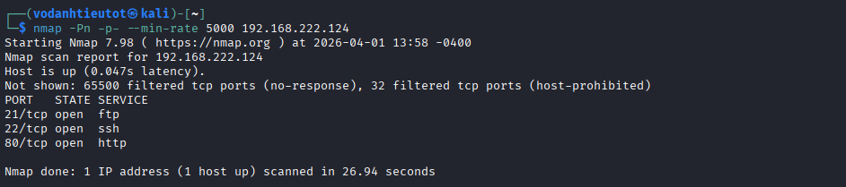

### 2.2 Service & Script Scan

Detailed scan against discovered ports:

```bash
nmap -sC -sV -A -Pn -p 21,80 <TARGET_IP>
```


Key findings:

| Port | Service | Notes |
|---|---|---|
| 21/tcp | FTP | FTP service — anonymous login candidate |
| 80/tcp | HTTP | Web server — hosting company front page |

---

## 3. Service Enumeration — FTP

### 3.1 FTP Anonymous Login Test

With an FTP port open, the first step is to test for anonymous login and enumerate any files:

```bash
ftp <TARGET_IP>
# Username: anonymous
# Password: (blank or anonymous)
```


> **Result:** Anonymous FTP access granted but the server contained no files of value. FTP is a dead end at this stage — continue to the web surface.

---

## 4. Web Enumeration — Root & Hidden Domain Discovery

### 4.1 Browsing the Web Root

Navigate to `http://<TARGET_IP>/`:


The front page presents a web hosting company interface. Manual inspection reveals:
- No working functional features (login, sign-up, contact forms are all non-functional)
- Page source yields no credentials, hidden comments, or useful endpoints
- The surface is largely cosmetic

> **Next step:** Brute-force directories to find hidden application paths.

### 4.2 Gobuster — Root Directory Scan

```bash
gobuster dir -u http://<TARGET_IP> \
  -w /usr/share/wordlists/dirbuster/directory-list-2.3-medium.txt \
  -t 70
```


Key directories discovered:

| Path | Notes |
|---|---|
| `/news` | Interesting — incomplete page render suggests a virtual host |
| Other paths | Standard hosting directories |

### 4.3 Hidden Virtual Host Discovery — Page Source Analysis

Navigating to `/news` renders an incomplete or broken page. This is a strong indicator that the application expects a **hostname**, not an IP address. Viewing the page source reveals a clue:


Inspecting the page source exposes a hidden domain reference:


> 🎯 **Critical finding:** The page source references the virtual host `news.insanityhosting.vm`. This domain is not publicly resolvable — it is only accessible via the `/etc/hosts` file on the attacker machine.

### 4.4 Adding the Virtual Host to /etc/hosts

Add the target IP and discovered hostname to the local resolver:

```bash
echo "<TARGET_IP> insanityhosting.vm news.insanityhosting.vm" >> /etc/hosts
```

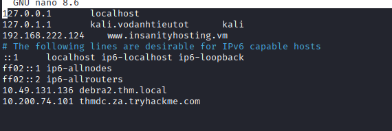

> With the virtual host registered, browsers and tools will now correctly route requests to `news.insanityhosting.vm`.

---

## 5. Deep Enumeration — news.insanityhosting.vm

### 5.1 Gobuster on the Virtual Host

With the domain configured, run Gobuster against the virtual host:

```bash
gobuster dir -u http://news.insanityhosting.vm \
  -w /usr/share/wordlists/dirbuster/directory-list-2.3-medium.txt \
  -t 70
```


| Path | Notes |
|---|---|
| `/admin` | CMS admin panel |
| `/monitoring` | Internal monitoring portal — high value |
| `/webmail` | SquirrelMail webmail interface |
| `/robots.txt` | No restricted paths of interest |

### 5.2 Admin Panel — BLUDIT CMS

Navigate to `http://news.insanityhosting.vm/admin`:


The admin panel is a **BLUDIT CMS** login form. BLUDIT has known CVEs (brute-force bypass, RCE via file upload), but rather than exploit prematurely, continue enumerating the other discovered paths first.

### 5.3 PHP File & Robots.txt

A PHP file discovered during enumeration reveals no sensitive data:


Checking `robots.txt`:


> Neither the PHP file nor `robots.txt` yielded actionable intelligence.

### 5.4 Welcome Page — Username Enumeration

The `/welcome` path (or equivalent page) on the virtual host contains a page referencing a staff member:


> 🎯 **Finding:** A staff member named **`otis`** is referenced on the welcome page. Note this username — it will be used later as a brute-force candidate.

### 5.5 Monitoring Portal

Navigate to `http://news.insanityhosting.vm/monitoring`:


A custom-built login portal with a noticeably different look from standard frameworks — likely an internally developed application. Custom internal apps are typically less hardened than commercial products and are good brute-force candidates.

### 5.6 SquirrelMail Webmail

Navigate to `http://news.insanityhosting.vm/webmail`:

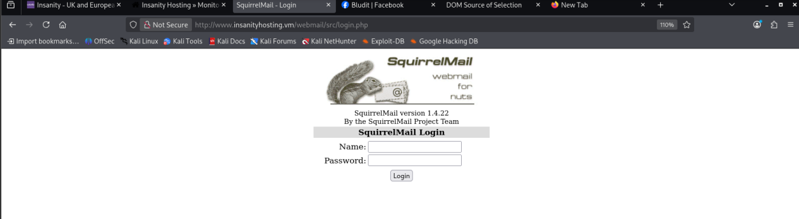

**SquirrelMail** is a classic PHP-based webmail client. Credentials valid against the system accounts will likely work here too.

---

## 6. Credential Discovery — Brute Force monitoring/login.php

### 6.1 Analyzing the Login Request

Using Burp Suite or browser developer tools, intercept a login attempt against the monitoring portal to identify the POST parameters:

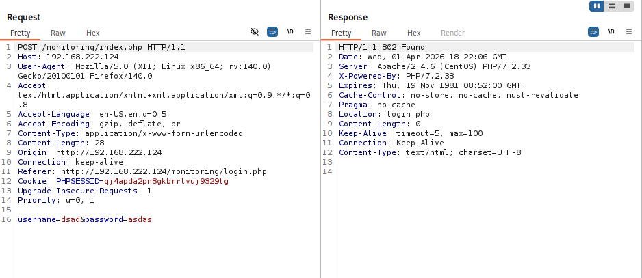

The login form submits a standard `POST` request with identifiable parameter names. Armed with the username `otis` discovered earlier and the POST structure, we can brute-force this endpoint.

### 6.2 Hydra Brute Force

```bash
hydra -l otis -P /usr/share/wordlists/rockyou.txt \
  news.insanityhosting.vm http-post-form \
  "/monitoring/login.php:username=^USER^&password=^PASS^:Invalid"
```

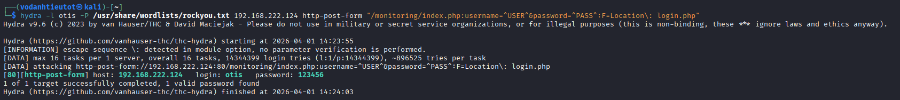

```
[80][http-post-form] host: news.insanityhosting.vm
    login: otis   password: 123456
```

> 🎯 **Credentials found:**
> - **Username:** `otis`
> - **Password:** `123456`
>
> A trivially weak password on an internal monitoring system — a critical authentication failure.

---

## 7. Lateral Movement — SquirrelMail Webmail

### 7.1 Logging into the Monitoring Portal

Using `otis:123456` to log in to the monitoring portal reveals a **domain management panel**:


This is a domain administration interface. The output display format looks structured — resembling database query results displayed in a table. Keep this in mind.

### 7.2 Credential Reuse — SquirrelMail

Attempt to log in to the SquirrelMail webmail service with the same credentials:

```
Username: otis
Password: 123456
```

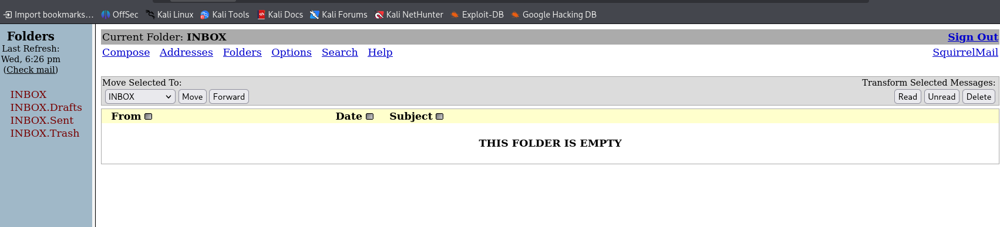

> ✅ **Credential reuse confirmed.** The same `otis:123456` credentials work on SquirrelMail. This is a classic credential reuse vulnerability — users and systems sharing passwords across multiple services.

### 7.3 BLUDIT Admin — Login Attempt

Test the credentials against the BLUDIT admin panel:

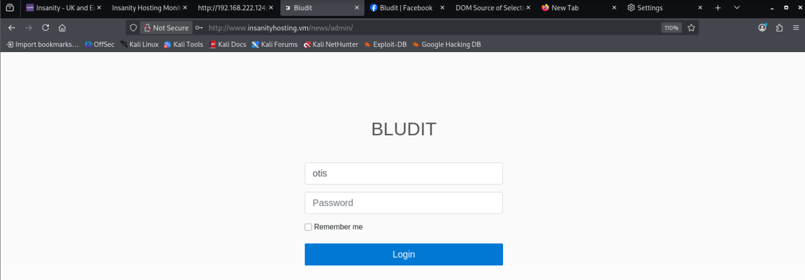

> ❌ The BLUDIT admin login does not accept these credentials. The BLUDIT admin account uses different credentials. Move on.

---

## 8. SQL Injection — Domain Management Panel

### 8.1 Investigating the Domain Management Panel

The monitoring portal's domain management interface displays output in a structured table format — strongly suggestive of a backend database query. Experimenting with input fields:


The tabular output format (resembling a MySQL result set) suggests the backend is directly constructing SQL queries from user input without sanitization. This is a SQL injection candidate.

### 8.2 SQL Injection — MySQL Hash Dump

After iterating through SQL injection payloads, the backend query is confirmed vulnerable. Exploiting the injection yields a MySQL password hash for the user `eliot`:

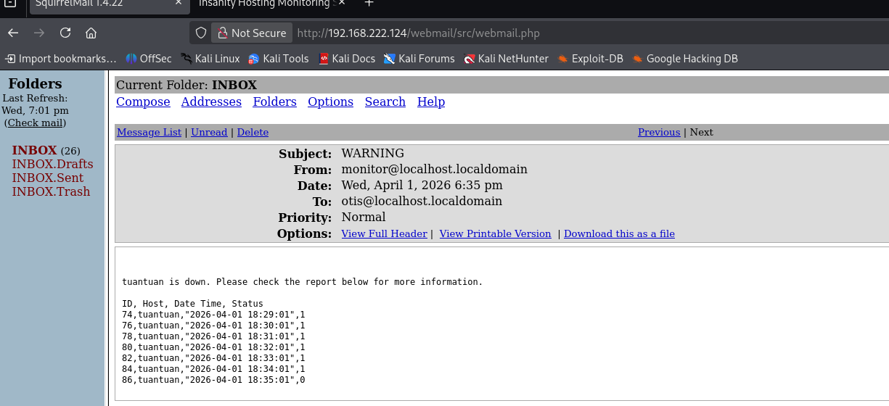

> 🎯 **SQL injection successful.** The domain management panel is vulnerable to SQLi. A MySQL password hash for user **`eliot`** was extracted from the database.

### 8.3 Hash Cracking

Crack the extracted hash using Hashcat or an online cracking service:

```bash
hashcat -m 0 eliot_hash.txt /usr/share/wordlists/rockyou.txt
# or
john --format=raw-md5 eliot_hash.txt --wordlist=/usr/share/wordlists/rockyou.txt
```

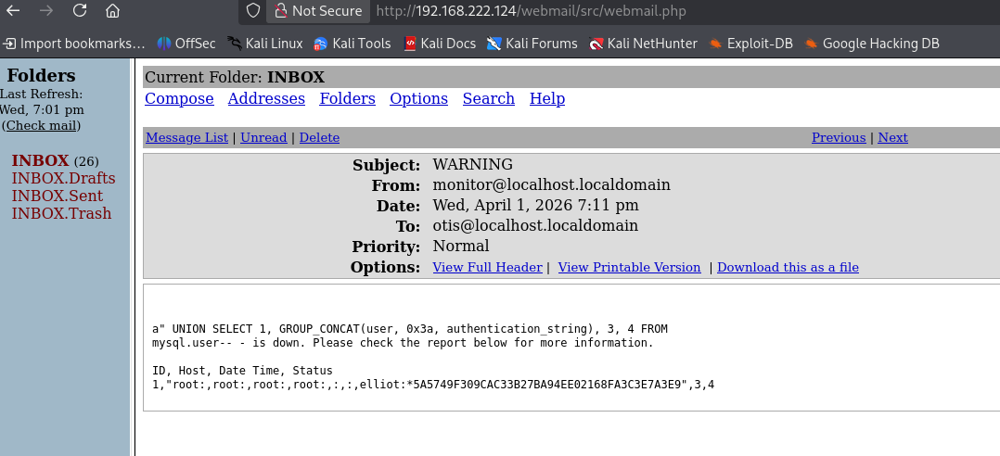

> 🎯 **Credentials recovered:**
> - **Username:** `eliot`
> - **Password:** *(cracked from hash)*

---

## 9. Initial Access — SSH as eliot

### 9.1 SSH Login

Using the cracked credentials to authenticate via SSH:

```bash
ssh eliot@<TARGET_IP>
```


### 9.2 User Flag — local.txt

```bash
eliot@insanityhosting:~$ cat local.txt
```

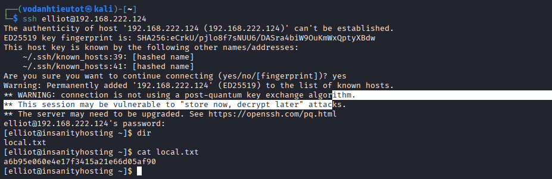

> 🚩 **local.txt (User Flag):** captured from `/home/eliot/local.txt`

---

## 10. Privilege Escalation — Firefox Credential Decryption → Webmin

### 10.1 Enumerating the Home Directory — Firefox Profile

Exploring `eliot`'s home directory reveals a Mozilla Firefox profile:

```bash
eliot@insanityhosting:~$ ls -la ~/.mozilla/firefox/
```


> 🎯 **Critical finding:** Firefox stores saved passwords in two files within the user profile:
> - `key4.db` — the NSS key database (encryption keys)
> - `logins.json` — encrypted login entries
>
> Together, these files can be decrypted offline to recover any passwords the user has saved in their browser.

### 10.2 Locating the Credential Files

Navigate into the Firefox profile directory to locate the credential files:

```bash
eliot@insanityhosting:~$ ls ~/.mozilla/firefox/*.default/
# key4.db and logins.json present
```


### 10.3 Staging the Files for Exfiltration

```bash
eliot@insanityhosting:~$ cp ~/.mozilla/firefox/*.default/key4.db /tmp/
eliot@insanityhosting:~$ cp ~/.mozilla/firefox/*.default/logins.json /tmp/
```

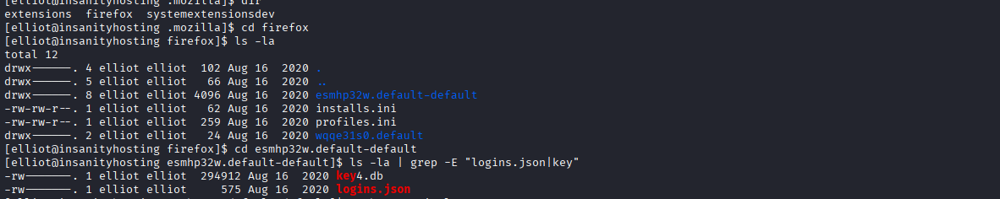

### 10.4 Exfiltration via SCP

Transfer the files from the target to the attacker machine using SCP over the established SSH session:

```bash
# On attacker machine:
scp eliot@<TARGET_IP>:/tmp/key4.db ./firefox_loot/
scp eliot@<TARGET_IP>:/tmp/logins.json ./firefox_loot/
```


### 10.5 Decrypting Firefox Credentials

Use **firefox_decrypt** (or equivalent tool) to decrypt the saved credentials from the exfiltrated files:

```bash
python3 firefox_decrypt.py ./firefox_loot/
```


> 🎯 **Root credentials recovered from Firefox saved passwords:**
> - **Username:** `root`
> - **Password:** *(recovered from Firefox profile)*
>
> The `eliot` user had saved root credentials in their Firefox browser — a severe OPSEC failure.

### 10.6 SSH Tunnel to Webmin (Port 10000)

Attempting a direct SSH login as `root` fails — password authentication for root over SSH is disabled. However, checking the Firefox saved login URL reveals it points to **port 10000** — a **Webmin** administration interface. Webmin is not directly accessible from outside; an SSH tunnel is required:

```bash
ssh -L 10000:localhost:10000 eliot@<TARGET_IP>
```

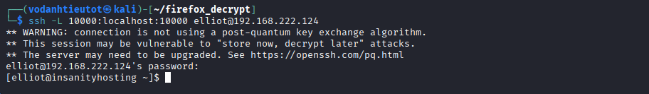

### 10.7 Webmin Access → Root Shell

With the tunnel active, navigate to `https://localhost:10000` in the attacker's browser and log in with the recovered root credentials:

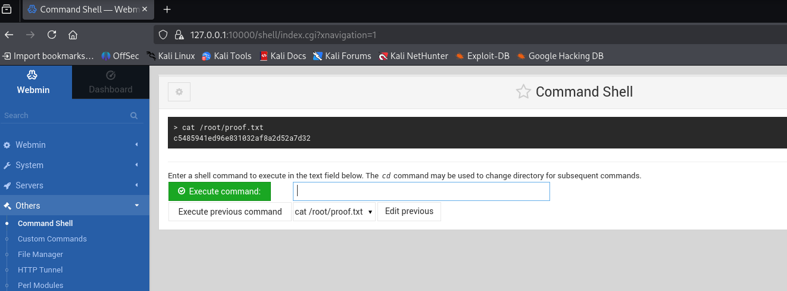

> ✅ **Root access achieved via Webmin.** The SSH tunnel successfully exposes the internal Webmin service, and the recovered root password grants full administrative access.

---

## 11. Flag Capture

### 11.1 Root Flag — proof.txt

Through the Webmin command execution interface (or a root shell spawned from it), retrieve the final flag:

```bash
cat /root/proof.txt
```


> 🚩 **proof.txt (Root Flag):** captured from `/root/proof.txt`

---

## 12. Flags & Answers Summary

| Flag | Location | Value |
|---|---|---|
| User Flag | `/home/eliot/local.txt` | *(captured during lab)* |
| Root Flag | `/root/proof.txt` | *(captured during lab)* |

---

## 13. Attack Chain Summary

```
[1] Nmap -Pn -p- --min-rate 5000
        → Port 21 (FTP), Port 80 (HTTP)

[2] FTP enumeration
        → Anonymous login — no useful files found, dead end

[3] Browse http://<TARGET_IP>/
        → Hosting company front page — no functional features
        → Page source: no secrets

[4] Gobuster dir / (medium wordlist, 70 threads)
        → /news (301) — broken render suggests virtual host

[5] Page source analysis of /news
        → Hidden domain: news.insanityhosting.vm

[6] /etc/hosts update
        → echo "<TARGET_IP> insanityhosting.vm news.insanityhosting.vm" >> /etc/hosts

[7] Gobuster dir http://news.insanityhosting.vm (medium wordlist)
        → /admin (BLUDIT CMS), /monitoring (custom login), /webmail (SquirrelMail)
        → /robots.txt (no restricted paths)

[8] Browse /welcome (or equivalent page)
        → Staff member name: otis (username candidate)

[9] Burp Suite intercept on /monitoring/login.php
        → POST parameters identified

[10] Hydra brute force — monitoring portal
        → Username: otis | Password: 123456

[11] Login to monitoring portal (otis:123456)
        → Domain management panel — tabular output suggests SQL backend

[12] Credential reuse test on SquirrelMail
        → otis:123456 → successful webmail login ✓
        → BLUDIT admin → failed ✗

[13] SQL injection — domain management panel
        → Input manipulation → backend SQLi confirmed
        → MySQL password hash for user "eliot" dumped

[14] Hash cracking
        → eliot's plaintext password recovered

[15] SSH as eliot → user shell ✓
        → cat local.txt → user flag ✓

[16] Enumerate home directory
        → ~/.mozilla/firefox/*.default/ discovered
        → key4.db + logins.json (Firefox saved credentials)

[17] SCP exfiltration
        → key4.db + logins.json transferred to attacker machine

[18] firefox_decrypt
        → Root credentials recovered from Firefox saved passwords

[19] SSH tunnel
        → ssh -L 10000:localhost:10000 eliot@<TARGET_IP>
        → Webmin (port 10000) exposed locally

[20] Webmin login as root
        → Root access achieved via browser ✓
        → cat /root/proof.txt → root flag ✓
```

---

## 14. Tools Used

| Tool | Purpose |
|---|---|
| `nmap` | Port scanning & service fingerprinting |
| `ftp` | FTP anonymous login test |
| Firefox / Browser | Manual web application browsing & page source analysis |
| `gobuster` | Web directory brute-forcing (3 passes: root, virtual host, subpaths) |
| Burp Suite | HTTP request interception for POST parameter analysis |
| `hydra` | Credential brute-forcing against monitoring/login.php |
| `ssh` | Remote shell access and SSH tunneling (`-L` port forwarding) |
| `scp` | Secure file transfer of Firefox credential database files |
| `firefox_decrypt` | Offline decryption of Firefox saved passwords (key4.db + logins.json) |
| `hashcat` / `john` | Password hash cracking for MySQL hash |
| Webmin (port 10000) | Root access via browser-based server administration panel |
